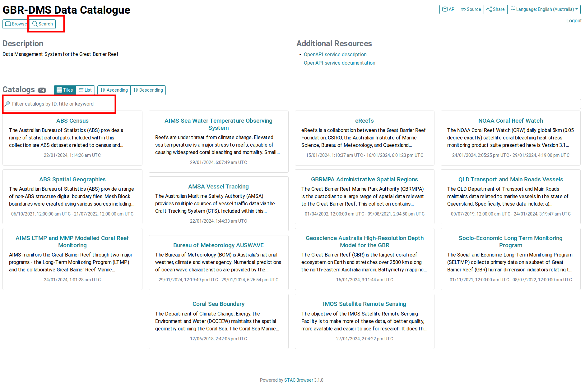
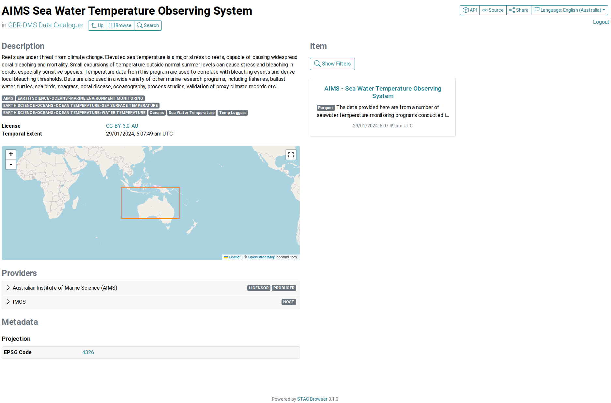
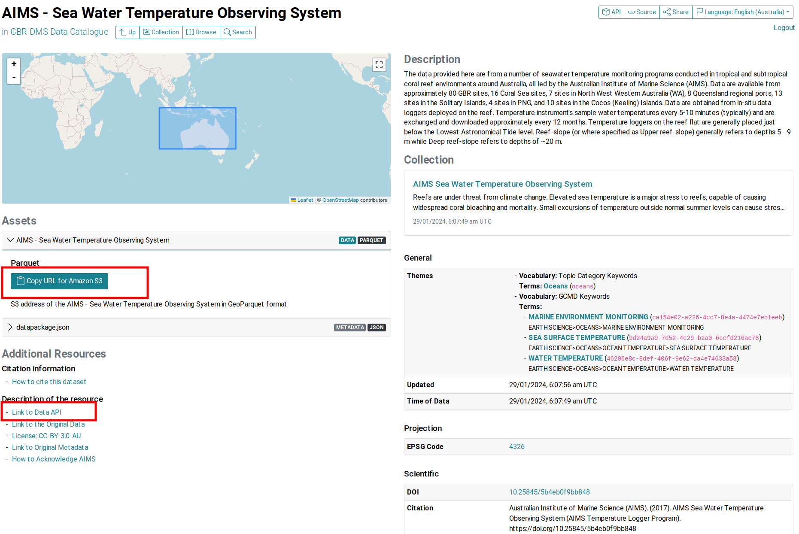

# Automated data access from the Reef 2050 Integrated Monitoring and Reporting Program Data Management System (RIMReP DMS)

This repository contains example notebooks in `R` and `Python` showing how to access datasets available in the Reef 2050 Integrated Monitoring and Reporting Program Data Management System (RIMReP DMS). These notebooks include suggested workflows on how to query datasets to create summary tables, figures, and maps.

## Table of contents 

- [Automated data access from the Reef 2050 Integrated Monitoring and Reporting Program Data Management System (RIMReP DMS)](#automated-data-access-from-the-reef-2050-integrated-monitoring-and-reporting-program-data-management-system-rimrep-dms)
  - [Table of contents](#table-of-contents)
  - [More information](#more-information)
  - [What is RIMReP DMS?](#what-is-rimrep-dms)
  - [Discovering datasets in RIMReP DMS](#discovering-datasets-in-rimrep-dms)
    - [Discovering datasets via STAC](#discovering-datasets-via-stac)
  - [Code snippets](#code-snippets)
    - [Connecting to tabular dataset in S3 bucket](#connecting-to-tabular-dataset-in-s3-bucket)
    - [Extracting tabular data from S3 bucket](#extracting-tabular-data-from-s3-bucket)
    - [Extracting gridded data from S3 bucket](#extracting-gridded-data-from-s3-bucket)

## More information

-   [Using API to access RIMReP DMS datasets](more_information/rimrep_api_access.md)  
-   [Running example notebooks in this repository](more_information/running_notebooks.md)  
    -   [Setting up your machine](more_information/running_notebooks.md/#setting-up-your-machine)  
-   [Description of example notebooks in repository](more_information/repository_file_description.md/#description-of-example-notebooks-in-repository)  
-   [Description of scripts in repository](more_information/repository_file_description.md/#description-of-scripts-in-repository)  

## What is RIMReP DMS?

RIMReP DMS is an Open Geospatial Consortium (OGC) API service and analysis-ready, cloud-optimised (ARCO) repository for data and metadata relevant to the management of the Great Barrier Reef. RIMReP DMS offers services to allow the discovery of the data and the interaction with external RIMReP systems.

In simple terms, RIMReP DMS is a data portal that aims to be a "one-stop-shop" for all data related to the Great Barrier Reef World Heritage Area, which can be easily accessed by the Great Barrier Reef Marine Park Authority (GBRMPA) to support evidence-based management strategies. All datasets have a standard format regardless of their origin, which not only facilitates access to data, but also their analysis as it removes the need to understand and parse different data formats.

Datasets that have an open licence are publicly available in the RIMReP DMS, while datasets that have a restricted licence are only available to users that have been granted access to them by the data provider.

[Table of contents](#table-of-contents)

## Discovering datasets in RIMReP DMS

To browse datasets available in the RIMReP DMS you can use the SpatioTemporal Asset Catalogs (STAC). STAC provides a common language to describe a range of geospatial information, so that data can be indexed and easily discovered. Our STAC catalogue is available at [https://stac.reefdata.io/browser/](https://stac.reefdata.io/browser/).

Alternatively, we provide a link to the original source of the dataset to give users the option of accessing the data directly from the data provider.

### Discovering datasets via STAC

The [STAC catalogue](https://stac.reefdata.io/browser/) is a web-based interface that allows users to search for datasets using a range of filters, such as dataset name, data provider, and date range. To search for datasets, you have the option of clicking on the **Search** button on the top right corner of the page, or you can use the search bar on the top left corner of the page. These two options are highlighted in red boxes in the image below.



Datasets available via STAC are organised by **collections**, each containing one or multiple datasets or *items* that are related to each other. To illustrate this, we will use the [AIMS Sea Water Temperature Observing System](https://stac.reefdata.io/browser/collections/aims-temp) as an example.



The collection level page includes the following information:

-   A description of the collection, which is a brief summary of the datasets available in the collection.  
-   The items or datasets available in the collection. In this case, we can see that there is a single item available in the collection.  
-   The license under which the datasets are available.  
-   The temporal coverage of the datasets.  
-   A map showing the spatial coverage of the datasets.  
-   Information about the data provider . 

If you click on the item name (in this case, [*AIMS Sea Water Temperature Observing System*](https://stac.reefdata.io/browser/collections/aims-temp/items/aims-temp-loggers)), you will be taken to the item level page.



The item level page includes the following information:

-   A map showing the spatial coverage of the dataset.  
-   A description of the dataset.  
-   A link to the collection level page.  
-   A link to the dataset available in a RIMReP DMS S3 bucket under the **Assets** section.  
-   Under the **Additional Resources** section, there will be a link to the data API under and to the original source of the dataset.  
-   Metadata about the dataset, including the projection system, preferred citation and the names of the columns in the dataset.  
  
The API and S3 links are highlighted in red boxes in the image above because these are the two methods shown in this repository to access datasets available in the RIMReP DMS.

[Table of contents](#table-of-contents)

## Code snippets

In this section, we are including code snippets that will help you get started with the GBR DMS. These snippets are available in `R` and `Python`, simply select the language you want to use from the tabs below.

### Connecting to tabular dataset in S3 bucket

To run this code in `R` or `Python`, you will need to have the S3 URL address for the dataset of your interest. For this example, we are using the *AIMS Sea Surface Temperature Monitoring Program* dataset, but you can simply replace the S3 URL address with the one for the dataset you want to access.

You can get this URL following the instructions in the [Searching for datasets via STAC](#searching-for-datasets-via-stac) section above.

<details>

<summary><b> Instructions for R users </b></summary>

``` r
# Loading arrow library to connect to S3 bucket
library(arrow)
# Providing S3 URL address for dataset of interest
dataset_s3 <- "s3://gbr-dms-data-public/aims-temp-loggers/data.parquet"
# Connecting to S3 bucket
s3_conn <- s3_bucket(dataset_s3)
# Accessing dataset
ds <- open_dataset(s3_conn)
```

Remember that you can change the value of `dataset_s3` to the S3 URL address for the dataset you want to access.

Note that if you do not have the `arrow` library installed in your machine, you will need to install it before running the code above. You can do so by running the following line: `install.packages("arrow")`. Alternatively, you can run refer to the [Setting up your machine](#setting-up-your-machine) section below for instructions on how to install all packages used in this repository at once.

</details>

<details>

<summary><b> Instructions for Python users </b></summary>

``` python
# Loading pyarrow library to connect to S3 bucket
from pyarrow import parquet as pq
# Providing S3 URL address for dataset of interest
dataset_s3 = 's3://gbr-dms-data-public/aims-temp-loggers/data.parquet'
# Connecting to S3 bucket
ds = pq.ParquetDataset(dataset_s3)
```

Remember that you can change the value of `dataset_s3` to the S3 URL address for the dataset you want to access.

Note that if you do not have the `pyarrow` package installed in your machine, you will not be able to run the code above. You can install it using a package manager such as `pip` or `conda`. Alternatively, you can run refer to the [Setting up your machine](#setting-up-your-machine) section below for instructions on how to install all packages used in this repository at once.

</details>

### Extracting tabular data from S3 bucket

Once you have connected to the S3 bucket, you do not have to download the entire dataset to your local machine to carry out your analysis. Instead, you can extract data from the dataset of interest based on one or more conditions. You can then load into memory only the relevant data needed to create summary tables, figures, or maps. We are including code snippets showing a simple data selection based on spatial and temporal conditions.

<details>

<summary><b> Instructions for R users </b></summary>

Once you have connected to the S3 bucket, you can use [`dplyr` verbs](https://dplyr.tidyverse.org/) to extract a subset of the data based on one or more conditions. Here, we assume that a dataset connection has already been established following instructions in the [Connecting to S3 bucket](#connecting-to-s3-bucket) section above and this dataset is stored in the `ds` variable. We will assume that our dataset has `longitude`, `latitude`, and `time` columns, and we will use them to extract data based on spatial and temporal conditions.

``` r
# Loading relevant libraries
library(dplyr)

# We will extract data for the year 2019 that includes Townsville and Cairns
ds_subset <- ds |> 
  # First we apply a filter based on longitudes
  filter(longitude > 145.6 & longitude < 146.9) |>
  # Then we apply a filter based on latitudes
  filter(latitude > -19.3 & latitude < -16.8) |>
  # Finally, we apply a filter based on time
  filter(time >= "2019-01-01" & time <= "2019-12-31") |> 
  # We could even select only the columns we need
  # We will assume that the dataset also has a column called 'site' and we want to select it
  select(longitude, latitude, time, site)

# We can now load the data into memory
ds_subset <- ds_subset |> 
  collect()
```

You can change the values of the conditions above to extract data that is relevant for your needs. Other conditions may include extracting data based on a specific site, a specific depth range, or even a specific variable.

</details>

<details>

<summary><b> Instructions for Python users </b></summary>

Once you have connected to the S3 bucket, you can use the `pandas` package to connect to a dataset and extract a subset of the data based on one or more conditions. We will assume that our dataset has `longitude`, `latitude`, and `time` columns, and we will use them to extract data based on spatial and temporal conditions. We will use the *AIMS Sea Surface Temperature Monitoring Program* dataset as an example, but you can replace the S3 URL address with the one for the dataset you want to access.

``` python
# Loading relevant packages
import pandas as pd

# We store the S3 URL address in a variable
dataset_s3 = 's3://gbr-dms-data-public/aims-temp-loggers/data.parquet'

# We will define a variable with our conditions to extract data for the year 2019 that includes Townsville and Cairns
filters = [
    ('lon', '>', 145.6),
    ('lon', '<', 146.9),
    ('lat', '>', -19.3),
    ('lat', '<', -16.8),
    ('time', '>=', pd.Timestamp('2019-01-01T10:00:00Z')),
    ('time', '<', pd.Timestamp('2020-01-01T10:00:00Z')),
]

# We will extract data for the year 2019 that includes Townsville and Cairns
ds_subset = pd.read_parquet(
    dataset_s3,
    # We can select the columns of our interest with the columns argument
    columns=['lon', 'lat', 'time', 'site', 'qc_val'],
    # We can now apply our filters
    filters=filters,
    # We can connect anonymously because this is a public dataset
    storage_options={'anon': True},
)
```

</details>

### Extracting gridded data from S3 bucket

Gridded data is also available in the RIMReP DMS. This data is stored in [Zarr](https://zarr.readthedocs.io/en/stable/) format, which is a format that allows for efficient storage of array-based data. This data is also stored in S3 buckets, but the connection and extraction process is slightly different from the one described above for tabular data.

<details>

<summary><b> Instructions for R users </b></summary>

To make access of gridded data in `R` as easy as possible for users, we created a function called `connect_dms_dataset`, which you can find in the `useful_functions.R` script. This function takes the API address for the dataset of interest, the variable name of interest as arguments and returns a `SpatRaster` object. Additionally, you can provide spatial and temporal boundaries to extract data. We will use the *NOAA Coral Reef Watch degree heating weeks* dataset as an example, but you can replace the API address with the one for the dataset you want to access.

Note that you will need to head over to our dashboard: <https://dashboard.reefdata.io/> to get a token before you can access the data. When you use the `connect_dms_dataset` function, you will be prompted to enter your token. If you do not have an account, you can contact us at [info-rimrep\@utas.edu.au](mailto:info-rimrep@utas.edu.au).

``` r
#Loading useful_functions script
source("R_based_scripts/useful_functions.R")
#Loading and manipulating gridded data
library(terra)

#Defining API URL (obtained from STAC catalogue)
base_url <- "https://pygeoapi.reefdata.io/collections/noaa-crw-chs-dhw"

#Defining variable of interest (obtained from STAC catalogue)
variable_name <- "degree_heating_week"

#Connecting to DMS to extract data
ras_dhw <- connect_dms_dataset(base_url, variable_name,
                           #Temporal limits
                           start_time = "2023-01-01", end_time = "2023-01-07", 
                           #Spatial limits
                           lon_limits = c(145.30, 146.90),
                           lat_limits = c(-17, -16.30))

#You can plot the raster to check that the data was extracted correctly
plot(ras_dhw)
```

</details>

<details>

<summary><b> Instructions for Python users </b></summary>

Instead of using `dask_geopandas` to connect to the S3 bucket and extract tabular data, we will use the `s3fs` package to connect and extract gridded data. We will use the *NOAA Coral Reef Watch degree heating weeks* dataset as an example, but you can replace the S3 URL address with the one for the dataset you want to access.

``` python
#Loading relevant packages
#Connecting to S3 bucket
import s3fs
#Loading and manipulating gridded data
import xarray as xr

#Storing the S3 URL address in a variable
coral_url = 's3://gbr-dms-data-public/noaa-crw-chs-dhw/data.zarr'

#Connecting to public bucket - No credentials required
s3_bucket = s3fs.S3FileSystem(anon = True)

#Loading data into memory
coral_ds = xr.open_dataset(s3fs.S3Map(root = coral_url, s3 = s3_bucket), engine = 'zarr')
```

</details>

[Table of contents](#table-of-contents)
 