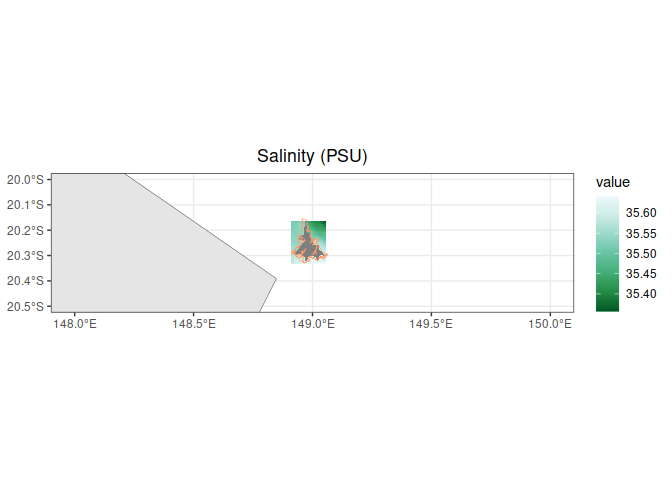
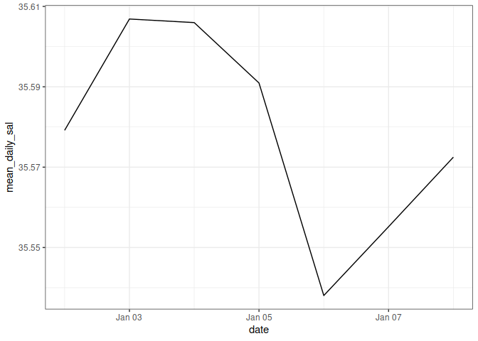

# eReef_data_extraction
Denisse Fierro Arcos
2024-01-14

- [Extracting eReefs outputs using a
  shapefile](#extracting-ereefs-outputs-using-a-shapefile)
  - [Loading libraries](#loading-libraries)
  - [Loading Whitsunday features from GBR
    shapefile](#loading-whitsunday-features-from-gbr-shapefile)
  - [Connecting to RIMREP DMS collection via
    API](#connecting-to-rimrep-dms-collection-via-api)
  - [Plotting data](#plotting-data)
  - [Clipping raster to match
    shapefile](#clipping-raster-to-match-shapefile)

# Extracting eReefs outputs using a shapefile

[eReefs](https://research.csiro.au/ereefs/) is a group of environmental
models managed by various government and non-profit organisations. These
models can simulate past conditions and predict future states for
hydrodynamic conditions, sediment transport, and water quality within
the Greet Barrier Reef (GBR). The aim is to provide information about
the past and current states of GBR, as well as its likely future
condition.

eReefs model outputs can be found in the DMS under the [**eReefs**
collection](https://stac.reefdata.io/browser/collections/ereefs). In
this notebook, we will use the [daily hydrodynamic model
outputs](https://stac.reefdata.io/browser/collections/ereefs/items/aims-ereefs-agg-hydrodynamic-1km-daily)
as an example of how to extract data.

We will also use the GBR feature shapefile to extract data from eReef.

## Loading libraries

``` r
#Loading useful_functions script
source("useful_functions.R")
#Mapping
library(terra)
library(sf)
library(tidyterra)
library(rnaturalearth)
#Data manipulation
library(tibble)
library(tidyr)
```

## Loading Whitsunday features from GBR shapefile

We will use the GBR features here, but we will only load boundaries for
the Whitsunday for this exercise. However, the function loading these
GBR features can load the entire shapefile or any other GBR feature.

``` r
#Loading boundaries for Whitsundays
whitsundays <- gbr_features(site_name = "Whitsunday")
```

    Subsetting GBR features by Whitsunday

``` r
#Checking results of query
whitsundays
```

    Simple feature collection with 42 features and 7 fields
    Geometry type: POLYGON
    Dimension:     XY
    Bounding box:  xmin: 148.9111 ymin: -20.32891 xmax: 149.0637 ymax: -20.15519
    Geodetic CRS:  GDA94
    # A tibble: 42 × 8
       UNIQUE_ID   GBR_NAME   LOC_NAME_S                  geometry FEAT_NAME LEVEL_1
     * <chr>       <chr>      <chr>                  <POLYGON [°]> <chr>     <chr>  
     1 20041111104 Whitsunda… Whitsunda… ((148.9313 -20.29419, 14… Reef      Reef   
     2 20041124104 Whitsunda… Whitsunda… ((149.0355 -20.30176, 14… Reef      Reef   
     3 20041103104 Whitsunda… Whitsunda… ((148.9969 -20.23033, 14… Reef      Reef   
     4 20041121104 Whitsunda… Whitsunda… ((148.9929 -20.30349, 14… Reef      Reef   
     5 20041119104 Whitsunda… Whitsunda… ((148.9694 -20.32657, 14… Reef      Reef   
     6 20041118104 Whitsunda… Whitsunda… ((148.9614 -20.15612, 14… Reef      Reef   
     7 20041113104 Whitsunda… Whitsunda… ((148.933 -20.26951, 148… Reef      Reef   
     8 20041108104 Whitsunda… Whitsunda… ((148.9859 -20.31167, 14… Reef      Reef   
     9 20041109104 Whitsunda… Whitsunda… ((148.9579 -20.30375, 14… Reef      Reef   
    10 20041104104 Whitsunda… Whitsunda… ((149.0111 -20.23419, 14… Reef      Reef   
    # ℹ 32 more rows
    # ℹ 2 more variables: LEVEL_2 <chr>, LEVEL_3 <chr>

## Connecting to RIMREP DMS collection via API

From the STAC catalogue item for the [daily hydrodynamic model
outputs](https://stac.reefdata.io/browser/collections/ereefs/items/aims-ereefs-agg-hydrodynamic-1km-daily),
we can get the link to the API from the *Additional Resources* section
of the page on the left under the map. As an example, we will access
data for using the API link for the period between 2023-01-01 and
2023-01-07.

**Note:** Before running the code chunk below, make sure you either have
store your user credentials as environmental variables, or have this
information with you to input in the `connect_dms_dataset` function
below. Alternatively, if you already have an access token, you can
provide this as an input in the `connect_dms_dataset` function. Refer to
**The data API** subsection under **How to use DMS services and data**
in the [README
page](https://github.com/aodn/rimrep-training/blob/main/CoTS-training-Jan2024/README.md)
for more information.

If you do not user credentials, you will not be able to access our API,
please contact the DMS team to set up an account by emailing
<info-dms@utas.edu.au>.

``` r
#Defining API URL (obtained from STAC catalogue)
base_url <- "https://pygeoapi.reefdata.io/collections/aims-ereefs-agg-hydrodynamic-1km-daily/"

#Defining variable of interest (obtained from STAC catalogue)
variable_name <- "salt"

#Connecting to DMS to extract data
salt_gbr <- connect_dms_dataset(base_url, variable_name, start_time = "2023-01-01", 
                                end_time = "2023-01-07", bounding_shape = whitsundays)
```

    Warning: No 'access_token' and no user credentials were provided as input.

    Checking if 'CLIENT_ID' variable exists.

    Warning: No 'access_token' and user credentials were provided as input.

    Checking if 'CLIENT_SECRET' variable exists.

    Access token retrieved successfully.

## Plotting data

We will plot the first layer of this raster in a map to check the
temperature data.

``` r
#Get map of Australia
aust <- ne_countries(country = "Australia", returnclass = "sf")

#Start a plot
ggplot()+
  #Plot one raster layer
  geom_spatraster(data = salt_gbr$`salt_k=-0.5_1`)+
  #Choose a nicer palette for our map
  scale_fill_distiller(palette = "BuGn")+
  #Add Australia
  geom_sf(data = aust)+
  #Add Whitsundays
  geom_sf(data = whitsundays, fill = NA, colour = "#ff9966")+
  #Establish map limits
  lims(x = c(148, 150), y = c(-20.5, -20))+
  #Apply a nice predefined theme
  theme_bw()+
  #Add a title
  labs(title = "Salinity (PSU)")+
  #Center the plot title
  theme(plot.title = element_text(hjust = 0.5))
```



The grey areas are land areas without any salinity data.

## Clipping raster to match shapefile

We will use the shapefile for the Whitsundays to extract data from the
raster, and then create time series.

``` r
#First, we will check that the CRS is the same in shapefile and the raster
st_crs(whitsundays)$input == st_crs(salt_gbr)$input
```

    [1] FALSE

Since, they are not the same, we will transform our shapefile to match
the CRS of the raster. Then, we will extract reef polygons only because
we do not care about what is happening on land.

``` r
whi_reefs <- whitsundays |> 
  #We will use reef areas only
  filter(str_detect(GBR_NAME, "Reef")) |> 
  st_transform(st_crs(salt_gbr))

#We can check if they match now
st_crs(whi_reefs)$input == st_crs(salt_gbr)$input
```

    [1] TRUE

We can now extract the data from the raster to the polygon. For
simplicity, we will extract data for layers that have `-0.5` included in
their name. In the [eReef timeseries
notebook](https://github.com/aodn/rimrep-examples/blob/main/R_based_scripts/eReef_maps_timeseries.qmd),
we will expand on the reasoning behind this choice.

``` r
#Selecting layers
layer_names <- str_subset(names(salt_gbr), "-0.5")

#Subsetting raster
sss_gbr <- salt_gbr[[layer_names]]

#Extracting data
salt_whi_reefs <- terra::extract(sss_gbr, whi_reefs)

#Checking result
head(salt_whi_reefs)
```

      ID salt_k=-0.5_1 salt_k=-0.5_2 salt_k=-0.5_3 salt_k=-0.5_4 salt_k=-0.5_5
    1  1            NA            NA            NA            NA            NA
    2  1      35.58565      35.59450      35.56654      35.54638      35.54124
    3  2            NA            NA            NA            NA            NA
    4  2      35.62184      35.65965      35.67466      35.67950      35.62422
    5  2            NA            NA            NA            NA            NA
    6  2      35.62184      35.65965      35.67466      35.67950      35.62422
      salt_k=-0.5_6 salt_k=-0.5_7
    1            NA            NA
    2      35.58973      35.58785
    3            NA            NA
    4      35.63264      35.65174
    5            NA            NA
    6      35.63264      35.65174

We can see that we have seven columns with data inside our columns, that
is one column for each day that we are interested in. We can now
calculate a mean for each day.

``` r
salt_whi_reefs <- salt_whi_reefs |> 
  #We will remove ID because it is not useful to us
  select(-ID)

#We will rename columns using the dates from the raster
names(salt_whi_reefs) <- unique(time(salt_gbr))

salt_whi_reefs <- salt_whi_reefs |> 
  #We will reorganise our data so it is easier to calculate a daily mean
  pivot_longer(everything(), values_to = "salinity", names_to = "date") |> 
  #Ensuring date column is in date format
  mutate(date = ymd(date)) |> 
  #We will group by date and calculate the mean
  group_by(date) |> 
  summarise(mean_daily_sal = mean(salinity, na.rm = T))

#Checking results
salt_whi_reefs
```

    # A tibble: 7 × 2
      date       mean_daily_sal
      <date>              <dbl>
    1 2023-01-02           35.6
    2 2023-01-03           35.6
    3 2023-01-04           35.6
    4 2023-01-05           35.6
    5 2023-01-06           35.5
    6 2023-01-07           35.6
    7 2023-01-08           35.6

Now we can make a line plot with this information.

``` r
salt_whi_reefs |> 
  ggplot(aes(x = date, y = mean_daily_sal))+
  geom_line()+
  theme_bw()
```



That is the end of the notebook. Do not forget that you can save any
data accessed from the DMS or the outputs produced here.
