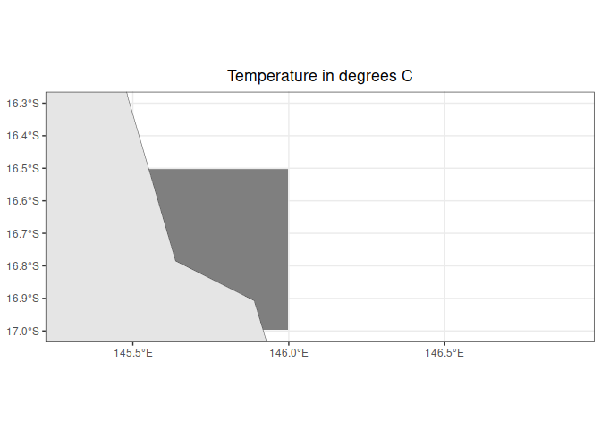

# eReef_maps_timeseries
Denisse Fierro Arcos
2024-01-14

- [Plotting maps and time series from eReefs
  outputs](#plotting-maps-and-time-series-from-ereefs-outputs)
  - [Loading libraries](#loading-libraries)
  - [Connecting to RIMREP collection via
    API](#connecting-to-rimrep-collection-via-api)
  - [Plotting data](#plotting-data)
  - [Calculating mean temperature values for area of
    interest](#calculating-mean-temperature-values-for-area-of-interest)
  - [Calculating time series for temperature
    raster](#calculating-time-series-for-temperature-raster)

# Plotting maps and time series from eReefs outputs

[eReefs](https://research.csiro.au/ereefs/) is a group of environmental
models managed by various government and non-profit organisations. These
models can simulate past conditions and predict future states for
hydrodynamic conditions, sediment transport, and water quality within
the Greet Barrier Reef (GBR). The aim is to provide information about
the past and current states of GBR, as well as its likely future
condition.

eReefs model outputs can be found in the DMS under the [**eReefs**
collection](https://stac.reefdata.io/browser/collections/ereefs). In
this notebook, we will use the [daily hydrodynamic model outputs at a 1
km
resolution](https://stac.reefdata.io/browser/collections/ereefs/items/aims-ereefs-agg-hydrodynamic-1km-daily?.asset=asset-data)
as an example of how to extract data.

## Loading libraries

``` r
#Loading useful_functions script
source("useful_functions.R")
#Mapping
library(terra)
library(sf)
library(tidyterra)
library(rnaturalearth)
#Dealing with tabular data
library(tibble)
```

## Connecting to RIMREP collection via API

From the STAC catalogue item for the [daily hydrodynamic model outputs
at a 1 km
resolution](https://stac.reefdata.io/browser/collections/ereefs/items/aims-ereefs-agg-hydrodynamic-1km-daily?.asset=asset-data),
we can get the link to the API from the *Additional Resources* section
of the page on the left under the map.

As an example, we will access data for using the API link for the period
between 2023-01-01 and 2023-01-07. We will only select data for coastal
waters up to ~150 km away from the coastline between Daintree and
Cairns.

**Note:** Before running the code chunk below, make sure you either have
store your user credentials as environmental variables, or have this
information with you to input in the `connect_dms_dataset` function
below. Alternatively, if you already have an access token, you can
provide this as an input in the `connect_dms_dataset` function. Refer to
**The data API** subsection under **How to use DMS services and data**
in the [README
page](https://github.com/aodn/rimrep-training/blob/main/CoTS-training-Jan2024/README.md)
for more information.

If you do not user credentials, you will not be able to access our API,
please contact the DMS team to set up an account by emailing
<info-dms@utas.edu.au>.

``` r
#Defining API URL (obtained from STAC catalogue)
base_url <- "https://pygeoapi.reefdata.io/collections/aims-ereefs-agg-hydrodynamic-1km-daily/"

#Defining variable of interest (obtained from STAC catalogue)
variable_name <- "temp"

#Connecting to DMS to extract data
temp_gbr <- connect_dms_dataset(API_base_url = base_url, 
                                variable_name, 
                                start_time = "2023-01-01", end_time = "2023-01-05", 
                                lon_limits = c(145.5, 146.00),
                                lat_limits = c(-17.00, -16.50))
```

    Warning: No 'access_token' and no user credentials were provided as input.

    Checking if 'CLIENT_ID' variable exists.

    Warning: No 'access_token' and user credentials were provided as input.

    Checking if 'CLIENT_SECRET' variable exists.

    Access token retrieved successfully.

## Plotting data

We will plot the first layer of this raster in a map to check the
temperature data.

``` r
#Get map of Australia
aust <- ne_countries(country = "Australia", returnclass = "sf")

#Start a plot
ggplot()+
  #Plot one raster layer
  geom_spatraster(data = temp_gbr$`temp_k=-140_1`)+
  #Choose a nicer palette for our map
  scale_fill_distiller(palette = "YlOrRd")+
  #Add Australia
  geom_sf(data = aust)+
  #Establish map limits
  lims(x = c(145.30, 146.90), y = c(-17, -16.30))+
  #Apply a nice predefined theme
  theme_bw()+
  #Add a title
  labs(title = "Temperature in degrees C")+
  #Center the plot title
  theme(plot.title = element_text(hjust = 0.5))
```



The dark grey areas in the plot are areas with no values in the model.
This is often seen in models because their grid may not match exactly
the land masses. However, this is a high resolution model (1 km grid
cells), so this needs more investigation. First, we will check our
multilayer raster.

``` r
temp_gbr
```

    class       : SpatRaster 
    dimensions  : 100, 100, 80  (nrow, ncol, nlyr)
    resolution  : 0.005, 0.005  (x, y)
    extent      : 145.4979, 145.9979, -17.0024, -16.5024  (xmin, xmax, ymin, ymax)
    coord. ref. : lon/lat WGS 84 
    source      : raster_dms_a85b2179b469.nc:temp 
    varname     : temp (Temperature) 
    names       : temp_~140_1, temp_~120_1, temp_~103_1, temp_k=-88_1, temp_k=-73_1, temp_k=-60_1, ... 
    unit        :   degrees C,   degrees C,   degrees C,    degrees C,    degrees C,    degrees C, ... 
    time (days) : 2023-01-02 to 2023-01-06 

We can see the dimensions are 140 rows (i.e., 140 grid cells along
`latitude`), 320 columns (i.e., 320 grid cells along `longitude`), and
112 layers. These layer should refer to the time steps, but why do we
have 112 when we requested data for seven days only? Let’s check the
time stamps.

``` r
time(temp_gbr)
```

     [1] "2023-01-02" "2023-01-02" "2023-01-02" "2023-01-02" "2023-01-02"
     [6] "2023-01-02" "2023-01-02" "2023-01-02" "2023-01-02" "2023-01-02"
    [11] "2023-01-02" "2023-01-02" "2023-01-02" "2023-01-02" "2023-01-02"
    [16] "2023-01-02" "2023-01-03" "2023-01-03" "2023-01-03" "2023-01-03"
    [21] "2023-01-03" "2023-01-03" "2023-01-03" "2023-01-03" "2023-01-03"
    [26] "2023-01-03" "2023-01-03" "2023-01-03" "2023-01-03" "2023-01-03"
    [31] "2023-01-03" "2023-01-03" "2023-01-04" "2023-01-04" "2023-01-04"
    [36] "2023-01-04" "2023-01-04" "2023-01-04" "2023-01-04" "2023-01-04"
    [41] "2023-01-04" "2023-01-04" "2023-01-04" "2023-01-04" "2023-01-04"
    [46] "2023-01-04" "2023-01-04" "2023-01-04" "2023-01-05" "2023-01-05"
    [51] "2023-01-05" "2023-01-05" "2023-01-05" "2023-01-05" "2023-01-05"
    [56] "2023-01-05" "2023-01-05" "2023-01-05" "2023-01-05" "2023-01-05"
    [61] "2023-01-05" "2023-01-05" "2023-01-05" "2023-01-05" "2023-01-06"
    [66] "2023-01-06" "2023-01-06" "2023-01-06" "2023-01-06" "2023-01-06"
    [71] "2023-01-06" "2023-01-06" "2023-01-06" "2023-01-06" "2023-01-06"
    [76] "2023-01-06" "2023-01-06" "2023-01-06" "2023-01-06" "2023-01-06"

We can see that we have data for the time period we wanted, but each day
is repeated multiple times. Why would that be? Let’s look at the names
of the raster for more information.

``` r
names(temp_gbr)
```

     [1] "temp_k=-140_1"  "temp_k=-120_1"  "temp_k=-103_1"  "temp_k=-88_1"  
     [5] "temp_k=-73_1"   "temp_k=-60_1"   "temp_k=-49_1"   "temp_k=-39.5_1"
     [9] "temp_k=-31_1"   "temp_k=-24_1"   "temp_k=-18_1"   "temp_k=-13_1"  
    [13] "temp_k=-9_1"    "temp_k=-5.35_1" "temp_k=-2.35_1" "temp_k=-0.5_1" 
    [17] "temp_k=-140_2"  "temp_k=-120_2"  "temp_k=-103_2"  "temp_k=-88_2"  
    [21] "temp_k=-73_2"   "temp_k=-60_2"   "temp_k=-49_2"   "temp_k=-39.5_2"
    [25] "temp_k=-31_2"   "temp_k=-24_2"   "temp_k=-18_2"   "temp_k=-13_2"  
    [29] "temp_k=-9_2"    "temp_k=-5.35_2" "temp_k=-2.35_2" "temp_k=-0.5_2" 
    [33] "temp_k=-140_3"  "temp_k=-120_3"  "temp_k=-103_3"  "temp_k=-88_3"  
    [37] "temp_k=-73_3"   "temp_k=-60_3"   "temp_k=-49_3"   "temp_k=-39.5_3"
    [41] "temp_k=-31_3"   "temp_k=-24_3"   "temp_k=-18_3"   "temp_k=-13_3"  
    [45] "temp_k=-9_3"    "temp_k=-5.35_3" "temp_k=-2.35_3" "temp_k=-0.5_3" 
    [49] "temp_k=-140_4"  "temp_k=-120_4"  "temp_k=-103_4"  "temp_k=-88_4"  
    [53] "temp_k=-73_4"   "temp_k=-60_4"   "temp_k=-49_4"   "temp_k=-39.5_4"
    [57] "temp_k=-31_4"   "temp_k=-24_4"   "temp_k=-18_4"   "temp_k=-13_4"  
    [61] "temp_k=-9_4"    "temp_k=-5.35_4" "temp_k=-2.35_4" "temp_k=-0.5_4" 
    [65] "temp_k=-140_5"  "temp_k=-120_5"  "temp_k=-103_5"  "temp_k=-88_5"  
    [69] "temp_k=-73_5"   "temp_k=-60_5"   "temp_k=-49_5"   "temp_k=-39.5_5"
    [73] "temp_k=-31_5"   "temp_k=-24_5"   "temp_k=-18_5"   "temp_k=-13_5"  
    [77] "temp_k=-9_5"    "temp_k=-5.35_5" "temp_k=-2.35_5" "temp_k=-0.5_5" 

The names gives us an indication of what is happening here. Let’s break
it down using the first name as an example: `temp_k=-140_1`. The first
part `temp_k` refers to our variable of interest, temperature. The
second part `-140` seems to be referring to the depth. If you look at
the names above, you can see that the negative numbers are repeated
several times. The last part of the name `_1` refers to the days of our
data, notice they are numbered one to seven, matching the seven days of
data we requested.

We could have also referred to the STAC catalogue for this
[item](https://stac.reefdata.io/browser/collections/ereefs/items/aims-ereefs-agg-hydrodynamic-1km-daily?.language=en-AU&.asset=asset-data),
which has links to the original data and metadata that can help us
understand our data.

Now that we understand our data structure better, we will calculate the
mean surface temperature for the seven days for which we have data, and
create a map.

## Calculating mean temperature values for area of interest

Before calculating a mean, we will need to subset our raster. Notice
that the smallest depth value in the names is -0.5, so we will use this
information to select the top layers only.

``` r
#Extract layer names for the surface
surf_layers <- str_subset(names(temp_gbr), "-0.5")

#Subsetting raster
sst_gbr <- temp_gbr[[surf_layers]]

#Checking results
sst_gbr
```

    class       : SpatRaster 
    dimensions  : 100, 100, 5  (nrow, ncol, nlyr)
    resolution  : 0.005, 0.005  (x, y)
    extent      : 145.4979, 145.9979, -17.0024, -16.5024  (xmin, xmax, ymin, ymax)
    coord. ref. : lon/lat WGS 84 
    source      : raster_dms_a85b2179b469.nc:temp 
    varname     : temp (Temperature) 
    names       : temp_k=-0.5_1, temp_k=-0.5_2, temp_k=-0.5_3, temp_k=-0.5_4, temp_k=-0.5_5 
    unit        :     degrees C,     degrees C,     degrees C,     degrees C,     degrees C 
    time (days) : 2023-01-02 to 2023-01-06 

We have a raster with seven layers and they all correspond to the
shallowest depth bin: -0.5 m. Now, we can calculate mean temperatures
using the `mean` function, so the `latitude` and `longitude` dimensions
of the raster remain same, but we will have 1 layer across time.

``` r
mean_sst_gbr <- mean(sst_gbr)
mean_sst_gbr
```

    class       : SpatRaster 
    dimensions  : 100, 100, 1  (nrow, ncol, nlyr)
    resolution  : 0.005, 0.005  (x, y)
    extent      : 145.4979, 145.9979, -17.0024, -16.5024  (xmin, xmax, ymin, ymax)
    coord. ref. : lon/lat WGS 84 
    source(s)   : memory
    name        :     mean 
    min value   : 28.91142 
    max value   : 30.46618 

Let’s plot a new map with the mean temperature values. We will also
change the colour of `NA` grid cells so we can clearly distinguish them
from the land.

``` r
#Start a plot
ggplot()+
  #Plot mean raster - Note that we do not need to specify a layer
  geom_spatraster(data = mean_sst_gbr)+
  #Choose a nicer palette for our map
  scale_fill_distiller(palette = "YlOrRd", 
                       #Change colour for NA grid cells
                       na.value = "#ff0099")+
  #Add Australia
  geom_sf(data = aust)+
  #Establish map limits
  lims(x = c(145.30, 146.90), y = c(-17, -16.30))+
  #Apply a nice predefined theme
  theme_bw()+
  #Add a title
  labs(title = "Mean temperature in degrees C")+
  #Center the plot title
  theme(plot.title = element_text(hjust = 0.5))
```


Now the `NA` grid cells show as a bright pink, and there are much less
of these grid cells, which makes sense. However, bright pink is probably
not the best choice of colour, but it highlights them in our example map
above. You can simply replace the pink by some other more sensible
choice.

## Calculating time series for temperature raster

The `terra` package has a `global` function that allows us to apply a
function across the entire raster. We will use it to calculate mean
temperature values for each time step. This will return a data frame
with mean temperature values per layer.

``` r
#Calculating mean temperature per time step
temp_ts_gbr <- global(temp_gbr, "mean", na.rm = T) |> 
  #Let's add a new column with the date for each raster
  mutate(date = time(temp_gbr))

#Let's check the result
temp_ts_gbr
```

                       mean       date
    temp_k=-140_1       NaN 2023-01-02
    temp_k=-120_1       NaN 2023-01-02
    temp_k=-103_1       NaN 2023-01-02
    temp_k=-88_1        NaN 2023-01-02
    temp_k=-73_1        NaN 2023-01-02
    temp_k=-60_1        NaN 2023-01-02
    temp_k=-49_1        NaN 2023-01-02
    temp_k=-39.5_1 29.02517 2023-01-02
    temp_k=-31_1   29.08847 2023-01-02
    temp_k=-24_1   29.14553 2023-01-02
    temp_k=-18_1   29.20213 2023-01-02
    temp_k=-13_1   29.25236 2023-01-02
    temp_k=-9_1    29.36831 2023-01-02
    temp_k=-5.35_1 29.60929 2023-01-02
    temp_k=-2.35_1 29.81189 2023-01-02
    temp_k=-0.5_1  29.78215 2023-01-02
    temp_k=-140_2       NaN 2023-01-03
    temp_k=-120_2       NaN 2023-01-03
    temp_k=-103_2       NaN 2023-01-03
    temp_k=-88_2        NaN 2023-01-03
    temp_k=-73_2        NaN 2023-01-03
    temp_k=-60_2        NaN 2023-01-03
    temp_k=-49_2        NaN 2023-01-03
    temp_k=-39.5_2 29.03897 2023-01-03
    temp_k=-31_2   29.09701 2023-01-03
    temp_k=-24_2   29.15175 2023-01-03
    temp_k=-18_2   29.22311 2023-01-03
    temp_k=-13_2   29.31686 2023-01-03
    temp_k=-9_2    29.48994 2023-01-03
    temp_k=-5.35_2 29.66415 2023-01-03
    temp_k=-2.35_2 29.75219 2023-01-03
    temp_k=-0.5_2  29.69616 2023-01-03
    temp_k=-140_3       NaN 2023-01-04
    temp_k=-120_3       NaN 2023-01-04
    temp_k=-103_3       NaN 2023-01-04
    temp_k=-88_3        NaN 2023-01-04
    temp_k=-73_3        NaN 2023-01-04
    temp_k=-60_3        NaN 2023-01-04
    temp_k=-49_3        NaN 2023-01-04
    temp_k=-39.5_3 29.03801 2023-01-04
    temp_k=-31_3   29.09585 2023-01-04
    temp_k=-24_3   29.15693 2023-01-04
    temp_k=-18_3   29.24275 2023-01-04
    temp_k=-13_3   29.35602 2023-01-04
    temp_k=-9_3    29.53535 2023-01-04
    temp_k=-5.35_3 29.71322 2023-01-04
    temp_k=-2.35_3 29.79909 2023-01-04
    temp_k=-0.5_3  29.72140 2023-01-04
    temp_k=-140_4       NaN 2023-01-05
    temp_k=-120_4       NaN 2023-01-05
    temp_k=-103_4       NaN 2023-01-05
    temp_k=-88_4        NaN 2023-01-05
    temp_k=-73_4        NaN 2023-01-05
    temp_k=-60_4        NaN 2023-01-05
    temp_k=-49_4        NaN 2023-01-05
    temp_k=-39.5_4 28.99049 2023-01-05
    temp_k=-31_4   29.06394 2023-01-05
    temp_k=-24_4   29.12626 2023-01-05
    temp_k=-18_4   29.21045 2023-01-05
    temp_k=-13_4   29.29530 2023-01-05
    temp_k=-9_4    29.47315 2023-01-05
    temp_k=-5.35_4 29.73605 2023-01-05
    temp_k=-2.35_4 29.90306 2023-01-05
    temp_k=-0.5_4  29.87348 2023-01-05
    temp_k=-140_5       NaN 2023-01-06
    temp_k=-120_5       NaN 2023-01-06
    temp_k=-103_5       NaN 2023-01-06
    temp_k=-88_5        NaN 2023-01-06
    temp_k=-73_5        NaN 2023-01-06
    temp_k=-60_5        NaN 2023-01-06
    temp_k=-49_5        NaN 2023-01-06
    temp_k=-39.5_5 28.82372 2023-01-06
    temp_k=-31_5   28.92342 2023-01-06
    temp_k=-24_5   29.00972 2023-01-06
    temp_k=-18_5   29.12119 2023-01-06
    temp_k=-13_5   29.21739 2023-01-06
    temp_k=-9_5    29.36470 2023-01-06
    temp_k=-5.35_5 29.56293 2023-01-06
    temp_k=-2.35_5 29.75117 2023-01-06
    temp_k=-0.5_5  29.79456 2023-01-06

Remember, the initial dataset has multiple layers for each because they
belong to different depth bins. We will add the depth bin information in
a new column using the row names.

``` r
temp_ts_gbr <- temp_ts_gbr |> 
  #Add row names to column named depth
  rownames_to_column("depth") |> 
  #Keep only depth information using regular expressions
  mutate(depth = as.numeric(str_extract(depth, "-(\\d{1,3}[.]\\d{1,2}|\\d{1,3})_", group = 1)),
         #We will transform depth to factors so it is easier to plot the data
         depth = factor(depth, levels = sort(unique(depth)), ordered = T))

#Checking results
head(temp_ts_gbr)
```

      depth mean       date
    1   140  NaN 2023-01-02
    2   120  NaN 2023-01-02
    3   103  NaN 2023-01-02
    4    88  NaN 2023-01-02
    5    73  NaN 2023-01-02
    6    60  NaN 2023-01-02

We will now plot the mean temperatures over time for every depth bin.

``` r
temp_ts_gbr |> 
  #Plotting per depth bin
  ggplot(aes(x = date, y = mean, color = depth))+
  #Use a line plot and increase line width
  geom_line(linewidth = 0.75)+
  #Change title of legend
  guides(colour = guide_legend(title = "Depth (m)"))+
  #Change the y axis label
  labs(y = "Mean temperature in degrees celsius")+
  #Change labels of x axis and show them daily
  scale_x_date(date_labels = "%Y-%m-%d", breaks = "1 day")+
  #Apply a nicer predefined theme
  theme_bw()+
  #Remove x axis title, change positioning of labels
  theme(axis.title.x = element_blank(), 
        axis.text.x = element_text(angle = 45, hjust = 1))
```

    Warning: Removed 35 rows containing missing values or values outside the scale range
    (`geom_line()`).


We have a line plot with mean temperatures over time for each depth bin
in the model. We can save this plot using the `ggsave` function.
