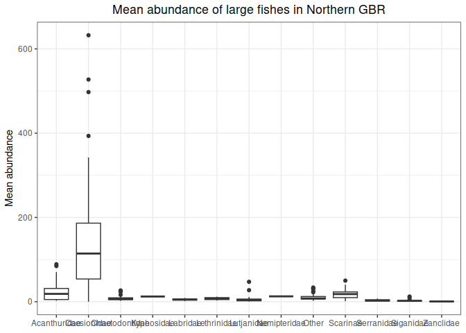

# LTMP_data_extraction
Denisse Fierro Arcos
2024-01-19

- [Goal of this notebook](#goal-of-this-notebook)
- [Loading libraries](#loading-libraries)
- [Connecting to RIMReP collection](#connecting-to-rimrep-collection)
  - [Exploring dataset structure](#exploring-dataset-structure)

# Goal of this notebook

This notebook will demonstrate how to access the Long-Term Monitoring
Program (LTMP) dataset from AIMS. The goal of the LTMP is to measure the
long-term status and trend of reefs in the Great Barrier Reef (GBR)
World Heritage Area. Data has been collected across the GBR for over 35
years. There are a variety of variables measured during this campaign,
but they all provide information about the health of the coral reefs.

You can see more information about the LTMP in our
[catalogue](https://stac.reefdata.io/browser/collections/aims-ltmp-mmp-coralreef/items/aims-ltmp-mmp-coralreef-model).

# Loading libraries

``` r
#Accessing S3 bucket
library(arrow)
#Data manipulation
library(dplyr)
library(tidyr)
library(stringr)
#Managing dates
library(lubridate)
#Plotting
library(ggplot2)
```

# Connecting to RIMReP collection

We will connect to the LTMP dataset from AIMS stored in a S3 bucket.
Depending on your internet connection, this make take a couple of
minutes.

``` r
#Establishing connection
data_bucket <- s3_bucket("s3://gbr-dms-data-public/aims-ltmp-mmp-coralreef-model/data.parquet")

#Accessing dataset
data_df <- open_dataset(data_bucket)
```

## Exploring dataset structure

We can explore the dataset `schema` to understand its structure, and
identify the variables that are relevant to us.

``` r
#Checking data structure
data_df$schema
```

    Schema
    a_sector: double
    aims_reef_name: double
    data_type: string
    date: string
    depth: double
    domain_category: string
    domain_name: string
    fullreef_id: double
    gaz_name: double
    gbrmpa_reef_id: double
    id: int64
    lat_deg: double
    lat_min: double
    long_deg: double
    long_min: double
    lower: double
    mean: double
    median: double
    nrm_region: double
    project_code: string
    purpose: string
    reef_id: double
    reef_name: double
    reef_zone: string
    reefpage_category: string
    report_year: int64
    shelf: string
    upper: double
    variable: string
    geometry: binary
    minx: double
    miny: double
    maxx: double
    maxy: double
    fid: int64

    See $metadata for additional Schema metadata

We can see there is a `variable` column, which will give us an
indication of the information included in the dataset before loading it
to memory. We will check the unique values for this column.

``` r
data_df |> 
  distinct(variable) |> 
  collect()
```

    # A tibble: 13 × 1
       variable         
       <chr>            
     1 Large fishes     
     2 Damselfishes     
     3 Total fishes     
     4 Harvested        
     5 Herbivores       
     6 Coral Trout      
     7 Secondary targets
     8 HC               
     9 HARD CORAL       
    10 ABUNDANCE        
    11 ALGAE            
    12 MACROALGAE       
    13 SOFT CORAL       

Let’s explore the `Large fishes` a bit further. We can check the time
period for which we have records for this variable.

``` r
data_df |> 
  #Note that we need to write the variable exactly as it is showing above
  filter(variable == "Large fishes") |> 
  #We select the date column
  select(date) |> 
  #Turn the string to date type
  mutate(date = ymd(date)) |> 
  #Now we will get the minimum and maximum dates
  summarise(min = min(date, na.rm = T), max = max(date, na.rm = T)) |>
  collect()
```

    # A tibble: 1 × 2
      min        max       
      <date>     <date>    
    1 1994-10-16 2024-05-15

We can continue exploring the dataset this way before we decide the data
that is relevant to us. This helps us avoid downloading large datasets
to our machines. For this exercise, we will load data for `Large fishes`
collected in 2023 only.

``` r
large_fishes_23 <- data_df |> 
  #Remove geometry field. This is a big object and it will slow any process
  select(!geometry) |> 
  #Note that we need to write the variable exactly as it is showing above
  filter(variable == "Large fishes") |> 
  #Turn the string to date type
  mutate(date = ymd(date), 
         #Add a year column so we can filter data easily
         year = year(date),
         month = month(date)) |> 
  filter(year == 2023) |> 
  collect()

#Checking results
head(large_fishes_23)
```

    # A tibble: 6 × 36
      a_sector aims_reef_name data_type date       depth domain_category domain_name
         <dbl>          <dbl> <chr>     <date>     <dbl> <chr>           <chr>      
    1       NA             NA fish      2023-03-02     9 reef            HASTINGS R…
    2       NA             NA fish      2023-02-01     9 reef            REBE REEF  
    3       NA             NA fish      2023-01-30     9 reef            REEF 19-131
    4       NA             NA fish      2023-01-30     9 reef            REEF 19-131
    5       NA             NA fish      2023-01-30     9 reef            REEF 19-131
    6       NA             NA fish      2023-01-30     9 reef            REEF 19-131
    # ℹ 29 more variables: fullreef_id <dbl>, gaz_name <dbl>, gbrmpa_reef_id <dbl>,
    #   id <int>, lat_deg <dbl>, lat_min <dbl>, long_deg <dbl>, long_min <dbl>,
    #   lower <dbl>, mean <dbl>, median <dbl>, nrm_region <dbl>,
    #   project_code <chr>, purpose <chr>, reef_id <dbl>, reef_name <dbl>,
    #   reef_zone <chr>, reefpage_category <chr>, report_year <int>, shelf <chr>,
    #   upper <dbl>, variable <chr>, minx <dbl>, miny <dbl>, maxx <dbl>,
    #   maxy <dbl>, fid <int>, year <int>, month <int>

We can now create a plot of mean abundance per taxa, but first we will
remove rows with no taxa.

``` r
large_fishes_23 |> 
  #Remove rows with no taxa information
  drop_na(reefpage_category) |> 
  #Create box plots
  ggplot(aes(x = reefpage_category, y = mean))+
  geom_boxplot()+
  #Apply a nicer theme to the plot
  theme_bw()+
  #Fix y axis label and add title
  labs(y = "Mean abundance", title = "Mean abundance of large fishes in Northern GBR")+
  #Removing label for x axis
  theme(axis.title.x = element_blank(),
        #Center plot title
        plot.title = element_text(hjust = 0.5))
```



As with the other examples, you are able to save any summarised data our
outputs to your computer.
