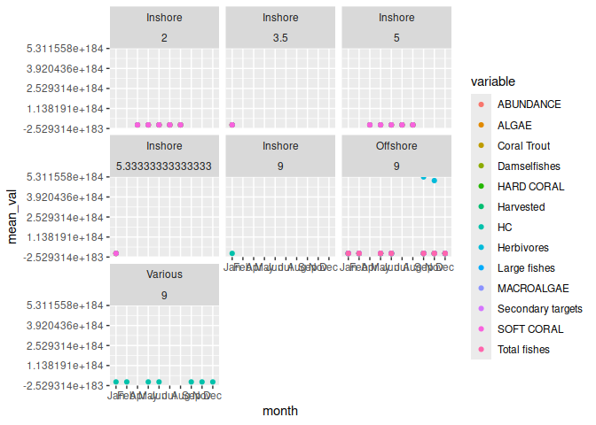
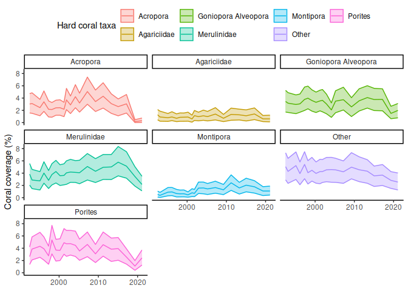

Extracting data from LTMP model
================
Denisse Fierro Arcos
2024-01-19

- [Goal of this notebook](#goal-of-this-notebook)
- [Loading libraries](#loading-libraries)
- [Connecting to RIMReP collection](#connecting-to-rimrep-collection)
  - [Exploring dataset structure](#exploring-dataset-structure)
  - [Extra example during workshop](#extra-example-during-workshop)

# Goal of this notebook

This notebook will demonstrate how to access the Long-Term Monitoring
Program (LTMP) dataset from AIMS. The goal of the LTMP is to measure the
long-term status and trend of reefs in the Great Barrier Reef (GBR)
World Heritage Area. Data has been collected across the GBR for over 35
years. There are a variety of variables measured during this campaign,
but they all provide information about the health of the coral reefs.

You can see more information about the LTMP in our
[catalogue](https://stac.reefdata.io/browser/collections/aims-ltmp-mmp-coralreef/items/aims-ltmp-mmp-coralreef-model).

# Loading libraries

``` r
#Accessing S3 bucket
library(arrow)
#Data manipulation
library(dplyr)
library(tidyr)
library(stringr)
library(janitor)
#Managing dates
library(lubridate)
#Plotting
library(ggplot2)
```

# Connecting to RIMReP collection

We will connect to the LTMP dataset from AIMS stored in a S3 bucket.
Depending on your internet connection, this make take a couple of
minutes.

``` r
#Establishing connection
data_bucket <- s3_bucket("s3://gbr-dms-data-public/aims-ltmp-mmp-coralreef-model/data.parquet")

#Accessing dataset
data_df <- open_dataset(data_bucket)
```

## Exploring dataset structure

We can explore the dataset `schema` to understand its structure, and
identify the variables that are relevant to us.

``` r
#Checking data structure
data_df$schema
```

    ## Schema
    ## a_sector: double
    ## aims_reef_name: double
    ## data_type: string
    ## date: string
    ## depth: double
    ## domain_category: string
    ## domain_name: string
    ## fullreef_id: double
    ## gaz_name: double
    ## gbrmpa_reef_id: double
    ## id: int64
    ## lat_deg: double
    ## lat_min: double
    ## long_deg: double
    ## long_min: double
    ## lower: double
    ## mean: double
    ## median: double
    ## nrm_region: double
    ## project_code: string
    ## purpose: string
    ## reef_id: double
    ## reef_name: double
    ## reef_zone: string
    ## reefpage_category: string
    ## report_year: int64
    ## shelf: string
    ## upper: double
    ## variable: string
    ## geometry: binary
    ## minx: double
    ## miny: double
    ## maxx: double
    ## maxy: double
    ## fid: int64
    ## 
    ## See $metadata for additional Schema metadata

We will get the first rows of the dataset to understand the information
included in it because the column names are not very informative.

``` r
df_sub <- data_df |> 
  #We will ignore the geometry column for now
  select(!geometry) |> 
  #Get the first 10 rows
  slice_head(n = 10) |> 
  collect()

#Check results
names(df_sub)
```

    ##  [1] "a_sector"          "aims_reef_name"    "data_type"        
    ##  [4] "date"              "depth"             "domain_category"  
    ##  [7] "domain_name"       "fullreef_id"       "gaz_name"         
    ## [10] "gbrmpa_reef_id"    "id"                "lat_deg"          
    ## [13] "lat_min"           "long_deg"          "long_min"         
    ## [16] "lower"             "mean"              "median"           
    ## [19] "nrm_region"        "project_code"      "purpose"          
    ## [22] "reef_id"           "reef_name"         "reef_zone"        
    ## [25] "reefpage_category" "report_year"       "shelf"            
    ## [28] "upper"             "variable"          "minx"             
    ## [31] "miny"              "maxx"              "maxy"             
    ## [34] "fid"

We can see that there are a number of columns that are completely empty.
We can remove these columns to make the dataset more manageable.

``` r
df_sub <- df_sub |> 
  #Remove columns with no data
  remove_empty("cols")

#Check results
df_sub
```

    ## # A tibble: 10 × 21
    ##    data_type date    depth domain_category domain_name     id lower  mean median
    ##    <chr>     <chr>   <dbl> <chr>           <chr>        <int> <dbl> <dbl>  <dbl>
    ##  1 fish      2020-0…     9 reef            JENKINS RE… 405425  62.6  75.9   75.3
    ##  2 fish      2018-0…     9 reef            JENKINS RE… 405426  61.5  72.7   72.1
    ##  3 fish      2016-0…     9 reef            JENKINS RE… 405427  46.2  54.6   54.5
    ##  4 fish      2013-1…     9 reef            JENKINS RE… 405428  46.2  54.5   54.0
    ##  5 fish      2012-0…     9 reef            JENKINS RE… 405429  48.6  57.5   57.1
    ##  6 fish      2009-1…     9 reef            JENKINS RE… 405430  44.9  53.8   53.8
    ##  7 fish      2008-0…     9 reef            JENKINS RE… 405431  47.6  57.4   56.9
    ##  8 fish      2006-0…     9 reef            JENKINS RE… 405432  57.9  69.5   69.0
    ##  9 fish      2020-0…     9 reef            JENKINS RE… 405433  79.4 128.   122. 
    ## 10 fish      2018-0…     9 reef            JENKINS RE… 405434 267.  446.   432. 
    ## # ℹ 12 more variables: project_code <chr>, purpose <chr>, reef_zone <chr>,
    ## #   report_year <int>, shelf <chr>, upper <dbl>, variable <chr>, minx <dbl>,
    ## #   miny <dbl>, maxx <dbl>, maxy <dbl>, fid <int>

We can see that the dataset contains information about the date of the
record, the location of the record (`domain_name` and `shelf`), the
depth, the variable measured, among other things.

For this example, we will extract data for the year 2020, and we will
calculate the mean abundance of fishes (`variable` columns) for each
`domain_name`, `depth` and `shelf` combination.

``` r
data_mth <- data_df |> 
  #We will ignore the geometry column for now
  select(!geometry) |> 
  #Select data for 2020
  filter(report_year == 2020) |> 
  #Return results
  collect() |> 
  #Add a month column
  mutate(month = month(ymd(date), label = T)) |>
  remove_empty("cols") |> 
  #Group data
  group_by(month, depth, shelf, variable) |>
  #Calculate mean abundance
  summarise(mean_val = mean(mean, na.rm = T)) |> 
  ungroup()
```

    ## `summarise()` has grouped output by 'month', 'depth', 'shelf'. You can override
    ## using the `.groups` argument.

``` r
#Check results
head(data_mth)
```

    ## # A tibble: 6 × 5
    ##   month depth shelf   variable   mean_val
    ##   <ord> <dbl> <chr>   <chr>         <dbl>
    ## 1 Jan    3.5  Inshore ABUNDANCE    0.541 
    ## 2 Jan    3.5  Inshore ALGAE        0.418 
    ## 3 Jan    3.5  Inshore HARD CORAL   0.260 
    ## 4 Jan    3.5  Inshore MACROALGAE   0.104 
    ## 5 Jan    3.5  Inshore SOFT CORAL   0.0512
    ## 6 Jan    5.33 Inshore ABUNDANCE    0.693

Let’s check what the mean abundance of fishes looks like for each month.

``` r
data_mth |> 
  ggplot(aes(month, mean_val, color = variable))+
  geom_point()+
  facet_wrap(shelf~depth)
```

<!-- -->

It appears that most of the data in 2020 came from offshore areas at a
depth of 9 meters.

By checking the contents of a subset of the dataset, we can get a better
idea of the information included in it. This will help us to identify
the variables that are relevant to us, and to understand the structure
of the dataset.

## Extra example during workshop

Plotting hard coral cover over entire period of dataset.

``` r
#Extracting hard coral data
hc <- data_df |>
  #Ignoring geometries (because it takes a long time)
  select(!geometry) |>
  filter(variable == "HARD CORAL") |> 
  collect()

#Creating a plot
hc |> 
  #Transforming to percentage
  mutate(mean = mean*100, lower = lower*100, upper = upper*100) |> 
  remove_empty("cols") |> 
  filter(domain_name == "LANGFORD AND BIRD ISLES" &
           domain_category == "reef" & purpose == "COMPOSITION") |> 
  mutate(date = ymd(date)) |> 
  ggplot(aes(date, mean, color = reefpage_category))+
  geom_line()+
  geom_ribbon(aes(ymin = lower, ymax = upper, 
                  fill = reefpage_category), alpha = 0.3)+
  facet_wrap(~reefpage_category)+
  labs(fill = "Hard coral taxa", color = "Hard coral taxa",
       y = "Coral coverage (%)")+
  theme_classic()+
  theme(axis.title.x = element_blank(), legend.position = "top")
```

<!-- -->
