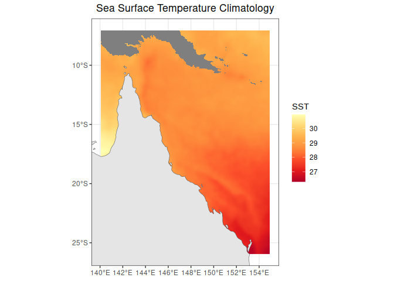
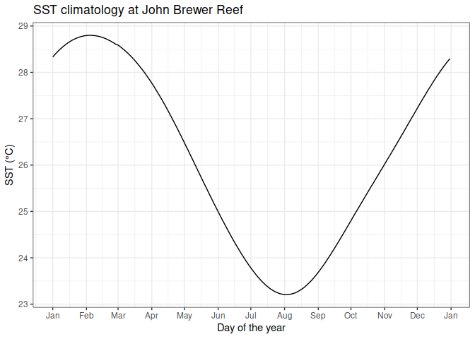

SST climatologies
================
DMS team
2024-05-25

- [Goal of this notebook](#goal-of-this-notebook)
- [Load libraries](#load-libraries)
- [NOAA SST climatology](#noaa-sst-climatology)
  - [Connecting to RIMREP collection via
    API](#connecting-to-rimrep-collection-via-api)
  - [Plotting the climatology for the GBR
    region](#plotting-the-climatology-for-the-gbr-region)
  - [Extrac MMM value for one reef
    location](#extrac-mmm-value-for-one-reef-location)
  - [SSTAARS SST climatology](#sstaars-sst-climatology)

# Goal of this notebook

This notebook will demonstrate how to access the the different
collections that contain Sea Surface Temperature climatologies. We will
plot a map of a climatological values for a region, extract
climatological expected temperature values from one point and produce a
plot of the climatological year for one area.

The main DMS items used in this notebook are:

- NOAA SST climatology
  (<https://stac.reefdata.io/browser/collections/noaa-crw/items/noaa-crw-climatology>)  
- SSTAARS SST climatology
  (<https://stac.reefdata.io/browser/collections/imos-satellite-remote-sensing/items/csiro-sstaars-daily>)

Note that the methodology behind each of the climatologies are very
different, so the values are not directly comparable. Please refer to
the original metadata for more information.

# Load libraries

``` r
#Loading useful_functions script
source("useful_functions.R")
#Gridded data
library(terra)
library(tidyterra)
#Shapefiles
library(sf)
#Base maps
library(rnaturalearth)
#Data manupulation
library(tibble)
library(tidyr)
```

# NOAA SST climatology

This dataset is a monthly climatology of Sea Surface Temperature (SST)
from NOAA Coral Reef Watch (CRW). The data is available at 0.05 degree
resolution and covers the period 1985-2019. It contains the expected SST
for each month of the year and the Maximum Monthly Mean (MMM).

## Connecting to RIMREP collection via API

From the STAC catalogue item for the [NOAA CRW SST
Climatology](https://stac.reefdata.io/browser/collections/noaa-crw/items/noaa-crw-climatology),
we can get the link to the API from the *Additional Resources* section
of the page under the map.

**Note:** Before running the code chunk below, make sure you either have
store your user credentials as environmental variables, or have this
information with you to input in the `connect_dms_dataset` function
below. Alternatively, if you already have an access token, you can
provide this as an input in the `connect_dms_dataset` function. Refer to
**The data API** subsection under **How to use DMS services and data**
in the [README
page](https://github.com/aodn/rimrep-training/blob/main/CoTS-training-Jan2024/README.md)
for more information.

If you do not have user credentials, you will not be able to access our
API, please contact the DMS team to set up an account by emailing
<info-dms@utas.edu.au>.

``` r
#Defining API URL (obtained from STAC catalogue)
base_url <- "https://pygeoapi.reefdata.io/collections/noaa-crw-climatology"

#Restrict the data to the GBR region
latMin = -26
latMax = -7
lonMin = 140
lonMax = 155

#Defining variable of interest (obtained from STAC catalogue)
variable_name <- "sst_clim_mmm"

#Connecting to DMS and downloading data
mmm_gbr <- connect_dms_dataset(base_url, variable_name, 
                               lat_limits = c(latMin, latMax), 
                               lon_limits = c(lonMin, lonMax))
```

    ## Warning: No 'access_token' and no user credentials were provided as input.

    ## Checking if 'CLIENT_ID' variable exists.

    ## Warning: No 'access_token' and user credentials were provided as input.

    ## Checking if 'CLIENT_SECRET' variable exists.

    ## Access token retrieved successfully.

    ## Loading required package: jsonlite

    ## Data downloaded successfully.

## Plotting the climatology for the GBR region

Note that the MMM retrieves actually two variables, the MMM climatology
and the land mask. We are interested in the MMM.

``` r
#Get map of Australia
aust <- ne_countries(country = "Australia", returnclass = "sf", scale = "medium")

#Start a plot
pp <- ggplot()+
  #Plot one raster layer
  geom_spatraster(data = mmm_gbr$sst_clim_mmm)+
  #Choose a nicer palette for our map
  scale_fill_distiller(palette = "YlOrRd", name = "SST")+
  #Add Australia
  geom_sf(data = aust)+
  #Set map limits
  lims(x = c(lonMin, lonMax), y = c(latMin, latMax))+
  #Apply a nice predefined theme
  theme_bw()+
  #Add a title
  labs(title = "Sea Surface Temperature Climatology")+
  #Center the plot title
  theme(plot.title = element_text(hjust = 0.5), 
        legend.title = element_text("MMM (°C)"))

print(pp)
```

<!-- -->

## Extrac MMM value for one reef location

Using the `gbr_features` function from `useful_functions` we can extract
the location of one reef and use its coordinates to extract the
corresponding MMM value. Let’s extract the coordinates of John Brewer
Reef in the central region of the GBR.

``` r
#Get the coordinates of John Brewer Reef
john_brewer <- gbr_features("John Brewer Reef")
```

    ## Subsetting GBR features by john brewer reef (18-075)

``` r
#extract the value of the MMM for John Brewer Reef
john_brewer_MMM <- terra::extract(mmm_gbr$sst_clim_mmm, john_brewer)
```

    ## Warning: [extract] transforming vector data to the CRS of the raster

This will extract TWO values as the polygon covers two MMM pixels. We
will take the mean of the two values.

``` r
john_brewer_MMM <- mean(john_brewer_MMM$sst_clim_mmm, na.rm = T)
```

Now let’s explore the evolution of the SST at john Brewer Reef over 2024
summer:

``` r
#Get SST values for JB reef form NOAA CRW SST item
base_url <- "https://pygeoapi.reefdata.io/collections/noaa-crw-chs-sst"
var_name <- "analysed_sst"
jb_sst <- connect_dms_dataset(base_url, "sst_climatology", variable_name = var_name,
                              start_time = "2023-12-01", end_time = "2024-04-15", 
                              bounding_shape = john_brewer)
```

    ## Warning: No 'access_token' and no user credentials were provided as input.

    ## Checking if 'CLIENT_ID' variable exists.

    ## Warning: No 'access_token' and user credentials were provided as input.

    ## Checking if 'CLIENT_SECRET' variable exists.

    ## Access token retrieved successfully.

    ## Data downloaded successfully.

``` r
#As the result includes two cells, let's take the average of the cells for each date
jb_sst_mean <- global(jb_sst, mean, na.rm = T)
```

    ## Warning in x@ptr$mglobal(txtfun, na.rm, opt): GDAL Message 1: 1-pixel
    ## width/height files not supported, xdim: 2 ydim: 1

``` r
#Add timestamp to the data
jb_sst_mean$time <- as.Date(time(jb_sst))

#Plot the SST evolution
pp <- ggplot(jb_sst_mean, aes(x = time, y = mean))+
  geom_line()+
  geom_hline(yintercept = john_brewer_MMM, linetype = "dashed", color = "red")+
  #add MMM label to MMM line
  annotate("text", x = as.Date("2023-12-01"), y = john_brewer_MMM, label = "MMM", color = "red", vjust=-1)+
  labs(title = "SST evolution at John Brewer Reef", subtitle = "2024", x = "Date", y = "SST (°C)")+
  theme_bw()
pp
```

<!-- -->

## SSTAARS SST climatology

Let’s do the same but using SSTAARS climatology. It contains the mean
climatological value of the SST for each day of the year. The data is
available at 2km of resolution considering the period from 1992 to 2016.

``` r
#Defining API URL (obtained from STAC catalogue)
base_url <- "https://pygeoapi.reefdata.io/collections/csiro-sstaars-daily"

#Defining variable of interest (obtained from STAC catalogue)
variable_name <- "TEMP_DAY_OF_YEAR"

#Connecting to DMS and downloading data
sstaars_gbr <- connect_dms_dataset(base_url, variable_name,
                                   bounding_shape = john_brewer)
```

    ## Warning: No 'access_token' and no user credentials were provided as input.

    ## Checking if 'CLIENT_ID' variable exists.

    ## Warning: No 'access_token' and user credentials were provided as input.

    ## Checking if 'CLIENT_SECRET' variable exists.

    ## Access token retrieved successfully.

    ## Data downloaded successfully.

As we asked for a polygon that contains many pixels corresponding to the
1km SSTAARS grid, we will take the mean of the values.

``` r
## Take the mean of the climatological values per day
sstaars_gbr_mean <- global(sstaars_gbr, mean, na.rm = T)

## add a day sequence to the resulting dataframe
seqTime <- seq.Date(as.Date("2024-01-01"), as.Date("2024-12-31"), by = "day")

## As the climatology is based on a non-leap year, we need to remove 29 February from the series
seqTime <- seqTime[!grepl("02-29", seqTime)]

## Add to the data frame
sstaars_gbr_mean$time <- seqTime


## plot using ggplot2
pp <- ggplot(sstaars_gbr_mean, aes(x = time, y = mean))+
  geom_line()+
  labs(title = "SST climatology at John Brewer Reef", x = "Day of the year", y = "SST (°C)")+
  scale_x_date(date_labels = "%b", date_breaks = "1 month")+
  theme_bw()
pp
```

<!-- -->

Let’s compare the SST values for 2024 with the SSTAARS climatology:

``` r
## Plot SST values aling with climatological values
pp <- ggplot(jb_sst_mean, aes(x = time, y = mean)) +
  geom_line() +
  geom_line(data = sstaars_gbr_mean, aes(x = time, y = mean), color = "red") +
  ## Add SSTAARS label at the end of the line
  annotate("text", x = as.Date("2024-04-10"), y = sstaars_gbr_mean$mean[length(sstaars_gbr_mean$mean)], label = "SSTAARS", color = "red", vjust=9)+
  ## add MMM line
  geom_hline(yintercept = john_brewer_MMM, linetype = "dashed", color = "coral") +
  ## Add MMM label at the end of the line
  annotate("text", x = as.Date("2024-04-15"), y = john_brewer_MMM, label = "MMM", color = "coral", vjust=-0.5)+
  ## limit the plot to January-April 2024 and adjust the y scale
  coord_cartesian(xlim = as.Date(c("2024-01-01", "2024-04-15")), ylim = c(26, 31))+
  labs(title = "SST evolution at John Brewer Reef - 2024", x = "Date", y = "SST (°C)")+
  theme_classic(base_size = 14)
  

pp
```

<!-- -->
