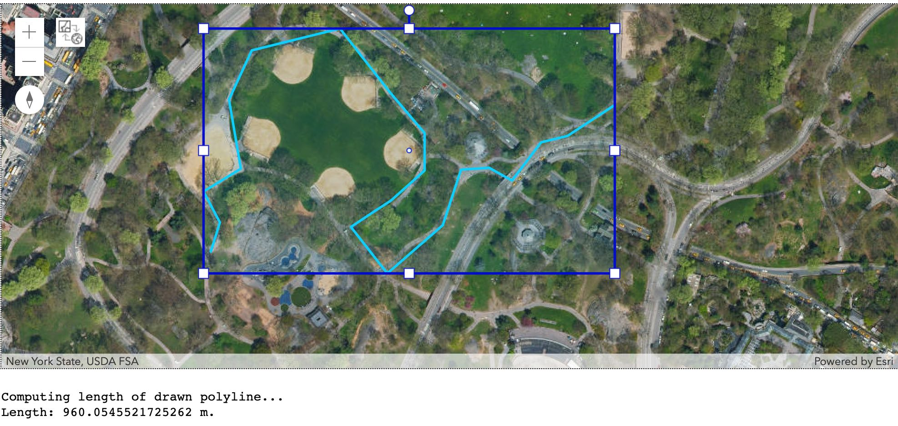

```{r setup, include=FALSE}
knitr::opts_chunk$set(echo = TRUE)
```

# Goal of this notebook

This notebook will show how to access the RIMReP `geoparquet` collection for Great Barrier Reef (GBR) Feature from the Great Barrier Reef Marine Park Authority (GBRMPA). This dataset includes the unique IDs and names of all features above water, including sand banks, reefs, cays, islets, and islands. Since this dataset includes spatial data, we can extract the spatial limits of each feature included in this dataset.  
  
We will use the spatial boundaries to extract environmental or biological information for sites of our interest.  

# Workflow to be followed in this notebook
1. Connect to RIMReP_DMS to access and explore it the GBR features data collection
2. Get GBR features geometries to extract information from biological or environmental dataset within an area of interest
3. Convert WKB geometries into Simple Feature (sf) objects. 
4. Export polygons as shapefiles


**Glosary:**  
- WKB stands for [well-known binary](https://loc.gov/preservation/digital/formats/fdd/fdd000549.shtml), which is one way to represent geometries (i.e., spatial compondng of a feature).  
- A simple feature refers to the two-dimensional representation of an object in the real world (e.g., a tree, a reef, island, country, etc.). Here we use the `sf` package to deal with simple features. If you would like more information on simple features, you can refer to the [`sf website](https://r-spatial.github.io/sf/articles/sf1.html#what-is-a-feature).  

## Loading libraries

```{r libraries, results = "hide", message = F, warning = F}
library(arrow)
library(dplyr)
library(magrittr)
library(stringr)
library(wkb)
library(ggplot2)
library(sf)
library(lubridate)
library(rnaturalearth)
```

## Connecting to RIMReP collection

Connecting to the Great Barrier Reef Feature dataset. This can take a minute or so.

```{r connect}
#Establishing connection
data_bucket <- s3_bucket("s3://rimrep-data-public/gbrmpa-complete-gbr-features")

#Accessing dataset
data_df <- open_dataset(data_bucket)
```

## Exploring dataset structure

We can explore the dataset `schema` to understand its structure, and identify the fields that are relevant to us.

```{r explore}
#Checking data structure
data_df$schema
```
We can see that there are a number of variables available in this dataset. We will need to access four variables to create a list of all above water sites in the Great Barrier Reef Marine Park:  
- `UNIQUE_ID`, which includes a unique identification number for each area above water  
- `GBR_NAME`, which includes the name of each location above water  
- `LOC_NAME_S`, combination between feature name and unique ID  
- `geometry`, which includes latitude and longitude coordinates in WKB format.  
  
We will transform the information in the `geometry` field into coordinate pairs (i.e., latitude and longitude in degrees for each node along its boundary).  
  
**Note:** One location (`GBR_NAME`) may contain multiple values under the `UNIQUE_ID` column. This is because above water structures may not appear connected when looking at the surface, but they are part of the same structure and thus are connected under water.
  
## Extracting sites and coordinates from dataset

We can extract data from the GBR features dataset by using `dplyr` verbs as shown below. This could take from a few seconds up to a minute depending on the speed of your Internet connection.

```{r sites_bin}
sites <- data_df %>% 
  #We select unique sites included in the dataset
  distinct(UNIQUE_ID, GBR_NAME, LOC_NAME_S, geometry) %>%
  #This will load them into memory
  collect()

#Checking results
glimpse(sites)
```
As explained above, the `geometry` field is in WKB format, which we will transform into degree coordinates in the next step. Here, we will use the `readWKB` function from the `WKB` package to transform the `geometry` and then we will convert it to an `sf` object for easy data manipulation.

### Transforming `geometry` format
```{r sites_deg}
sites <- sites %>% 
  #Adding column with spatial information in degrees
  mutate(coords_deg = readWKB(geometry) %>% st_as_sf())

#Clean up sites information transforming into shapefile
sites <- sites %>%
  #Removing original geometry column
  select(!geometry) %>% 
  #Renaming coordinate degrees column
  mutate(coords_deg = coords_deg$geometry) %>% 
  rename("geometry" = "coords_deg") %>% 
  #Transforming into shapefile
  st_as_sf() %>% 
  #Assigning reference systems: WGS84 (EPSG: 4326)
  st_set_crs(4326)

#Checking results - We will exclude the geometry column
head(sites)
```
When [exploring the GBR features dataset](#exploring-dataset-structure), you may have noticed other fields besides `geometry` that contain spatial information. For example, `X_COORD` and `Y_COORD` contain the coordinates of the centroid of each feature in the GBR dataset. While, `minx`, `miny`, `maxx`, and `maxy` fields contain the coordinates for the lower left corner and the upper right corner of a feature. This is otherwise known as the extent, which is a rectangle covering the maximum spatial extent of a feature. 

We chose to use the `geometry` field in this notebook because it gives us access to fine scale data about a feature (see light blue line in image below). The centroid (`X_COORD` and `Y_COORD` fields) would have only given information about a single point (white dot at the centre of the image). The extent (dark blue rectangle), on the other hand, would have coarsen the resolution of a feature.  
  
.


## Plotting all features 

We will make a map of all features included within the Great Barrier Reef Marine Protected Area in green so they are easily recognised. Note that the GBR features also includes a `Mainland` location, which represents the state of Queensland. We will show this state as light red.

```{r map_sites}
#Loading basemap with countries in Oceania and Asia
australia <- ne_countries(country = "Australia", returnclass = "sf")

#Extracting mainland Australia for plotting
mainland_aus <- sites %>% 
  filter(str_detect(LOC_NAME_S, "Mainland"))

#Creating map with all features included in GBR dataset
#Plotting basemap of Australia
australia %>% 
  ggplot()+
  geom_sf()+
  #Adding all GBR features in green
  geom_sf(inherit.aes = F, data = sites, color = "green", fill = "green")+
  #Adding mainland features included in the dataset
  geom_sf(inherit.aes = F, data = mainland_aus, fill = "#f28f7f")+
  #Adjusting limits to focus on GBR: East of 130E and north of 30S
  lims(x = c(130, NA), y = c(-30, NA))+
  #Removing default grey background
  theme_bw()
```

## Saving GBR features as shapefile
We will need to provide a path to the folder where we want to save our shapefile containing the limits of all features within the GBR Marine Protected Area.

```{r saving_outputs, eval = F}
#First we will provide a path to the folder where we want to save our data
folder_out <- "Outputs"

#Checking if folder exists, if not, create it
if(!dir.exists(folder_out)){
  dir.create(folder_out)
}

#Saving data summaries
shp_out <- paste(folder_out, "GBR_features.shp", sep = "/")
#Setting delete layer to TRUE to allow shapefile to be overwritten if needed
write_sf(sites, shp_out, delete_layer = TRUE)
```

