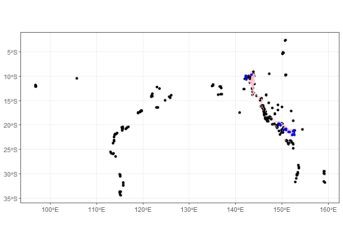
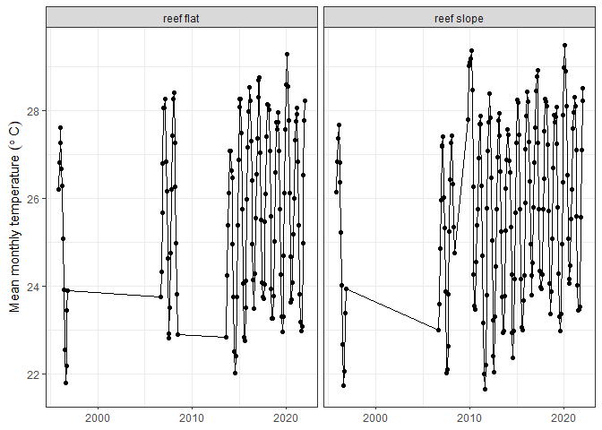

- [Goal of this notebook](#goal-of-this-notebook)
- [Loading libraries](#loading-libraries)
- [Connecting to RIMReP collection](#connecting-to-rimrep-collection)
- [Extracting monitoring sites and their
  coordinates](#extracting-monitoring-sites-and-their-coordinates)
- [Identifying AIMS sites within GBR feature of
  interest](#identifying-aims-sites-within-gbr-feature-of-interest)
  - [Identifying sites of interest](#identifying-sites-of-interest)
    - [Mapping with `ggplot2`](#mapping-with-ggplot2)
    - [Mapping with `leaflet`](#mapping-with-leaflet)
  - [Extracting temperature for monitoring site within area of
    interest](#extracting-temperature-for-monitoring-site-within-area-of-interest)
  - [Plotting timeseries](#plotting-timeseries)
  - [Saving data summaries and plot](#saving-data-summaries-and-plot)

# Goal of this notebook

This notebook will demonstrate how to use one or more Great Barrier Reef
(GBR) features recognised by the Great Barrier Reef Marine Park
Authority (GBRMPA) dataset to extract water temperature data from the
AIMS Sea Surface Temperature Monitoring Program available at RIMReP
`geoparquet` collection.

In addition to published `R` libraries, this notebook uses a set of
functions especially created for manipulating RIMReP data collections.
These functions are available in the
`useful_functions.R` script, which **must** exist in the same directory
where this notebook is located.

# Loading libraries

``` r
#Accessing S3 bucket
library(arrow)
#Data manipulation
library(dplyr)
library(magrittr)
library(stringr)
#Managing dates
library(lubridate)
#Plotting
library(ggplot2)
library(leaflet)
#Mapping
library(sf)
#Custom library
source("useful_functions.R")
```

# Connecting to RIMReP collection

Connecting to the AIMS Sea Surface Temperature Monitoring Program
dataset. This can take a minute or so.

``` r
#Establishing connection
data_bucket <- s3_bucket("s3://rimrep-data-public/091-aims-sst/test-50-64-spatialpart")

#Accessing dataset
data_df <- open_dataset(data_bucket)
```

# Extracting monitoring sites and their coordinates

``` r
sites_shp <- data_df %>% 
  #We select unique sites included in the dataset
  distinct(site, subsite, lon, lat) %>%
  #This will load them into memory
  collect()

#Creating shapefile of unique locations
sites_shp <- sites_shp %>% 
  #Creating column to identify deployment location
  mutate(deployment_location =  case_when(str_detect(subsite, "FL[0-9]{1}") ~ "reef flat",
                                          str_detect(subsite, "SL[0-9]{1}") ~ "reef slope",
                                          #If no condition is met, classify as "other"
                                          T ~ "other")) %>%
  #Turning into sf object
  st_as_sf(coords = c("lon", "lat"), crs = 4326)

#Checking results
glimpse(sites_shp)
```

    ## Rows: 589
    ## Columns: 4
    ## $ site                <chr> "Hamelin Bay", "Flinders Bay", "Geographe Bay", "C…
    ## $ subsite             <chr> "HAMBAYFL1", "FLINDERSBAY1", "GEOBAYFL1", "COWBAYF…
    ## $ deployment_location <chr> "reef flat", "other", "reef flat", "reef flat", "r…
    ## $ geometry            <POINT [°]> POINT (115.0268 -34.2206), POINT (115.2009 -…

# Identifying AIMS sites within GBR feature of interest

In this section, we will use the functions included in the
[useful_spatial_functions_data_extraction](https://github.com/aodn/rimrep-examples/blob/main/poc-data-api/useful_spatial_functions_data_extraction.R)
script to load GBR features of interest. We will then use the boundaries
of the feature of interest to identify the names of the sites within
these limits.

We will use the `gbr_features` function to access the boundaries for our
sites of interest. If no parameters are given to this function, it will
load all features recognised by GBRMPA. You could also provide the name
of the site using the `site_name` parameter or the GBRMPA unique ID
using the `site_id` parameter. You can also use both parameters at the
same time in case you have the names for some sites and the IDs for
others.

As an example, we will use **U/N Reef** or unnamed reefs. It should be
noted that **U/N Reef** refers to multiple unnamed reefs, and each reef
can be identified by its `UNIQUE_ID`. We chose to use **U/N Reef** for
this example simply because it will return multiple reefs within the GBR
and thus will overlap with the most number of AIMS monitoring sites.

``` r
un_reefs <- gbr_features(site_name = "u/n reef")
```

    ## Subsetting GBR features by u/n reef

``` r
#Checking results
un_reefs
```

    ## Simple feature collection with 4101 features and 3 fields
    ## Geometry type: POLYGON
    ## Dimension:     XY
    ## Bounding box:  xmin: 141.1284 ymin: -24.43007 xmax: 153.1677 ymax: -8.965184
    ## Geodetic CRS:  WGS 84
    ## # A tibble: 4,101 × 4
    ##    UNIQUE_ID   GBR_NAME LOC_NAME_S                                      geometry
    ##  * <chr>       <chr>    <chr>                                      <POLYGON [°]>
    ##  1 09361104104 U/N Reef U/N Reef (09-361d) ((143.2286 -9.263747, 143.2286 -9.26…
    ##  2 09361104100 U/N Reef U/N Reef (09-361)  ((143.2367 -9.267288, 143.2377 -9.26…
    ##  3 09361104102 U/N Reef U/N Reef (09-361b) ((143.2341 -9.259977, 143.232 -9.259…
    ##  4 09361104103 U/N Reef U/N Reef (09-361c) ((143.2284 -9.260164, 143.2287 -9.25…
    ##  5 09361104105 U/N Reef U/N Reef (09-361e) ((143.2196 -9.257815, 143.2199 -9.25…
    ##  6 09361104106 U/N Reef U/N Reef (09-361f) ((143.2299 -9.256957, 143.2299 -9.25…
    ##  7 09361104101 U/N Reef U/N Reef (09-361a) ((143.2398 -9.260512, 143.2399 -9.26…
    ##  8 09354104100 U/N Reef U/N Reef (09-354)  ((143.1372 -9.261412, 143.1374 -9.26…
    ##  9 09359104100 U/N Reef U/N Reef (09-359)  ((143.2262 -9.272064, 143.2262 -9.27…
    ## 10 09363104109 U/N Reef U/N Reef (09-363i) ((143.2719 -9.323137, 143.2715 -9.32…
    ## # ℹ 4,091 more rows

## Identifying sites of interest

Depending on the amount of polygons used to identify the sites of
interest, this may take a couple of minutes.

We will plot the original AIMS monitoring sites (black), the polygon of
interest (pink) and the sites within polygons (blue) to check that sites
have been correctly identified.

Note that unless the AIMS site is within a polygon, it will not to be
identified in our final list.

Below we are including two ways of plotting sites and polygons: using
`ggplot2`, which produces a static map, and using `leaflet`, which
produces an interactive map.

### Mapping with `ggplot2`

``` r
site_list <- sites_of_interest(sites_shp, un_reefs)
```

    ## Warning: attribute variables are assumed to be spatially constant throughout
    ## all geometries

``` r
#Plotting results
#AIMS monitoring sites
sites_shp %>% 
  ggplot()+
  geom_sf()+
  #Polygon of interest
  geom_sf(inherit.aes = F, data = un_reefs, color = "pink")+
  #AIMS polygons within area of interest
  geom_sf(inherit.aes = F, data = site_list, color = "blue")+
  theme_bw()
```

<!-- -->

### Mapping with `leaflet`

Maps produced with `leaflet` are interactive and allows users to zoom in
and out as they need.

``` r
#Starting interactive map
leaflet() %>% 
  #Adding a basemap from Open Street Map
  addTiles() %>% 
  #Adding polygons of the unnamed (U/N) reefs
  addPolygons(data = un_reefs, weight = 1) %>% 
  #Adding all sites in black
  addCircleMarkers(data = sites_shp, radius = 1.5, color = "black") %>% 
  #Adding sites within U/N reefs in pink
  addCircleMarkers(data = site_list, radius = 3, color = "pink")
```

**Note**: Due to the size of the interactive map, we chose not to
display it in the GitHub markdown (file ending in `.md`), however, you
will be able to see it and interact with it when you run the code above
in `RStudio` using the file ending in `.Rmd`.

## Extracting temperature for monitoring site within area of interest

We will now extract data only for the monitoring sites located within
the GBR feature of our interest.

``` r
#Extracting data points within U/N reefs from the cloud
temp_area_int <- data_df %>%
  select(site, subsite, time, qc_val) %>% 
  inner_join(st_drop_geometry(site_list), by = c("site", "subsite")) %>% 
  collect()
```

Now we will calculate the monthly means for temperature. We will group
the monthly means on deployment location. Note that points of interest
within the U/N reefs were only deployed in reef flats, or reef slopes.
There were no deployments in an unknown deployment location.

``` r
temp_area_int <- temp_area_int %>% 
  #Adding year and month columns
  mutate(year = year(time),
         month = month(time)) %>%
  #Group by month, year and deployment location
  group_by(year, month, deployment_location) %>%
  #Calculating means for groups
  summarise(temp_monthly_mean = round(mean(qc_val, na.rm = TRUE), 2))
```

    ## `summarise()` has grouped output by 'year', 'month'. You can override using the
    ## `.groups` argument.

``` r
#Checking results
head(temp_area_int)
```

    ## # A tibble: 6 × 4
    ## # Groups:   year, month [3]
    ##    year month deployment_location temp_monthly_mean
    ##   <dbl> <dbl> <chr>                           <dbl>
    ## 1  1995    11 reef flat                        26.2
    ## 2  1995    11 reef slope                       26.1
    ## 3  1995    12 reef flat                        26.8
    ## 4  1995    12 reef slope                       26.8
    ## 5  1996     1 reef flat                        27.3
    ## 6  1996     1 reef slope                       27.4

## Plotting timeseries

We can now use `ggplot2` to create a plot showing how temperature has
changed over time. We will save the plot as a variable so we can save it
to our local machine later.

``` r
temp_plot <- temp_area_int %>% 
  #Combining year and month columns into one
  mutate(date = ym(paste0(year, "-", month))) %>% 
  #Plotting temperature of y axis and time on x axis. Color data by site.
  ggplot(aes(x = date, y = temp_monthly_mean))+
  #Plot data as points and lines
  geom_point()+
  geom_line()+
  #Creating subplots for each site for easy comparison
  facet_grid(~deployment_location)+
  #Removing default grey background
  theme_bw()+
  #Change position of legend
  theme(legend.position = "top", axis.title.x = element_blank())+
  #Change position and title of legend
  # guides(colour = guide_legend(title.position = "top", title.hjust = 0.5, title = "Site names"))+
  labs(y = expression("Mean monthly temperature  " ( degree~C)))

#Checking plot
temp_plot
```

<!-- -->

## Saving data summaries and plot

We will need to provide a path to the folder where we want to save our
data summaries and plots, as well as the file names for our outputs.

``` r
#First we will provide a path to the folder where we want to save our data
folder_out <- "Outputs"

#Checking if folder exists, if not, create it
if(!dir.exists(folder_out)){
  dir.create(folder_out)
}

#Saving data summaries
data_out <- paste(folder_out, "monthly_means_temperature.csv", sep = "/")
write_csv_arrow(temp_area_int, file = data_out)

#Saving plot
plot_out <- paste(folder_out, "monthly_means_timeseries.png", sep = "/")
ggsave(plot_out, temp_plot, device = "png")
```
