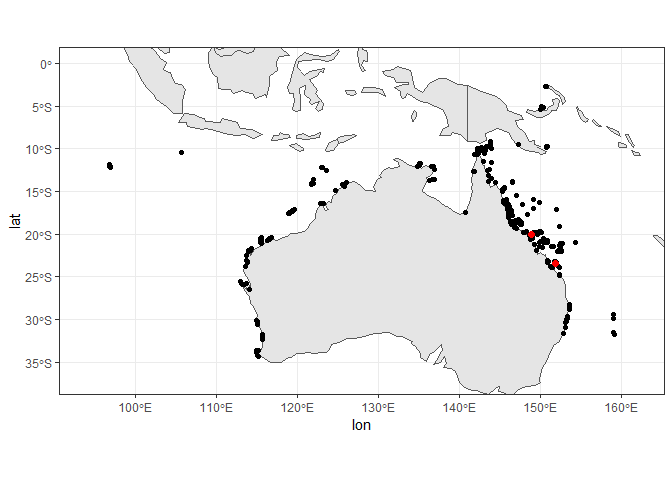
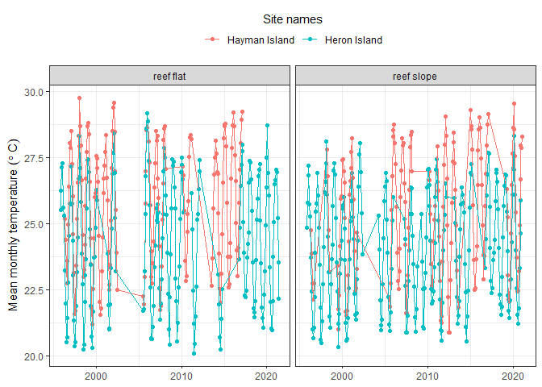

Extracting temperature at specific reefs
================
Denisse Fierro Arcos
2023-06-05

- [Goal of this notebook](#goal-of-this-notebook)
- [Loading libraries](#loading-libraries)
- [Connecting to RIMReP collection](#connecting-to-rimrep-collection)
  - [Exploring dataset structure](#exploring-dataset-structure)
- [Extracting variables of our interest from
  dataset](#extracting-variables-of-our-interest-from-dataset)
  - [Creating `deployment_location`
    column](#creating-deployment_location-column)
  - [Extracting latitude and longitude values (Option
    \#1)](#extracting-latitude-and-longitude-values-option-1)
    - [Transforming `geometry` format](#transforming-geometry-format)
  - [Extracting sites and coordinates from dataset (Option
    \#2)](#extracting-sites-and-coordinates-from-dataset-option-2)
- [Plotting map of sampled sites in this
  dataset](#plotting-map-of-sampled-sites-in-this-dataset)
- [Extracting data for sites of
  interest](#extracting-data-for-sites-of-interest)
  - [Plotting timeseries](#plotting-timeseries)
  - [Saving data summaries and plot](#saving-data-summaries-and-plot)

# Goal of this notebook

This notebook will demonstrate how to access the RIMReP `geoparquet`
collection for AIMS Sea Surface Temperature Monitoring Program. This
dataset includes sea temperature data since 1980 for tropical and
subtropical coral reefs around Australia, including sites at the Great
Barrier Reef.

We will also extract the coordinates for all sites sampled in this
monitoring program. This way we can extract data for the site of our
choice using the name of the site of our interest, without the need to
know their coordinates.

# Loading libraries

``` r
#Accessing S3 bucket
library(arrow)
#Data manipulation
library(dplyr)
library(magrittr)
library(stringr)
#Managing dates
library(lubridate)
#Plotting
library(ggplot2)
library(rnaturalearth)
#Managing spatial data
library(sf)
library(wkb)
```

# Connecting to RIMReP collection

As mentioned above, we will connect to the AIMS Sea Surface Temperature
Monitoring Program. This can take a minute or so.

``` r
#Establishing connection
data_bucket <- s3_bucket("s3://rimrep-data-public/091-aims-sst/test-50-64-spatialpart/")

#Accessing dataset
data_df <- open_dataset(data_bucket)
```

## Exploring dataset structure

We can explore the dataset `schema` to understand its structure, and
identify the fields that are relevant to us.

``` r
#Checking data structure
data_df$schema
```

    ## Schema
    ## fid: int64
    ## deployment_id: int64
    ## site: string
    ## site_id: int64
    ## subsite: string
    ## subsite_id: int64
    ## from_date: timestamp[us]
    ## thru_date: timestamp[us]
    ## depth: double
    ## parameter: string
    ## instrument_type: string
    ## serial_num: string
    ## lat: double
    ## lon: double
    ## gbrmpa_reef_id: string
    ## metadata_uuid: string
    ## sites_with_climatology_available: double
    ## time: timestamp[us, tz=UTC]
    ## cal_val: double
    ## qc_val: double
    ## qc_flag: double
    ## geometry: binary
    ## hilbert_distance: uint64
    ## 
    ## See $metadata for additional Schema metadata

We can see that there are a number of variables available in this
dataset. We will need to access three variables to create a list of all
sampled sites in this monitoring program:  
- `site`, which includes the name of all sites where temperature loggers
were deployed  
- `subsite`, which includes a shorten version of the site name and an
indication of where loggers where deployed (see below for more
details)  
- `geometry`, which includes latitude and longitude coordinates in
[well-known binary
(WKB)](https://loc.gov/preservation/digital/formats/fdd/fdd000549.shtml)
format

Based on the `subsite` information, we will create a new column that we
will call `deployment_location`. If `subsite` string includes `SL`, this
indicates the temperature logger was deployed on a reef slope (depths of
3 m or more). If this is the case, our new column will be labelled
`reef slope`. If `FL` is included in the `subsite` string, this means
the temperature logger was deployed on a reef flat (areas less than 3 m
deep). In this case, we will classify this as `reef flat` in our new
column.

Next, we will transform the information contained in the `geometry`
field into coordinate pairs (i.e., latitude and longitude in decimal
degrees).

**Note** that you can get additional information about the AIMS dataset
by exploring its metadata as shown below.

``` r
#Checking metadata
data_df$metadata
```

    ## $pandas
    ## [1] "{\"index_columns\": [\"hilbert_distance\"], \"column_indexes\": [{\"name\": null, \"field_name\": null, \"pandas_type\": \"unicode\", \"numpy_type\": \"object\", \"metadata\": {\"encoding\": \"UTF-8\"}}], \"columns\": [{\"name\": \"fid\", \"field_name\": \"fid\", \"pandas_type\": \"int64\", \"numpy_type\": \"int64\", \"metadata\": null}, {\"name\": \"deployment_id\", \"field_name\": \"deployment_id\", \"pandas_type\": \"int64\", \"numpy_type\": \"int64\", \"metadata\": null}, {\"name\": \"site\", \"field_name\": \"site\", \"pandas_type\": \"unicode\", \"numpy_type\": \"object\", \"metadata\": null}, {\"name\": \"site_id\", \"field_name\": \"site_id\", \"pandas_type\": \"int64\", \"numpy_type\": \"int64\", \"metadata\": null}, {\"name\": \"subsite\", \"field_name\": \"subsite\", \"pandas_type\": \"unicode\", \"numpy_type\": \"object\", \"metadata\": null}, {\"name\": \"subsite_id\", \"field_name\": \"subsite_id\", \"pandas_type\": \"int64\", \"numpy_type\": \"int64\", \"metadata\": null}, {\"name\": \"from_date\", \"field_name\": \"from_date\", \"pandas_type\": \"datetime\", \"numpy_type\": \"datetime64[ns]\", \"metadata\": null}, {\"name\": \"thru_date\", \"field_name\": \"thru_date\", \"pandas_type\": \"datetime\", \"numpy_type\": \"datetime64[ns]\", \"metadata\": null}, {\"name\": \"depth\", \"field_name\": \"depth\", \"pandas_type\": \"float64\", \"numpy_type\": \"float64\", \"metadata\": null}, {\"name\": \"parameter\", \"field_name\": \"parameter\", \"pandas_type\": \"unicode\", \"numpy_type\": \"object\", \"metadata\": null}, {\"name\": \"instrument_type\", \"field_name\": \"instrument_type\", \"pandas_type\": \"unicode\", \"numpy_type\": \"object\", \"metadata\": null}, {\"name\": \"serial_num\", \"field_name\": \"serial_num\", \"pandas_type\": \"unicode\", \"numpy_type\": \"object\", \"metadata\": null}, {\"name\": \"lat\", \"field_name\": \"lat\", \"pandas_type\": \"float64\", \"numpy_type\": \"float64\", \"metadata\": null}, {\"name\": \"lon\", \"field_name\": \"lon\", \"pandas_type\": \"float64\", \"numpy_type\": \"float64\", \"metadata\": null}, {\"name\": \"gbrmpa_reef_id\", \"field_name\": \"gbrmpa_reef_id\", \"pandas_type\": \"empty\", \"numpy_type\": \"object\", \"metadata\": null}, {\"name\": \"metadata_uuid\", \"field_name\": \"metadata_uuid\", \"pandas_type\": \"unicode\", \"numpy_type\": \"object\", \"metadata\": null}, {\"name\": \"sites_with_climatology_available\", \"field_name\": \"sites_with_climatology_available\", \"pandas_type\": \"float64\", \"numpy_type\": \"float64\", \"metadata\": null}, {\"name\": \"time\", \"field_name\": \"time\", \"pandas_type\": \"datetimetz\", \"numpy_type\": \"datetime64[ns]\", \"metadata\": {\"timezone\": \"UTC\"}}, {\"name\": \"cal_val\", \"field_name\": \"cal_val\", \"pandas_type\": \"float64\", \"numpy_type\": \"float64\", \"metadata\": null}, {\"name\": \"qc_val\", \"field_name\": \"qc_val\", \"pandas_type\": \"float64\", \"numpy_type\": \"float64\", \"metadata\": null}, {\"name\": \"qc_flag\", \"field_name\": \"qc_flag\", \"pandas_type\": \"float64\", \"numpy_type\": \"float64\", \"metadata\": null}, {\"name\": \"geometry\", \"field_name\": \"geometry\", \"pandas_type\": \"bytes\", \"numpy_type\": \"object\", \"metadata\": null}, {\"name\": \"hilbert_distance\", \"field_name\": \"hilbert_distance\", \"pandas_type\": \"uint64\", \"numpy_type\": \"uint64\", \"metadata\": null}], \"creator\": {\"library\": \"pyarrow\", \"version\": \"10.0.1\"}, \"pandas_version\": \"1.5.1\"}"
    ## 
    ## $geo
    ## [1] "{\"primary_column\": \"geometry\", \"columns\": {\"geometry\": {\"encoding\": \"WKB\", \"crs\": null, \"geometry_type\": \"Point\", \"bbox\": [112.9866, -34.3725, 115.7104, -22.495]}}, \"version\": \"0.4.0\", \"creator\": {\"library\": \"geopandas\", \"version\": \"0.12.2\"}}"

# Extracting variables of our interest from dataset

We can extract location (coordinates) from the AIMS dataset by using
`dplyr` verbs as shown below.

``` r
sites <- data_df %>% 
  #We select unique sites included in the dataset
  distinct(site, subsite, geometry) %>%
  #This will load them into memory
  collect()

#Checking results
glimpse(sites)
```

    ## Rows: 589
    ## Columns: 3
    ## $ site     <chr> "Hamelin Bay", "Flinders Bay", "Geographe Bay", "Cowaramup Ba…
    ## $ subsite  <chr> "HAMBAYFL1", "FLINDERSBAY1", "GEOBAYFL1", "COWBAYFL1", "CANAL…
    ## $ geometry <arrw_bnr> <01, 01, 00, 00, 00, 19, e2, 58, 17, b7, c1, 5c, 40, b1,…

## Creating `deployment_location` column

We will use the `subsite` column to create the categories in our new
column, as explained in the [exploring the dataset
structure](#exploring-dataset-structure). If no condition is met, then
we will label the row as *other*.

``` r
sites <- sites %>% 
  #Adding new column - Given categories based on a condition
  mutate(deployment_location =  case_when(str_detect(subsite, "FL[0-9]{1}") ~ "reef flat",
                                          str_detect(subsite, "SL[0-9]{1}") ~ "reef slope",
                                          #If no condition is met, return other
                                          T ~ "other"))

#Checking results
glimpse(sites)
```

    ## Rows: 589
    ## Columns: 4
    ## $ site                <chr> "Hamelin Bay", "Flinders Bay", "Geographe Bay", "C…
    ## $ subsite             <chr> "HAMBAYFL1", "FLINDERSBAY1", "GEOBAYFL1", "COWBAYF…
    ## $ geometry            <arrw_bnr> <01, 01, 00, 00, 00, 19, e2, 58, 17, b7, c1, …
    ## $ deployment_location <chr> "reef flat", "other", "reef flat", "reef flat", "r…

## Extracting latitude and longitude values (Option \#1)

As explained [above](#exploring-dataset-structure), the `geometry` field
is in WKB format, which we will transform into degree coordinates in the
next step. Here, we will use the `readWKB` function from the `WKB`
library to transform the `geometry` and then we will convert it to an
`sf` object for easy data manipulation.

### Transforming `geometry` format

``` r
sites <- sites %>% 
  #Adding column with coordinate pairs in degrees
  mutate(coords_deg = readWKB(geometry) %>% st_as_sf()) %>% 
  #Separating coordinate pairs into latitude and longitude columns
  mutate(lon = st_coordinates(coords_deg)[,"X"],
         lat = st_coordinates(coords_deg)[,"Y"])

#Checking results - We will exclude the geometry column
sites %>% 
  select(!geometry) %>% 
  arrange(site) %>% 
  head()
```

    ## # A tibble: 6 × 6
    ##   site        subsite  deployment_location coords_deg$geometry   lon   lat
    ##   <chr>       <chr>    <chr>                           <POINT> <dbl> <dbl>
    ## 1 100th Site  100THSI… other                (96.8709 -12.1069)  96.9 -12.1
    ## 2 19-131 Reef 19131FL1 reef flat           (149.3786 -19.7641) 149.  -19.8
    ## 3 19-131 Reef 19131SL1 reef slope          (149.3802 -19.7662) 149.  -19.8
    ## 4 19-131 Reef 19131SL3 reef slope           (149.376 -19.7728) 149.  -19.8
    ## 5 19-138 Reef 19138SL1 reef slope          (149.4305 -19.8069) 149.  -19.8
    ## 6 19-138 Reef 19138FL1 reef flat           (149.4199 -19.8024) 149.  -19.8

## Extracting sites and coordinates from dataset (Option \#2)

You may have noticed while [exploring the dataset
structure](#exploring-dataset-structure) that this dataset also includes
`lat` and `lon` fields. As their name suggest, they contain latitude and
longitude values in decimal degrees. We could also use these fields to
extract coordinates as shown in the block below.

``` r
data_df %>% 
  #We select unique sites included in the dataset together with lat and lon values
  distinct(site, subsite, lon, lat) %>% 
  #Selecting the first rows for comparison with option#1
  arrange(site) %>% 
  head() %>% 
  #We load them into memory
  collect()
```

    ## # A tibble: 6 × 4
    ##   site        subsite     lon   lat
    ##   <chr>       <chr>     <dbl> <dbl>
    ## 1 100th Site  100THSITE  96.9 -12.1
    ## 2 19-131 Reef 19131FL1  149.  -19.8
    ## 3 19-131 Reef 19131SL1  149.  -19.8
    ## 4 19-131 Reef 19131SL3  149.  -19.8
    ## 5 19-138 Reef 19138SL1  149.  -19.8
    ## 6 19-138 Reef 19138FL1  149.  -19.8

The two options shown above for extracting latitude and longitude values
for each site are equivalent and produce the same results. They are
interchangeable and you can use whichever you prefer.

# Plotting map of sampled sites in this dataset

We will make a map of all sites included in the AIMS Water Temperature
Monitoring Program. We will also highlight the location of two sites:
**Hayman Island** and **Heron Island** in red. We will use these
highlighted sites as examples to show you how to extract data at
multiple sites of interest.

``` r
#Loading basemap with countries in Oceania and Asia
oce_asia <- ne_countries(continent = c("oceania", "asia"), 
                                     returnclass = "sf")

#Creating map with all sites included in dataset
#First we plot the basemap with the countries in Oceania and Asia
oce_asia %>% 
  ggplot()+
  geom_sf()+
  #Plotting monitoring sites
  geom_point(inherit.aes = F, data = sites, aes(x = lon, y = lat))+
  geom_point(inherit.aes = F, data = sites[sites["site"] == "Hayman Island" | sites["site"] == "Heron Island",], 
             aes(x = lon, y = lat), color = "red", size = 2)+
  #Changing map limits - Adding a buffer of 2 degree around max and min site coordinates
  lims(y = c(floor(min(sites$lat))-2, ceiling(max(sites$lat))+2),
       x = c(floor(min(sites$lon))-2, ceiling(max(sites$lon))+2))+
  #Removing default grey background
  theme_bw()
```

<!-- -->

# Extracting data for sites of interest

We can use the information in our `sites` variable to extract data for a
site of interest. All we need to know is the name of the site, as shown
below.

Here, we will use data collected at **Hayman Island** and **Heron
Island** as an example. We will calculate monthly means at each site, so
we can plot time series that will show us how temperature has changed
over time.

``` r
sites_coords <- sites %>% 
  #Using random site as example
  filter(site %in% c("Hayman Island", "Heron Island")) %>% 
  #Extracting latitude and longitude coordinates
  select(site, lon, lat, deployment_location)

#Checking results
sites_coords
```

    ## # A tibble: 8 × 4
    ##   site            lon   lat deployment_location
    ##   <chr>         <dbl> <dbl> <chr>              
    ## 1 Heron Island   152. -23.4 reef flat          
    ## 2 Heron Island   152. -23.4 reef flat          
    ## 3 Heron Island   152. -23.4 reef flat          
    ## 4 Heron Island   152. -23.4 reef flat          
    ## 5 Heron Island   152. -23.4 reef flat          
    ## 6 Heron Island   152. -23.4 reef slope         
    ## 7 Hayman Island  149. -20.0 reef flat          
    ## 8 Hayman Island  149. -20.1 reef slope

We can see that there are multiple coordinates for each site, but they
are located in close proximity to one another. In this case, both sites
include instrument deployments in the reef flat and slope. We will use
this information to extract data from the original AIMS dataset.

Note that `qc_val` is the variable containing quality-controlled
temperature data in this dataset.

``` r
sites_temp <- data_df %>% 
  #We will only keep data for the sites of our interest
  inner_join(sites_coords, by = c("site", "lon", "lat")) %>% 
  #Turning results into data frame
  collect()
```

We will now calculate the monthly temperature means at each site and
deployment location (i.e., reef flat, reef slope, other).

``` r
sites_temp <- sites_temp %>% 
  #We will two new columns: year and month to calculate monthly means
  mutate(year = year(time),
         month = month(time)) %>%
  #We will now group data by month, year and site
  group_by(year, month, site, deployment_location) %>%
  #Calculating monthly means for temperature at each site
  summarise(temp_monthly_mean = round(mean(qc_val, na.rm = TRUE), 2),
            #Total number of observations used in monthly mean calculations
            tot_obs = n()) %>%
  #Arranging in chronological order
  arrange(site, deployment_location, year, month)
```

    ## `summarise()` has grouped output by 'year', 'month', 'site'. You can override
    ## using the `.groups` argument.

``` r
#Checking results
head(sites_temp)
```

    ## # A tibble: 6 × 6
    ## # Groups:   year, month, site [6]
    ##    year month site          deployment_location temp_monthly_mean tot_obs
    ##   <dbl> <dbl> <chr>         <chr>                           <dbl>   <int>
    ## 1  1996     5 Hayman Island reef flat                        25.2     116
    ## 2  1996     6 Hayman Island reef flat                        24.4    1439
    ## 3  1996     7 Hayman Island reef flat                        23.2    1488
    ## 4  1996     8 Hayman Island reef flat                        22.7    1488
    ## 5  1996     9 Hayman Island reef flat                        23.6    1440
    ## 6  1996    10 Hayman Island reef flat                        25.0    1487

## Plotting timeseries

We can now use `ggplot2` to create a plot showing how temperature has
changed over time. We will save the plot as a variable so we can save it
to our local machine later.

``` r
temp_plot <- sites_temp %>% 
  #Combining year and month columns into one
  mutate(date = ym(paste0(year, "-", month))) %>% 
  #Plotting temperature of y axis and time on x axis. Color data by site.
  ggplot(aes(x = date, y = temp_monthly_mean, color = site))+
  #Plot data as points and lines
  geom_point()+
  geom_line()+
  #Creating subplots for each site for easy comparison
  facet_grid(~deployment_location)+
  #Removing default grey background
  theme_bw()+
  #Change position of legend
  theme(legend.position = "top", axis.title.x = element_blank())+
  #Change position and title of legend
  guides(colour = guide_legend(title.position = "top", title.hjust = 0.5, title = "Site names"))+
  labs(y = expression("Mean monthly temperature  " ( degree~C)))

#Checking plot
temp_plot
```

    ## Warning: Removed 3 rows containing missing values (`geom_point()`).

<!-- -->

Note that `ggplot2` is warning us that three rows were removed from the
plot. This is because between May and July 2010, there were no
temperature measurements for the logger in the reef flat at Heron
Island.

## Saving data summaries and plot

We will need to provide a path to the folder where we want to save our
data summaries and plots, as well as the file names for our outputs.

``` r
#First we will provide a path to the folder where we want to save our data
folder_out <- "Outputs"

#Checking if folder exists, if not, create it
if(!dir.exists(folder_out)){
  dir.create(folder_out)
}

#Saving data summaries
data_out <- paste(folder_out, "monthly_means_temperature.csv", sep = "/")
write_csv_arrow(sites_temp, file = data_out)

#Saving plot
plot_out <- paste(folder_out, "monthly_means_timeseries.png", sep = "/")
ggsave(plot_out, temp_plot, device = "png")
```
