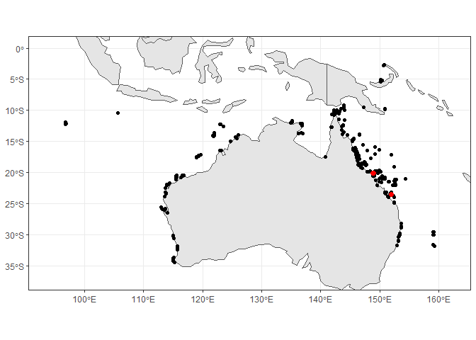
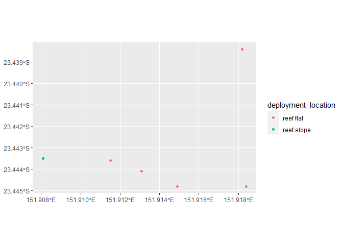
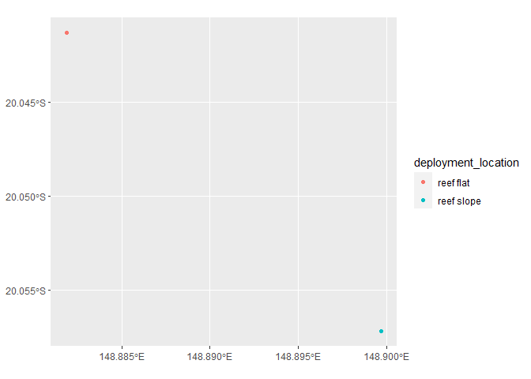

# Extracting_Water_Temperature_GBR_Features
Denisse Fierro Arcos
2023-06-05

- [Goal of this notebook](#goal-of-this-notebook)
- [Loading libraries](#loading-libraries)
- [Connecting to AIMS Sea Surface Temperature Monitoring Program
  collection](#connecting-to-aims-sea-surface-temperature-monitoring-program-collection)
  - [Exploring dataset structure](#exploring-dataset-structure)
- [Extracting variables of our interest from
  dataset](#extracting-variables-of-our-interest-from-dataset)
  - [Creating `deployment_location`
    column](#creating-deployment_location-column)
- [Extracting sites and coordinates from
  dataset](#extracting-sites-and-coordinates-from-dataset)
- [Plotting map of sampled sites in the AIMS
  dataset](#plotting-map-of-sampled-sites-in-the-aims-dataset)
- [Extracting data for sites of
  interest](#extracting-data-for-sites-of-interest)
  - [Plotting timeseries](#plotting-timeseries)
  - [Saving data summaries and plot](#saving-data-summaries-and-plot)

# Goal of this notebook

This notebook will demonstrate how to access the `geoparquet` collection
for the [AIMS Sea Surface Temperature Monitoring
Program](https://stac.reefdata.io/browser/collections/aims-temp). This
dataset includes sea temperature data from 1980 for tropical and
subtropical coral reefs around Australia, including sites at the Great
Barrier Reef.

We will extract the coordinates for all sites sampled in this monitoring
program. This way we can extract data for the site of our choice using
the name of the site of our interest1, without the need to know their
coordinates.

# Loading libraries

``` r
#Accessing S3 bucket
library(arrow)
#Data manipulation
library(dplyr)
library(stringr)
#Managing dates
library(lubridate)
#Plotting
library(ggplot2)
library(rnaturalearth)
#Managing spatial data
library(sf)
```

# Connecting to AIMS Sea Surface Temperature Monitoring Program collection

Connecting to this dataset can take a minute or so, please be patient
while this happens.

``` r
#Establishing connection
data_bucket <- s3_bucket("s3://rimrep-data-public/091-aims-sst/test-50-64-spatialpart/")

#Accessing dataset
data_df <- open_dataset(data_bucket)
```

## Exploring dataset structure

We can explore the dataset `schema` to understand its structure, and
identify the fields that are relevant to us.

``` r
#Checking data structure
data_df$schema
```

    Schema
    fid: int64
    deployment_id: int64
    site: string
    site_id: int64
    subsite: string
    subsite_id: int64
    from_date: timestamp[us]
    thru_date: timestamp[us]
    depth: double
    parameter: string
    instrument_type: string
    serial_num: string
    lat: double
    lon: double
    gbrmpa_reef_id: string
    metadata_uuid: string
    sites_with_climatology_available: double
    time: timestamp[us, tz=UTC]
    cal_val: double
    qc_val: double
    qc_flag: double
    geometry: binary
    hilbert_distance: uint64

    See $metadata for additional Schema metadata

We can see that there are a number of variables available in this
dataset. We will need to access three variables to create a list of all
sampled sites in this monitoring program:  
- `site`, which includes the name of all sites where temperature loggers
were deployed  
- `subsite`, which includes a shorten version of the site name and an
indication of where loggers where deployed (see below for more
details)  
- `geometry`, which includes latitude and longitude coordinates in
[well-known binary
(WKB)](https://loc.gov/preservation/digital/formats/fdd/fdd000549.shtml)
format

Based on the `subsite` information, we will create a new column that we
will call `deployment_location`. If `subsite` string includes `SL`, this
indicates the temperature logger was deployed on a reef slope (depths of
3 m or more). If this is the case, our new column will be labelled
`reef slope`. If `FL` is included in the `subsite` string, this means
the temperature logger was deployed on a reef flat (areas less than 3 m
deep). In this case, we will classify this as `reef flat` in our new
column.

Next, we will transform the information contained in the `geometry`
field into coordinate pairs (i.e., latitude and longitude in decimal
degrees).

# Extracting variables of our interest from dataset

We can extract location (coordinates) from the AIMS dataset by using
`dplyr` verbs as shown below.

``` r
sites <- data_df |> 
  #We select unique sites included in the dataset
  distinct(site, subsite, geometry) |>
  #This will load them into memory
  collect()

#Checking results
glimpse(sites)
```

    Rows: 589
    Columns: 3
    $ site     <chr> "Hamelin Bay", "Flinders Bay", "Geographe Bay", "Cowaramup Ba…
    $ subsite  <chr> "HAMBAYFL1", "FLINDERSBAY1", "GEOBAYFL1", "COWBAYFL1", "CANAL…
    $ geometry <arrw_bnr> <01, 01, 00, 00, 00, 19, e2, 58, 17, b7, c1, 5c, 40, b1,…

## Creating `deployment_location` column

We will use the `subsite` column to create the categories in our new
column, as explained in the [exploring the dataset
structure](#exploring-dataset-structure). If no condition is met, then
we will label the row as *other*.

``` r
sites <- sites |> 
  #Adding new column - Given categories based on a condition
  mutate(deployment_location =  case_when(str_detect(subsite, 
                                                     "FL[0-9]{1}") ~ 
                                            "reef flat",
                                          str_detect(subsite, 
                                                     "SL[0-9]{1}") ~ 
                                            "reef slope",
                                          #If no condition is met, return other
                                          T ~ "other"))

#Checking results
glimpse(sites)
```

    Rows: 589
    Columns: 4
    $ site                <chr> "Hamelin Bay", "Flinders Bay", "Geographe Bay", "C…
    $ subsite             <chr> "HAMBAYFL1", "FLINDERSBAY1", "GEOBAYFL1", "COWBAYF…
    $ geometry            <arrw_bnr> <01, 01, 00, 00, 00, 19, e2, 58, 17, b7, c1, …
    $ deployment_location <chr> "reef flat", "other", "reef flat", "reef flat", "r…

# Extracting sites and coordinates from dataset

Since we store the `geometry` column in the variable above, which
contains spatial data in binary format, we can use the `sf` library to
turn this data frame into a shapefile. Note that we need to use a
reference system for the shapefile to show correctly. This information
can be found in the STAC catalogue for each dataset.

``` r
sites <- sites |> 
  st_as_sf(crs = 4326)

#Checking results
glimpse(sites)
```

    Rows: 589
    Columns: 4
    $ site                <chr> "Hamelin Bay", "Flinders Bay", "Geographe Bay", "C…
    $ subsite             <chr> "HAMBAYFL1", "FLINDERSBAY1", "GEOBAYFL1", "COWBAYF…
    $ geometry            <POINT [°]> POINT (115.0268 -34.2206), POINT (115.2009 -…
    $ deployment_location <chr> "reef flat", "other", "reef flat", "reef flat", "r…

# Plotting map of sampled sites in the AIMS dataset

We will make a map of all sites included in the AIMS Water Temperature
Monitoring Program. We will also highlight the location of two sites:
**Hayman Island** and **Heron Island** in red. We will use these
highlighted sites as examples to show you how to extract data at
multiple sites of interest.

``` r
#Loading basemap with countries in Oceania and Asia
oce_asia <- ne_countries(continent = c("oceania", "asia"), 
                                     returnclass = "sf")

#Creating map with all sites included in dataset
#First we plot the basemap with the countries in Oceania and Asia
oce_asia |> 
  ggplot()+
  geom_sf()+
  #Plotting monitoring sites
  geom_sf(inherit.aes = F, data = sites)+
  geom_sf(inherit.aes = F, 
          data = sites[str_detect(sites$site, "Hayman|Heron"),], 
          color = "red", size = 2)+
  #Changing map limits - Adding a 2 degree buffer around max and min site 
  #coordinates
  lims(y = c(floor(st_bbox(sites)$ymin)-2, ceiling(st_bbox(sites)$ymax)+2),
       x = c(floor(st_bbox(sites)$xmin)-2, ceiling(st_bbox(sites)$xmax)+2))+
  #Removing default grey background
  theme_bw()
```



# Extracting data for sites of interest

We can use the information in our `sites` variable to extract data for a
site of interest. All we need to know is the name of the site, as shown
below.

Here, we will use data collected at **Hayman Island** and **Heron
Island** as an example. We will calculate monthly means at each site, so
we can plot time series that will show us how temperature has changed
over time.

``` r
sites_int <- sites |> 
  #Using random site as example
  filter(str_detect(site, "(Hayman|Heron) Island")) |> 
  #Extracting latitude and longitude coordinates
  select(site, deployment_location)

#Checking results
sites_int
```

    Simple feature collection with 8 features and 2 fields
    Geometry type: POINT
    Dimension:     XY
    Bounding box:  xmin: 148.8819 ymin: -23.4448 xmax: 151.9184 ymax: -20.0413
    Geodetic CRS:  WGS 84
    # A tibble: 8 × 3
      site          deployment_location            geometry
      <chr>         <chr>                       <POINT [°]>
    1 Heron Island  reef flat           (151.9115 -23.4436)
    2 Heron Island  reef flat           (151.9131 -23.4441)
    3 Heron Island  reef flat           (151.9149 -23.4448)
    4 Heron Island  reef slope          (151.9081 -23.4435)
    5 Heron Island  reef flat           (151.9184 -23.4448)
    6 Heron Island  reef flat           (151.9182 -23.4384)
    7 Hayman Island reef flat           (148.8819 -20.0413)
    8 Hayman Island reef slope          (148.8997 -20.0572)

We can see that there are multiple coordinates for each site, but they
are located in close proximity to one another. We can plot them to see
their location. We will plot them separately because these two sites are
not close to another. We will start with Heron Island sites.

``` r
sites_int |> 
  filter(str_detect(site, "Heron")) |> 
  ggplot()+
  geom_sf(aes(colour = deployment_location))
```



These sites are relatively close to one another (see the axes in the
map), and now we can plot the Hayman Island sites.

``` r
sites_int |> 
  filter(str_detect(site, "Hayman")) |> 
  ggplot()+
  geom_sf(aes(colour = deployment_location))
```



These are a little more spread out, but they are sampling slightly
different areas of the reef (flat and slope). The good news is that the
`site` name is the same regardless of their location, so we can use
their names to extract data from the original AIMS dataset. Note that
`qc_val` is the variable containing quality-controlled temperature data
in this dataset.

An alternatively is to get the coordinates for each point of interest
and use this information to extract data. This is more useful in case
the sites are named slightly different, for example: Heron Island 1,
Heron Island 2, etc. Since we have already shown how to extract data by
name, we will show the second option, so let’s start with getting the
coordinates.

``` r
#Getting coordinate values
coords <- sites_int |> 
  #Adding to data frame
  mutate(lon = st_coordinates(sites_int)[,"X"],
         lat = st_coordinates(sites_int)[,"Y"]) |> 
  #Removing original geometry
  st_drop_geometry()
  
#Extract data from DMS dataset
sites_temp <- data_df |> 
  #We will only keep data for the sites of our interest
  inner_join(coords, by = c("site", "lon", "lat")) |> 
  #Turning results into data frame
  collect()
```

We will now calculate the monthly temperature means at each site and
deployment location (i.e., reef flat, reef slope, other).

``` r
sites_temp <- sites_temp |> 
  #We will two new columns: year and month to calculate monthly means
  mutate(year = year(time),
         month = month(time)) |>
  #We will now group data by month, year and site
  group_by(year, month, site, deployment_location) |>
  #Calculating monthly means for temperature at each site
  summarise(temp_monthly_mean = round(mean(qc_val, na.rm = TRUE), 2),
            #Total number of observations used in monthly mean calculations
            tot_obs = n()) |>
  #Arranging in chronological order
  arrange(site, deployment_location, year, month)
```

    `summarise()` has grouped output by 'year', 'month', 'site'. You can override
    using the `.groups` argument.

``` r
#Checking results
head(sites_temp)
```

    # A tibble: 6 × 6
    # Groups:   year, month, site [6]
       year month site          deployment_location temp_monthly_mean tot_obs
      <dbl> <dbl> <chr>         <chr>                           <dbl>   <int>
    1  1996     5 Hayman Island reef flat                        25.2     116
    2  1996     6 Hayman Island reef flat                        24.4    1439
    3  1996     7 Hayman Island reef flat                        23.2    1488
    4  1996     8 Hayman Island reef flat                        22.7    1488
    5  1996     9 Hayman Island reef flat                        23.6    1440
    6  1996    10 Hayman Island reef flat                        25.0    1487

## Plotting timeseries

We can now use `ggplot2` to create a plot showing how temperature has
changed over time. We will save the plot as a variable so we can save it
to our local machine later.

``` r
temp_plot <- sites_temp |> 
  #Combining year and month columns into one
  mutate(date = ym(paste0(year, "-", month))) |> 
  #Plotting temperature of y axis and time on x axis. Color data by site.
  ggplot(aes(x = date, y = temp_monthly_mean, color = site))+
  #Plot data as points and lines
  geom_point()+
  geom_line()+
  #Creating subplots for each site for easy comparison
  facet_grid(~deployment_location)+
  #Removing default grey background
  theme_bw()+
  #Change position of legend
  theme(legend.position = "top", axis.title.x = element_blank())+
  #Change position and title of legend
  guides(colour = guide_legend(title.position = "top", title.hjust = 0.5, title = "Site names"))+
  labs(y = expression("Mean monthly temperature  " ( degree~C)))

#Checking plot
temp_plot
```

    Warning: Removed 3 rows containing missing values (`geom_point()`).


Note that `ggplot2` is warning us that three rows were removed from the
plot. This is because between May and July 2010, there were no
temperature measurements for the logger in the reef flat at Heron
Island.

## Saving data summaries and plot

We will need to provide a path to the folder where we want to save our
data summaries and plots, as well as the file names for our outputs.

``` r
#First we will provide a path to the folder where we want to save our data
folder_out <- "Outputs"

#Checking if folder exists, if not, create it
if(!dir.exists(folder_out)){
  dir.create(folder_out)
}

#Saving data summaries
data_out <- paste(folder_out, "monthly_means_temperature.csv", sep = "/")
write_csv_arrow(sites_temp, file = data_out)

#Saving plot
plot_out <- paste(folder_out, "monthly_means_timeseries.png", sep = "/")
ggsave(plot_out, temp_plot, device = "png")
```
