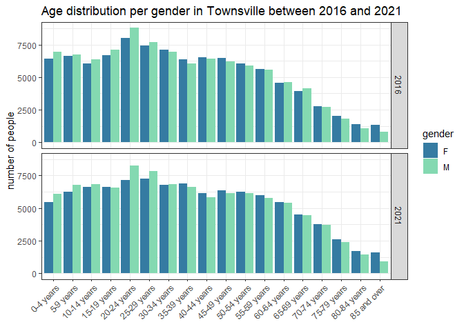
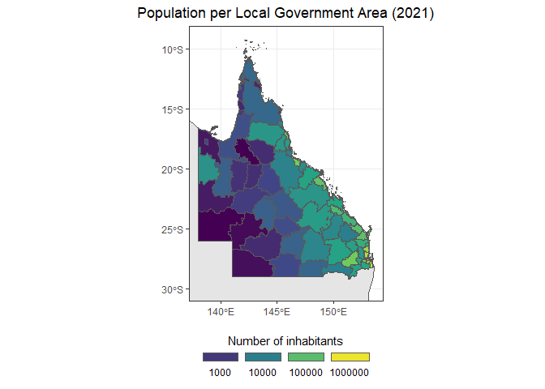

Plotting ABS data
================
Denisse Fierro Arcos
2023-06-14

- [Goal of this notebook](#goal-of-this-notebook)
  - [Loading libraries](#loading-libraries)
  - [Connecting to RIMReP collection and loading ABS regional
    dataset](#connecting-to-rimrep-collection-and-loading-abs-regional-dataset)
  - [Subsetting ABS dataset: QLD LGAs](#subsetting-abs-dataset-qld-lgas)
  - [Connecting to RIMReP collection and loading description of each
    column](#connecting-to-rimrep-collection-and-loading-description-of-each-column)
  - [Subsetting ABS dataset: Keeping columns of
    interest](#subsetting-abs-dataset-keeping-columns-of-interest)
  - [Creating summary tables](#creating-summary-tables)
  - [Plotting age classes](#plotting-age-classes)
    - [Extracting data for Townsville](#extracting-data-for-townsville)
    - [Plotting data](#plotting-data)
  - [Creating choropleth map with poulation data from the 2021
    census](#creating-choropleth-map-with-poulation-data-from-the-2021-census)

# Goal of this notebook

This notebook will show how to access the RIMReP `geoparquet` collection
for the Regional Data by Local Government Area (LGA) from the Australian
Bureau of Statistics (ABS), which contains data for the period between
2011 and 2022. This dataset includes data for the Census of Population
and Housing for 2011, 2016 and 2021.

Although this dataset has information available for all Australian
states and territories, we will focus on accessing data for the state of
Queensland only. We will create some summary table, as well as figures
and maps.

## Loading libraries

``` r
library(arrow)
library(wkb)
library(tidyverse)
library(sf)
library(lubridate)
library(rnaturalearth)
```

## Connecting to RIMReP collection and loading ABS regional dataset

``` r
#Establishing connection
data_bucket <- s3_bucket("s3://rimrep-data-public/abs-regional-lga-2021/data.parquet")

#Accessing ABS dataset
data_df <- open_dataset(data_bucket)

#Checking dimension of dataset
dim(data_df)
```

    ## [1] 4355  665

## Subsetting ABS dataset: QLD LGAs

As we can see above, the ABS dataset contains 4355 rows and 665 columns.
We can explore the contents of this dataset looking at its `schema`,
which will print the name of all columns available in the dataset. Since
there are 665 columns, we will just inspect the first 10 column names.

``` r
head(data_df$schema, n = 10)
```

    ## Schema
    ## DATAFLOW: string
    ## FREQUENCY: string
    ## TIME_PERIOD: int64
    ## REGIONTYPE: string
    ## REGION_CODE: int64
    ## REGION_NAME: string
    ## ACTIV_2: double
    ## ACTIV_3: double
    ## ADFS_2: double
    ## ADFS_3: double

We can see that there is a `REGION_CODE` column, which as its name
suggests, it contains a code that identifies its region or LGA included
in the dataset. The [ABS
website](https://www.abs.gov.au/statistics/standards/australian-statistical-geography-standard-asgs-edition-3/jul2021-jun2026/non-abs-structures/local-government-areas)
states that LGAs are identified by a unique five digit code. The first
digit identifies the state or territory where the LGA is located and the
four remaining digits identify the LGA itself. This means that we can
use this column to select LGAs within Queensland only, which will reduce
the size of the dataset.

According to the [LGA
documentation](https://www.abs.gov.au/statistics/standards/australian-statistical-geography-standard-asgs-edition-3/jul2021-jun2026/main-structure-and-greater-capital-city-statistical-areas/australia-and-stateterritory)
in the ABS website, the digit identifying the state of QLD is the number
three (3). Given that LGA codes have five digits in total, we know that
QLD LGAs will range between 30000 and 39999. We can now build our query
to extract the data we need.

``` r
#Selecting LGAs for QLD only
qld_lgas <- data_df %>% 
  filter(REGION_CODE >= 30000 & REGION_CODE <= 39999) %>% 
  collect()

#Check dimensions
dim(qld_lgas)
```

    ## [1] 616 665

Our dataset now has 616 rows instead of 4355, but we still have 665
columns. We can check the contents of the QLD data and decide which
columns to keep.

``` r
head(qld_lgas)
```

    ## # A tibble: 6 × 665
    ##   DATAFLOW      FREQUENCY TIME_PERIOD REGIONTYPE REGION_CODE REGION_NAME ACTIV_2
    ##   <chr>         <chr>           <int> <chr>            <int> <chr>         <dbl>
    ## 1 ABS:ABS_REGI… A                2011 LGA2021          30250 Aurukun         3.2
    ## 2 ABS:ABS_REGI… A                2011 LGA2021          30300 Balonne         3.4
    ## 3 ABS:ABS_REGI… A                2011 LGA2021          30370 Banana          3.3
    ## 4 ABS:ABS_REGI… A                2011 LGA2021          30410 Barcaldine      3.5
    ## 5 ABS:ABS_REGI… A                2011 LGA2021          30450 Barcoo          3.9
    ## 6 ABS:ABS_REGI… A                2011 LGA2021          30760 Blackall T…     4.4
    ## # ℹ 658 more variables: ACTIV_3 <dbl>, ADFS_2 <dbl>, ADFS_3 <dbl>,
    ## #   ADFS_4 <dbl>, ADFS_5 <dbl>, AGEMIG_10 <dbl>, AGEMIG_11 <dbl>,
    ## #   AGEMIG_12 <dbl>, AGEMIG_13 <dbl>, AGEMIG_14 <dbl>, AGEMIG_15 <dbl>,
    ## #   AGEMIG_16 <dbl>, AGEMIG_17 <dbl>, AGEMIG_18 <dbl>, AGEMIG_19 <dbl>,
    ## #   AGEMIG_2 <dbl>, AGEMIG_3 <dbl>, AGEMIG_4 <dbl>, AGEMIG_5 <dbl>,
    ## #   AGEMIG_6 <dbl>, AGEMIG_7 <dbl>, AGEMIG_8 <dbl>, AGEMIG_9 <dbl>,
    ## #   AGRIC_10 <dbl>, AGRIC_11 <dbl>, AGRIC_12 <dbl>, AGRIC_13 <dbl>, …

The first few column names are informative, we can guess what the
contents of the `REGION_CODE` and `REGION_NAME` are. But the information
contained in `ACTIV_2` or `ADFS_2` is unclear. The good news is that the
RIMReP collection has a table that gives a description of the data that
is stored in each column. In the next step we will load this table so we
can inspect it.

## Connecting to RIMReP collection and loading description of each column

``` r
#Establishing connection
table_bucket <- s3_bucket("s3://rimrep-data-public/abs-regional-lga-2021/measure-codes.parquet") 
#Loading table as a tibble
table <- read_parquet(table_bucket)

#Checking first few rows
head(table)
```

    ## # A tibble: 6 × 4
    ##   DESCRIPTION                                             UNIT  MULTIPLIER CODE 
    ##   <chr>                                                   <chr> <chr>      <chr>
    ## 1 Persons who have need for assistance with core activit… Perc… <NA>       ACTI…
    ## 2 Persons who have need for assistance with core activit… Numb… <NA>       ACTI…
    ## 3 Currently serving in the Australian Defence Force       Pers… <NA>       ADFS…
    ## 4 Previously served in the Australian Defence Force       Pers… <NA>       ADFS…
    ## 5 Currently serving in the Australian Defence Force (%)   Perc… <NA>       ADFS…
    ## 6 Previously served in the Australian Defence Force (%)   Perc… <NA>       ADFS…

For this example, we have already selected some columns of interest:  
- `ERP_23`: Median age  
- `ERP_F_(2-19)`: Number of females per age group  
- `ERP_F_20`: Estimated number of females in population  
- `ERP_M_(2-19)`: Number of males per age group  
- `ERP_M_20`: Estimated number of males in population  
- `ERP_P_20`: Estimated resident population  
- `ERP_17`: Percentage population of working age (15-64 years old)  
- `EQUIV_2`: Median household income

However, if you would like to choose different columns, you can either
view the table in its entirety and scroll through its content, or you
could query it using the `filter` function from the `dplyr` package as
shown below.

As an example, we will look for people born overseas. We will use a
partial match using the `str_detect` function from the `stringr`
package. We will also force the contents in the `DESCRIPTION` column to
be set to lower case to avoid missing any rows where the keyword may be
capitalised.

``` r
table %>% 
  filter(str_detect(str_to_lower(DESCRIPTION), "overseas"))
```

    ## # A tibble: 74 × 4
    ##    DESCRIPTION                              UNIT   MULTIPLIER CODE     
    ##    <chr>                                    <chr>  <chr>      <chr>    
    ##  1 Persons born overseas: 40-44 years       Number <NA>       AGEMIG_10
    ##  2 Persons born overseas: 45-49 years       Number <NA>       AGEMIG_11
    ##  3 Persons born overseas: 50-54 years       Number <NA>       AGEMIG_12
    ##  4 Persons born overseas: 55-59 years       Number <NA>       AGEMIG_13
    ##  5 Persons born overseas: 60-64 years       Number <NA>       AGEMIG_14
    ##  6 Persons born overseas: 65-69 years       Number <NA>       AGEMIG_15
    ##  7 Persons born overseas: 70-74 years       Number <NA>       AGEMIG_16
    ##  8 Persons born overseas: 75-79 years       Number <NA>       AGEMIG_17
    ##  9 Persons born overseas: 80-84 years       Number <NA>       AGEMIG_18
    ## 10 Persons born overseas: 85 years and over Number <NA>       AGEMIG_19
    ## # ℹ 64 more rows

## Subsetting ABS dataset: Keeping columns of interest

In addition to the columns identified above, we will also keep the
columns identifying the date the data was collected (`TIME_PERIOD`), the
LGAs where it was collected (`REGION_CODE` and `REGION_NAME`), and the
`geometry` because this column will allow us to create maps later.

``` r
qld_lgas_sub <- qld_lgas %>% 
  select(TIME_PERIOD, REGION_CODE, REGION_NAME, ERP_17, ERP_23, ERP_P_20,
         EQUIV_2, starts_with("ERP_F_") | starts_with("ERP_M_"), geometry)

qld_lgas_sub
```

    ## # A tibble: 616 × 82
    ##    TIME_PERIOD REGION_CODE REGION_NAME   ERP_17 ERP_23 ERP_P_20 EQUIV_2 ERP_F_10
    ##          <int>       <int> <chr>          <dbl>  <dbl>    <dbl>   <dbl>    <dbl>
    ##  1        2011       30250 Aurukun           NA     NA       NA     348       NA
    ##  2        2011       30300 Balonne           NA     NA       NA     669       NA
    ##  3        2011       30370 Banana            NA     NA       NA     852       NA
    ##  4        2011       30410 Barcaldine        NA     NA       NA     676       NA
    ##  5        2011       30450 Barcoo            NA     NA       NA     752       NA
    ##  6        2011       30760 Blackall Tam…     NA     NA       NA     600       NA
    ##  7        2011       30900 Boulia            NA     NA       NA     703       NA
    ##  8        2011       31000 Brisbane          NA     NA       NA     951       NA
    ##  9        2011       31750 Bulloo            NA     NA       NA     720       NA
    ## 10        2011       31820 Bundaberg         NA     NA       NA     550       NA
    ## # ℹ 606 more rows
    ## # ℹ 74 more variables: ERP_F_11 <dbl>, ERP_F_12 <dbl>, ERP_F_13 <dbl>,
    ## #   ERP_F_14 <dbl>, ERP_F_15 <dbl>, ERP_F_16 <dbl>, ERP_F_17 <dbl>,
    ## #   ERP_F_18 <dbl>, ERP_F_19 <dbl>, ERP_F_2 <dbl>, ERP_F_20 <dbl>,
    ## #   ERP_F_21 <dbl>, ERP_F_22 <dbl>, ERP_F_23 <dbl>, ERP_F_24 <dbl>,
    ## #   ERP_F_25 <dbl>, ERP_F_26 <dbl>, ERP_F_27 <dbl>, ERP_F_28 <dbl>,
    ## #   ERP_F_29 <dbl>, ERP_F_3 <dbl>, ERP_F_30 <dbl>, ERP_F_31 <dbl>, …

## Creating summary tables

We will use data for the most recent census (2021) to create a summary
table for all LGAs in Queensland. We will include total population and
population percentage by gender, median age, percentage of working
population and median household income.

``` r
qld_2021 <- qld_lgas_sub %>% 
  #Selecting data for 2021
  filter(TIME_PERIOD == 2021) %>% 
  #Calculating percentage of population per gender
  mutate(female_per = round((ERP_F_20/ERP_P_20)*100, 2),
         male_per = round((ERP_M_20/ERP_P_20)*100, 2)) %>% 
  #Renaming columns so data can be easily identified
  rename("tot_population" = "ERP_P_20", "working_age_per" = "ERP_17", 
         "med_house_inc_AUD" = "EQUIV_2") %>% 
  #Select columns of interest
  select(REGION_NAME, REGION_CODE, tot_population, female_per, male_per, 
         working_age_per, med_house_inc_AUD)
  
#See result
qld_2021
```

    ## # A tibble: 78 × 7
    ##    REGION_NAME    REGION_CODE tot_population female_per male_per working_age_per
    ##    <chr>                <int>          <dbl>      <dbl>    <dbl>           <dbl>
    ##  1 Aurukun              30250           1131       52.7     47.3            72.1
    ##  2 Balonne              30300           4379       49.7     50.3            63.4
    ##  3 Banana               30370          14663       48.3     51.7            62.9
    ##  4 Barcaldine           30410           2863       49.0     51.0            62.6
    ##  5 Barcoo               30450            312       46.5     53.5            67.9
    ##  6 Blackall Tambo       30760           1920       51.0     49.0            55.8
    ##  7 Boulia               30900            470       56.4     43.6            61.3
    ##  8 Brisbane             31000        1264024       50.4     49.6            69.2
    ##  9 Bulloo               31750            342       47.7     52.3            77.2
    ## 10 Bundaberg            31820         100118       50.6     49.4            57.9
    ## # ℹ 68 more rows
    ## # ℹ 1 more variable: med_house_inc_AUD <dbl>

We can then save this summary table into a local machine as a csv file
using the code below.

``` r
write_csv(qld_2021, "QLD_LGA_summaries_2021.csv")
```

The summary table is also available to be filtered by LGA name or code
or using any other conditions. For example, we will select LGAs where
median house income is above \$1,000, and percentage of people of
working age is 75% or more.

``` r
qld_2021 %>% 
  filter(med_house_inc_AUD > 1000 & working_age_per >= 75)
```

    ## # A tibble: 3 × 7
    ##   REGION_NAME REGION_CODE tot_population female_per male_per working_age_per
    ##   <chr>             <int>          <dbl>      <dbl>    <dbl>           <dbl>
    ## 1 Bulloo            31750            342       47.7     52.3            77.2
    ## 2 Diamantina        32750            270       43.7     56.3            76.3
    ## 3 McKinlay          34800            838       45.9     54.1            78.8
    ## # ℹ 1 more variable: med_house_inc_AUD <dbl>

## Plotting age classes

As part of our dataset we have information about the number of people in
different age classes by gender. We can create a bar plot using this
data. For this example, we will select census data from Townsville for
the years 2016 and 2021.

### Extracting data for Townsville

We will also need to get information about the age ranges included in
the age group columns. We will get this information from the description
table. We will use the column names starting with `ERP_F`, which contain
information about number of individuals for females, but the age ranges
in each class is the same across all genders.

``` r
#Getting information about age classes
age_groups <- table %>% 
  #Select column names starting with ERP_F except ERP_F_20 because it contains 
  #total number of people. We will also include only columns with number of people 
  #and not percentages
  filter(str_starts(CODE, "ERP_F") & UNIT == "Persons" & CODE != "ERP_F_20") %>% 
  #Getting the age group numbers and age range for each age class
  mutate(age_group = str_extract(CODE, "[0-9]{1,2}"), 
         age_class = str_remove(DESCRIPTION, "Females aged ")) %>% 
  select(age_group, age_class)

#Extracting data for Townsville (2016 and 2021 only)
townsville <- qld_lgas %>% 
  filter(REGION_NAME == "Townsville" & (TIME_PERIOD == 2016 | TIME_PERIOD == 2021)) %>% 
  #Select relevant columns 
  select(TIME_PERIOD, starts_with("ERP_F") | starts_with("ERP_M")) %>% 
  #Reduce number of columns
  pivot_longer(!TIME_PERIOD, names_to = c("gender", "age_group"), 
               names_pattern = ("ERP_(.*)_(.*)"), values_to = "number_ind") %>% 
  #Keeping only information about relevant age groups
  right_join(age_groups, by = "age_group") %>% 
  #Adding a column for year
  mutate(year = TIME_PERIOD,
         age_group = as.numeric(age_group)) %>% 
  #Ordering data by age groups
  arrange(age_group) 

#Checking results
townsville
```

    ## # A tibble: 72 × 6
    ##    TIME_PERIOD gender age_group number_ind age_class    year
    ##          <int> <chr>      <dbl>      <dbl> <chr>       <int>
    ##  1        2016 F              2       6403 0-4 years    2016
    ##  2        2016 M              2       6960 0-4 years    2016
    ##  3        2021 F              2       5481 0-4 years    2021
    ##  4        2021 M              2       6113 0-4 years    2021
    ##  5        2016 F              3       6654 5-9 years    2016
    ##  6        2016 M              3       6720 5-9 years    2016
    ##  7        2021 F              3       6231 5-9 years    2021
    ##  8        2021 M              3       6786 5-9 years    2021
    ##  9        2016 F              4       6055 10-14 years  2016
    ## 10        2016 M              4       6351 10-14 years  2016
    ## # ℹ 62 more rows

### Plotting data

``` r
#Fix order of groups - Select the unique age classes
age_class_ord <- townsville %>% 
  distinct(age_class) %>% 
  pull()
#This will give us the age classes in order.

#Creating plot
towns_age <- townsville %>%
  #We will turn the age class into an ordered factor. We use the class in order from above
  mutate(age_class = factor(age_class, levels = age_class_ord, ordered = T)) %>% 
  #Showing age class on x axis and color by gender
  ggplot(aes(age_class, number_ind, fill = gender))+
  #Showing gender columns next to each other 
  geom_col(position = position_dodge())+
  #Choosing a colour-blind friendly palette
  scale_fill_viridis_d(option = "G", begin = 0.5, end = 0.85)+
  #Showing data for each year in a different row
  facet_grid(year~.)+
  #Removing grey background
  theme_bw()+
  #Remove x axis label, change y axis label and adding a title
  labs(x = element_blank(), y = "number of people", 
       title = "Age distribution per gender in Townsville between 2016 and 2021")+
  #Changing the angle and location of the text in the x axis and centering title
  theme(axis.text.x.bottom = element_text(angle = 45, vjust = 1, hjust = 1), 
        title = element_text(hjust = 0.5))

towns_age
```

<!-- -->

From this plot, we can see that the amount of people in the younger age
classes has decreased, while there was an increase in the older classes
between the 2016 and 2021 censuses.

Since we saved this plot in a variable in our session, we can save it to
our local machine with the code below.

``` r
ggsave("Townsville_age_classes_2016_2021.png", towns_age, device = "png")
```

## Creating choropleth map with poulation data from the 2021 census

We will select 2021 data from the QLD data we extracted at the
beginning. We will select two columns only: `ERP_P_20`, which has
information about total number of inhabitants per LGA, and `geometry`,
which has the coordinates for the boundaries of each LGA. The spatial
information is given in [well-known binary
(WKB)](https://loc.gov/preservation/digital/formats/fdd/fdd000549.shtml)
format. which we will transform into coordinate pairs (latitude and
longitude) before we create our map.

``` r
#Selecting population data from 2021
qld_pop_2021 <- qld_lgas_sub %>% 
  #Selecting data for 2021
  filter(TIME_PERIOD == 2021) %>% 
  #Keeping only columns of interest
  select(REGION_CODE, REGION_NAME, ERP_P_20, geometry) %>% 
  #Adding column with spatial information in degrees
  mutate(coords_deg = readWKB(geometry) %>% st_as_sf()) %>%
  #Removing original geometry column
  select(!geometry) %>% 
  #Renaming coordinate degrees column
  mutate(coords_deg = coords_deg$geometry) %>% 
  rename("geometry" = "coords_deg") %>% 
  #Transforming into simple feature
  st_as_sf() %>% 
  #Assigning reference systems: WGS84 (EPSG: 4326)
  st_set_crs(4326)
```

Now we are ready to plot the population data for Queensland.

``` r
#Getting basemap of Australia
australia <- ne_countries(country = "Australia", returnclass = "sf")

#This will ensure no scientific notation is used in population values
options(scipen = 999)

#Plotting Australia as base map
australia %>% 
  ggplot()+
  geom_sf()+
  #Plotting QLD population data
  geom_sf(inherit.aes = F, data = qld_pop_2021, aes(fill = ERP_P_20))+
  #Adding title
  labs(title = "Population per Local Government Area (2021)")+
  #Selecting colour-blind friendly palette. Applying transformation to colorbar 
  #setting scale breaks
  scale_fill_viridis_c(trans = "log", breaks = c(1e3, 1e4, 1e5, 1e6), 
                       #Giving title to colorbar
                       name = "Number of inhabitants", 
                       #Adjusting legend parameters
                       guide = guide_legend(keyheight = unit(3, units = "mm"), 
                                            keywidth = unit(12, units = "mm"), 
                                            label.position = "bottom", title.hjust = 0.5,
                                            title.position = 'top', nrow = 1))+
  #Focusing map on QLD
  lims(x = c(138, NA), y = c(-30, NA))+
  #Remove grey background
  theme_bw()+
  #Adjusting position of legend and plot title
  theme(legend.position = "bottom", plot.title = element_text(hjust = 0.5))
```

<!-- -->
