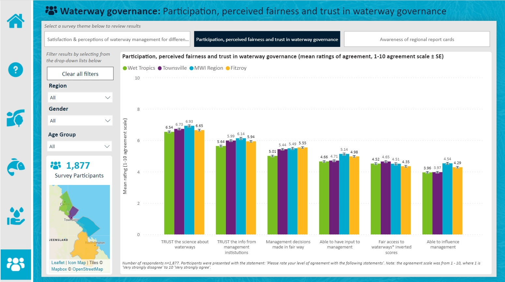

```{r setup, include=FALSE}
knitr::opts_chunk$set(echo = TRUE)
```

# Goal of this notebook

This notebook will show how to access the RIMReP `geoparquet` collection for the Social and Economic Long-Term Monitoring Program (SELTMP) from CSIRO, which contains the latest results of this survey (2021). This dataset collects data on a subset of Great Barrier Reef (GBR) human dimension indicators relating to social, economic, cultural, and governance aspects of the GBR, as described within the Reef 2050 Long Term Sustainability Plan (Reef 2050 Plan). These human dimensions are considered to play a pivotal role in resilience-based management of the GBR.  
  
In this example, we will produce three figures:  
1. Bar plot showing the proportion of people surveyed performing recreational activities per region  
2. Bar plot showing people's perception of waterway health  
3. Bar plot comparing the trust in science by fishers against their perception of climate change  
  

# Loading libraries

```{r libraries, results = "hide", message = F, warning = F}
library(arrow)
library(tidyverse)
library(magrittr)
library(tm)
library(janitor)
library(wordcloud2)
```

# Connecting to RIMReP collection and loading SELTMP dataset

```{r connect_abs_data}
#Establishing connection
data_bucket <- s3_bucket("s3://rimrep-data-public/csiro-seltmp-baseline-surveys-jul22/data.parquet")

#Accessing SELTMP dataset
data_df <- open_dataset(data_bucket)

#Checking dimension of dataset
dim(data_df)
```
  
## Checking dataset structure

As we can see above, the SELTMP dataset contains `r nrow(data_df)` rows and `r ncol(data_df)` columns. We can explore the contents of this dataset looking at its `schema`, which will print the name of all columns available in the dataset and the type of data they contain. Since there are `r ncol(data_df)` columns, we will just print the first 10 column names.  
  
```{r exploring_dataset}
head(data_df$schema, n = 10)
```
  
## Loading dataset metadata
We can see that there is a `REGION` column, which as its name suggests, it contains a code that identifies the regions within the area surveyed. However, the other column names are given as codes (e.g., `q1`). We can get more details about the information contained in each column of this dataset by looking at its metadata.  
  
```{r}
#Establishing connection to metadata file
table_bucket <- s3_bucket("s3://rimrep-data-public-development/csiro-seltmp-baseline-surveys-jul22/reference.parquet")

#Loading table as a tibble
table <- read_parquet(table_bucket)

#Checking first few rows
head(table)
```
  
## Extracting data about recreational activities
We can now use our metadata table to find the variables of interest.  
  
```{r}
#Searching for matches
rec <- table %>% 
  filter(str_detect(str_to_lower(new_name), "waterway rec"))

#Checking results
rec
```
  
From the table above, we can see that question `9` contains data about recreational activities. We can also see that there are multiple options for recreational activities under the same question. We will create a new column that will identify the activity, so we can plot it.  
  
We will also keep the region column (`quotagroup-label`) because this contains the regions where respondents were located and we want to create a bar plot that shows the differences in responses across regions.      
  
```{r}
rec <- rec %>% 
  #Creating a new column for each activity
  separate(description, c("q_number", "activity"), sep = " - ") %>% 
  #Extracting region from new_name column (upper case letters between - and ONLY)
  mutate(region = str_extract(new_name, "- (.+) ONLY -", group = 1)) %>% 
  #We will only keep columns that are useful for us
  select(activity, field, region)

#Checking results
rec
```
  
Now we have the necessary information to extract the questions from the complete SELTMP dataset that tell us about recreational activities in the study area. We will also need to do some data wrangling to format our data in a way that is easy to plot.  
    
```{r subset_occ}
#Extracting recreational activities questions
recreation <- data_df %>% 
  #Selecting columns of interest - We use the field column in the above data frame
  select(all_of(rec$field)) %>% 
  #Removing columns ending in  "_OTHER" as this provides a description of what other activities were carried out
  select(!ends_with("_OTHER")) %>% 
  #Loading data into memory for further processing
  collect()

#We need to do some additional clean up before plotting
recreation <- recreation %>% 
  #We will make the data frame longer. This means that instead of having multiple columns for each region/activity, 
  #we will have single column containing information about the activities/region linked to that observation
  pivot_longer(cols = everything(), names_to = "field", values_to = "rec_act") %>%
  #We remove any rows with no data in the occupation column (i.e., a single respondent cannot be in multiple regions)
  drop_na(rec_act) %>% 
  #Join with metadata table
  left_join(rec, by = "field") %>% 
  #Summarise data by region and activity
  group_by(region, activity) %>% 
  #Calculate number of respondents per region - This is a simple count of observations per region
  mutate(respondent = n(),
         #Removing additional information in the "Other" category for activities
         activity = case_when(str_detect(activity, "please") ~ "Other",
                              T ~ activity),
         #Change from upper case in region to only first letter as uppercase
         region = case_when(region != "MWI" ~ str_to_title(region),
                            T ~ region)) %>% 
  #Correcting spelling mistake in one of the regions
  mutate(region = case_when(region == "Glastone" ~ "Gladstone",
                            T ~ region)) %>% 
  #Calculate percentage of respondents performing an activity
  #We add the number of people who reported that they performed an activity
  summarise(rec_act = sum(rec_act, na.rm = T),
            #We get the total respondents per region (Otherwise this column would be lost)
            respondent = mean(respondent, na.rm = T),
            #We calculate the percentage - No decimals needed
            per_rec = round((rec_act/respondent)*100, 0)) %>% 
  #Calculate mean % by activity to order data in plot
  group_by(activity) %>% 
  mutate(order_plot = mean(per_rec))

#Checking result
head(recreation)
```
  
### Plotting data about recreational activities
Our data is now ready for us to make a plot. We will order our plot by the mean percentage of people reporting performing an activity. Higher proportions will be at the bottom and decrease towards the top.  
  

```{r}
#Creating plot and assign it to a variable
rec_plot <- recreation %>% 
  #We use activity on y axis and ordering by order_plot in descending order
  ggplot(aes(y = reorder(activity, -order_plot), x = per_rec, fill = activity))+
  #Plot as bars and add a black border
  geom_bar(stat = "identity", color = "black")+
  #Divide plot by regions
  facet_grid(~region)+
  #Add % values as text at the end of the bars
  geom_text(aes(label = per_rec), size = 3, hjust = -0.2, vjust = 0.3)+
  #Change color palette
  scale_fill_brewer(type = "qual", palette = "Paired")+
  #Change x axis limits
  lims(x = c(0, 90))+
  #Change base theme for plot
  theme_bw()+
  #Adding labels, title and caption
  labs(x = "% respondents", title = "Waterway recreation activities performed \nby respondents", 
       caption = "*Numbers next to bars show the % of respondents for each activity")+
  #Formatting figure 
  theme(axis.text.x = element_text(angle = 90, hjust = 1),
        axis.title.y = element_blank(),
        legend.position = "none",
        panel.grid.major.x = element_blank(),
        panel.grid.minor = element_blank(),
        panel.grid.major.y = element_line(linetype = "dashed"),
        plot.title = element_text(hjust = 0.5), 
        plot.caption = element_text(hjust = 0))

#Checking result
rec_plot
```
  
The above figure can be saved locally with the following line: `ggsave("recreation_activities_plot.png", rec_plot, device = "png")`.  

## Extracting data about waterway health
Using the metadata table we loaded towards the beginning of this notebook, we will find the survey questions that cover perceived waterway health.
  
```{r}
#Searching for matches
health <- table %>%
  filter(str_detect(str_to_lower(new_name), "perceived health"))

#Checking results
health
```
  
The first thing we notice is that for some regions there are more questions about perceived health, which refer to areas that are not present across all regions. Since we would like to compare results across regions, we will select areas that are present across all regions. These are covered by questions `13_1` to `13_8`. We will select these from our table of questions above and then use it to load the data we need to create a plot.  
  
We should highlight three issues with the data:  
1. The Fitzroy region does not include information about wetlands (`13_2`) and offshore reefs (`13_7`).  
2. The area categories and ID for the Gladstone region do not match all categories and ID for other regions.  
3. There is no variable dictionary included for the Gladstone region  
  
Since we do not have information to interpret the Gladstone region (and to maintain things simple), we will ignore this region when creating our plot.
  
Finally, we will add the `-label` suffix to the `field` column because we would like to access the actual labels of the responses instead of the numerical categories.  
  
```{r}
health <- health %>% 
  #Selecting questions 13_1 to 13_8
  filter(str_detect(field, ".*_[1-8]{1}$")) %>% 
  #Creating a new column for each activity
  separate(description, c("q_number", "area"), sep = " - ") %>% 
  #Extracting region from new_name column
  mutate(region = str_extract(new_name, "- (.+) Perceived", group = 1)) %>% 
  #Removing Gladstone region
  filter(region != "GLADSTONE") %>% 
  #Adding -label suffix to field column
  mutate(field = str_c(field, "-label")) %>%
  #We will only keep columns that are useful for us
  select(area, field, region)

#Checking results
health
```
  
As we did with the previous plot, we will use the table above to extract the questions that contain data about perceptions of waterway health. In this case, we will also need to do some data wrangling to format our data in a way that is easy to plot.  
    
```{r}
#Extracting waterway health perception questions
water_health <- data_df %>%
  #Selecting columns of interest - We use the field column in the above data frame
  select(all_of(health$field), "w13_1") %>% 
  #Loading data into memory for further processing
  collect()

#We will select data for the w13_1 columns to order ratings
labels_water <- water_health %>% 
  select(starts_with("w13_1")) %>% 
  #Removing NA rows
  drop_na() %>% 
  #Keeping unique values
  distinct() %>% 
  #Arranging by numeric value
  arrange(w13_1) %>% 
  #Cleaning up column names
  clean_names()

#We need to do some additional clean up before plotting
water_health_reg <- water_health %>% 
  select(!w13_1) %>% 
  #We will make the data frame longer. This means that instead of having multiple columns for each region/area, 
  #we will have single column containing information about the region/area linked to that observation
  pivot_longer(cols = everything(), names_to = "field", values_to = "rating") %>%
  #We remove any rows with no data in the rating column (i.e., a single respondent cannot be in multiple regions)
  drop_na(rating) %>% 
  #Join with metadata table
  left_join(health, by = "field") %>% 
  #Summarise data by region and area
  group_by(region, area) %>% 
  #Calculate number of respondents per region - This is a simple count of observations per region
  mutate(respondent = n(),
         #Change from upper case in region to only first letter as uppercase
         region = case_when(region != "MWI" ~ str_to_title(region),
                            T ~ region)) %>% 
  #Calculate percentage by rating, so we add rating to the grouping
  group_by(region, area, rating) %>%
  #We count the amount of responses under each rating
  mutate(rate_count = n(),
         rate_per = round((rate_count/respondent)*100, 0)) %>% 
  #Keep unique values only
  distinct() %>% 
  #Change rating column to ordered factor
  mutate(rating = factor(rating, levels = labels_water$w13_1_label, ordered = T)) %>%
  #Convert Not applicable level to NA 
  mutate(rating = fct_recode(rating, NULL = "Not applicable (have not visited)"))

#Checking result
head(water_health)
```
  
### Plotting data about waterway health
We will show results for a single region as it is difficult to show all regions in a single plot. For this example, we will show the Wet Tropics.  
  
```{r}
#Creating plot and assign it to a variable
water_health_reg %>% 
  filter(region == "Wet Tropics") %>% 
  #We use activity on y axis and ordering by order_plot in descending order
  ggplot(aes(y = area, x = rate_per, fill = rating))+
  #Plot as bars and add a black border
  geom_bar(stat = "identity", color = "black", position = "fill")+
  scale_x_continuous(labels = scales::percent)+
  #Add % values as text at the end of the bars
  geom_text(aes(label = rate_per, fontface = 2), size = 3, position = "fill", hjust = 1.1)+
  #Change color palette
  scale_fill_brewer(type = "qual", palette = "Paired")+
  #Change base theme for plot
  theme_bw()+
  #Adding labels, title and caption
  labs(x = "% respondents", title = "Rating of perceived waterway health \nby habitat in the Wet Tropics region",
       caption = "*Numbers inside bars show the % of respondents per rating")+
  #Formatting figure 
  theme(axis.title = element_blank(),
        legend.position = "top", legend.margin = margin(l = -2, unit = "cm"),
        legend.title = element_blank(),
        panel.grid = element_blank(),
        plot.title = element_text(hjust = 0.5), 
        plot.caption = element_text(hjust = 0))

```
  
## Extracting data about governance
Finally, we will replicate one of the plots about governance of waterways that is available in the SELTMP website, which we are including below. By now, you know that the first step is to look for the variables that contain the information we want to plot.  
  
Since the plot does not include a keyword that is common for all variables, we will search for `science` since the first variable in the plot is about "trust in science about waterways".  
  
.
  
```{r}
#Searching for matches - We will use "science" as a keyword
table %>%
  filter(str_detect(str_to_lower(description), "science"))
```
  
We can see that trust in science falls under question `18`. We will do another query to our table and check that all variables needed for the plot are included in question `18`. We will use additional keywords identifying the questions that are relevant for our plot.  
  
```{r}
#Keywords representing questions of interest
keys <- paste("science", "institutions", "management", "access", "fair", "influence", sep = "|",collapse = "|")

govern <- table %>%
  #Searching for matches - We will use "18_" as a keyword
  filter(str_detect(field, "18_")) %>% 
  #Second filter with keywords
  filter(str_detect(description, keys))

#Checking results
govern
```
  
We have identified the fields containing the information we need to recreate the plot. We now need to tidy up our table as we have done previously.  
  
  
```{r}
govern <- govern %>%
  #Extracting region and label from new_name column 
  separate(new_name, c("q_number", "region", "question"), sep = " - ") %>% 
  #Extracting region from new_name column - Remove apostrophes (')
  mutate(question = str_replace(question, "\\'", ""),
         #Get only words in upper case
         question = str_extract(question, " (?:[A-Z ]+[A-Z]+)")) %>% 
  #We will only keep columns that are useful for us
  select(question, field, region)

#Checking results
govern
```
  
Note that unlike the previous example, we will not use the `-label` columns because we are interested in the quantifying the level of agreement of the respondents to the statements in the survey.  
  
We will now use the table above to load the questions about governance to our session. As in the previous examples, we will need to do some data wrangling to format our data in a way that is easy to plot.  
    
```{r}
#Extracting waterway health perception questions
governance <- data_df %>%
  #Selecting columns of interest - We use the field column in the above data frame
  select(all_of(govern$field)) %>% 
  #Loading data into memory for further processing
  collect()

#We need to do some additional clean up before plotting
governance <- governance %>%
  #We will make the data frame longer as we did in the previous examples
  pivot_longer(cols = everything(), names_to = "field", values_to = "agreement") %>%
  #We remove any rows with no data in the occupation column (i.e., a single respondent cannot be in multiple regions)
  drop_na(agreement) %>% 
  #Join with metadata table
  left_join(govern, by = "field") %>% 
  #Summarise data by region and activity
  group_by(region, question) %>% 
  #Calculate number of respondents per region - This is a simple count of observations per region
  mutate(respondent = n(),
         #Change from upper case in region to only first letter as uppercase
         region = case_when(region != "MWI" ~ str_to_title(region),
                            T ~ region)) %>% 
  #Calculate mean agreement and standard error
  summarise(agree_mean = round(mean(agreement, na.rm = T), 2),
            agree_sd = sd(agreement, na.rm = T),
            #We get the total respondents per region (Otherwise this column would be lost)
            respondent = mean(respondent, na.rm = T),
            #We calculate the percentage - No decimals needed
            agree_se = (agree_sd/sqrt(respondent))) %>% 
  #Calculate mean % by activity to order data in plot
  group_by(question) %>% 
  mutate(order_plot = mean(agree_mean))

#Checking results
governance
```
  
### Plotting data about governance
Our data is now ready for us to make a plot. We will order our plot by the mean agreement. Higher agreement will be on the left and decrease to the right.  

```{r}
#Creating plot and assign it to a variable
governance %>% 
  #We use activity on y axis and ordering by order_plot in descending order
  ggplot(aes(y = reorder(question, -order_plot), x = agree_mean, fill = region))+
  #Plot as bars and add a black border
  geom_bar(stat = "identity", color = "black")+
  geom_errorbar(aes(xmin = agree_mean, xmax = agree_mean+agree_se), width = 0.5)+
  #Divide plot by regions
  facet_grid(~region)+
  #Add % values as text at the end of the bars
  geom_text(aes(label = agree_mean), size = 3, hjust = 1.2)+
  #Change color palette
  scale_fill_brewer(type = "qual", palette = "Paired")+
  #Change x axis limits
  lims(x = c(0, 8))+
  #Change base theme for plot
  theme_bw()+
  #Adding labels, title and caption
  labs(x = "Mean agreeement", title = "Perceived fairness and trust by respondents \nin waterway governance", 
       caption = "*Numbers inside bars show the mean agreeement with each statement. Standard errors\n shown as black lines.")+
  #Formatting figure 
  theme(axis.text.x = element_text(angle = 90, hjust = 1),
        axis.title = element_blank(),
        legend.position = "none",
        panel.grid.major.y = element_blank(),
        panel.grid.minor = element_blank(),
        panel.grid.major.x = element_line(linetype = "dashed"),
        plot.title = element_text(hjust = 0.5), 
        plot.caption = element_text(hjust = 0))

```
    
### Word cloud example using favourite waterways for recreation
  
We will search for the relevant questions in our table of variables, and prepare query results to extract data from SELTMP dataset.    

```{r}
#Searching for matches
water <- table %>%
  filter(str_detect(str_to_lower(new_name), "favourite.*waterway")) %>%
  separate(new_name, c("q_number", "region"), sep = " - ") %>%
  #Extracting region from new_name column
  mutate(region = str_remove(region, " ONLY")) %>%
  #We will only keep columns that are useful for us
  select(field, region)

#Checking results
water
```
  
In this case, we will show global results, so we will ignore regions. However, by changing the grouping of the data, we can create word clouds for each region.  
  
```{r}
#Extracting waterway health perception questions
fav_water <- data_df %>%
  #Selecting columns of interest - We use the field column in the above data frame
  select(all_of(water$field)) %>% 
  #Loading data into memory for further processing
  collect()

#We need to do some additional clean up before plotting
#Defining answers that are not informative
not_accepted <- "do not|can[:punct:]|variety|havent|^na$|don[:punct:]|dont|none|not |no |wildlife|nil|idk|lovely|know|\\?|car|fishing|all|any|;|boat|impossible|chair|unsure|secret|swimming"

#Cleaning data
fav_water <- fav_water %>%
  #We will make the data frame longer as we did in the previous examples
  pivot_longer(cols = everything(), names_to = "field", values_to = "waterways") %>%
  #Forcing everything to be lower case
  mutate(waterways = str_to_lower(waterways)) %>% 
  #Remove non-informative answers
  filter(!str_detect(waterways, not_accepted)) %>% 
  #Change all special characters to ; to separate things easier
  mutate(waterways = str_to_lower(str_replace_all(waterways, "[:punct:]| and | or |the |  ", ";"))) %>%
  #Separate responses by semicolon (;)
  separate_longer_delim(waterways, delim = ";") %>% 
  #Removing stop words
  mutate(waterways = removeWords(waterways, stopwords("english"))) %>% 
  #Remove blank spaces
  mutate(waterways = str_trim(str_to_lower(waterways), "both")) %>% 
  #Remove empty cells
  filter(waterways != "" & waterways != "s") %>% 
  #Correcting multiple cases of great barrier reef
  mutate(waterways = case_when(str_detect(waterways, "gbr") ~ "great barrier reef",
                               str_detect(waterways, "barrier reef") ~ "great barrier reef",
                               T ~ waterways)) %>%
  #Correcting multiple cases of beach
  mutate(waterways = case_when(waterways == "beaches" ~ "beach",
                               T ~ waterways)) %>%
  #Correcting multiple cases of creek
  mutate(waterways = case_when(waterways == "creeks" ~ "creek",
                               T ~ waterways)) %>%
  #Correcting multiple cases of Whitsunday Islands
  mutate(waterways = case_when(str_detect(waterways, "whitsunday") ~ "whitsunday islands",
                               T ~ waterways)) %>%
  count(waterways) %>% 
  arrange(desc(n))

#Checking results
fav_water
```
  
More work needs to be done in cleaning this dataset. However, since there are over 1,000 rows with responses, it is beyond the scope of this notebook to complete harmonise the answers in the dataset. For now, we will move on to plotting these results.  
  
Note that you will need to run this notebook in your local machine to see the results of the word cloud.  
  
```{r eval=FALSE}
wordcloud2(fav_water)
```

