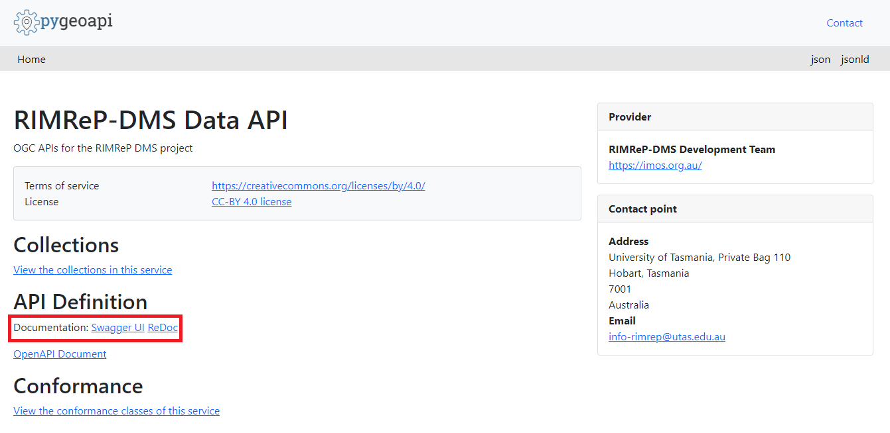

# Using API to access RIMReP DMS datasets
  
  
All datasets available through STAC are also available via Pygeoapi. The main difference between the two is that Pygeoapi provides API access to the datasets, while STAC provides a web-based interface to search for datasets. A list of all datasets can be found at [https://pygeoapi.staging.reefdata.io/collections](https://pygeoapi.staging.reefdata.io/collections).  
  
Full documentation about how to use the API can be found under the **API Definition** section of the Pygeoapi home page shown inside the red box in the image above. You can also click [here](https://pygeoapi.staging.reefdata.io/openapi?f=html) to access the documentation.  
    
[Home](../README.md)
