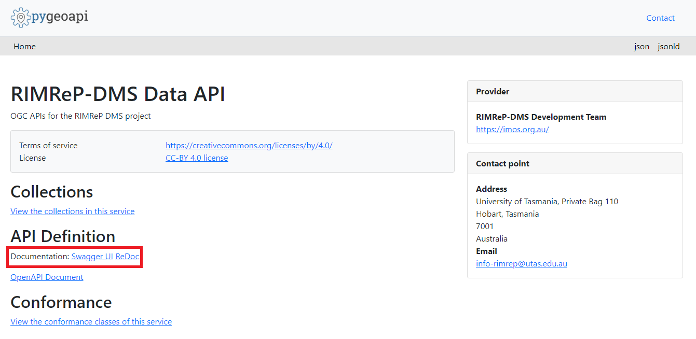

# Using API to access RIMReP DMS datasets
All RIMReP DMS datasets available through STAC are also available via pygeoapi. The data API services are provided through [pygeoapi](https://pygeoapi.io) a server implementation of a set of [OGC API standards](https://ogcapi.ogc.org). This service allows you to extract data from every collection using simple filters like time and space (i.e., coordinates).  
  
The main difference in the data access points is that pygeoapi provides API access to the datasets (i.e., machine-to-machine communication), while STAC provides a web-based interface to search for datasets (i.e., easily accessible to humans). Note that while the majority of datasets in the DMS are publicly available, the DMS also manages non-public datasets that could be accessed with authorisation from the original data provider. This is the reason why DMS users need an account to access this system. For a full list of publicly available datasets, go to our Pygeoapi page: [https://pygeoapi.reefdata.io/](https://pygeoapi.reefdata.io/).  
  
Full documentation about how to use the API can be found under the **API Definition** section of the Pygeoapi home page shown inside the red box in the image below. You can also click [here](https://pygeoapi.reefdata.io/openapi?f=html) to access the documentation.  
  
  
  
Unlike STAC, all API calls need user credentials. This applies even if you are trying to access publicly available datasets through the API. If you need access to the API services, contact the DMS team by emailing [info-dms@utas.edu.au](mailto:info-dms@utas.edu.au). We will create a unique set of `CLIENT_ID` and `CLIENT_SECRET` pairs that are meant to be used by a single user. These are unique identifiers linked to your user profile, which defines what datasets you are granted permission to access. This is why you should considered them as private information, just like any other password, and not share them with others.  
  
Once you have your `CLIENT_ID` and `CLIENT_SECRET`, you will need to create an **Access Token** following the instructions in the next section of this document before starting an API call. Think of this a two-factor authentication process that is designed to keep data secure inside the DMS.  
  
## Using the data API: How to get an access token
**Option 1:** Login into the DMS system accessing the [login dashboard](https://dashboard.reefdata.io). From this page you will need to copy the access token. You can now store the token as a variable in your code, we recommend that you store it as an environment variable to avoid sharing it accidentally.  
  

  
**Option 2:** If you are planning to use a Machine-to-Machine workflow (i.e., download data via script in your computer), you can request an access token via the command line or inside your `Python` or `R` script. You can click on the options below for more details on how to do this. Note that the **access token** is only valid for one hour, so it is possible that you need to request a new token for each API call you make.  
    
<details>
<summary><b>R</b></summary>
  
Included in this folder, you will find a file called `useful_functions.R`. This file includes a collection of functions that you may find useful when accessing data in the DMS. One of the functions we are including is `dms_token`, which requests an access token using your DMS user credentials.  
  
In the chunk below, we assume that you have stored your user credentials as environmental variables in `R`. If you have not done so, just follow the steps below:  
  
```R
#Create or update the environmental variable 
Sys.setenv("CLIENT_ID" = "paste_CLIENT_ID_here")
Sys.setenv("CLIENT_SECRET" = "paste_CLIENT_SECRET_here")

#Check environmental variable has been corrected created/updated
Sys.getenv(c("CLIENT_ID", "CLIENT_SECRET"))
```
  
Note that the credentials must be given within quotation marks, for example: `"client_id123"`. If you provide the token as `client_id123`, that is without quotation marks (`""`), you will get an error.   
  
We should point out that setting environmental variables in this way will only save them for the duration of your `R` session. That is, once you close RStudio, this information will no longer be available. If you would like to store them permanently in your device, you can use `edit_r_environ()` function from the `usethis` package instead. When you call this function, file called `.Renviron` will open in a new tab in your RStudio session. In the `.Renviron` paste your user credentials in the same format shown below.  
  
```
"CLIENT_ID" = "paste_CLIENT_ID_here"
"CLIENT_SECRET" = "paste_CLIENT_SECRET_here"
```
  
Once again, make sure that the credentials are given within quotation marks, and that you include your user credentials. When you are done, save your changes, close the tab, and restart your `R` session for changes to take effect. If you chose this last option, your user credential will be permanently stored in your device.  
  
Now you are ready to get your **access token**. We included a function in our `useful_functions.R` custom library that can help you get your token easily. If you have your user credentials saved as environmental variables, simply copy and paste the chunk below to `R`.  
  
```R
#Loading DMS custom made functions
source("R_notebooks/useful_functions.R")

#Get access token
token <- dms_token(Sys.getenv("CLIENT_ID"), Sys.getenv("CLIENT_SECRET"))

```
  
In the code above, the access token will be stored in `token` variable.  
  
</details>
  
<details>
<summary><b>Command Line Interface</b></summary>
  
It is recommended to store the `CLIENT_ID` and `CLIENT_SECRET` as environmental variables. Assuming that you have already defined these environmental variables, you can request an access token using the following command: 

```bash
ACCESS_TOKEN=$(curl --location --request POST "https://keycloak.reefdata.io/realms/rimrep-production/protocol/openid-connect/token" -s \
  --header "Content-Type: application/x-www-form-urlencoded" \
  --data-urlencode "client_id=$CLIENT_ID" \
  --data-urlencode "client_secret=$CLIENT_SECRET" \
  --data-urlencode "grant_type=client_credentials" | jq -r '.["access_token"]')
```
</details>
  
<details>
<summary><b>Python</b></summary>
  
Assuming that `CLIENT_ID` and `CLIENT_SECRET` are already defined as environment variables, you can use the code below to get the access token: 

```python
import requests
import os

client_id = os.environ["CLIENT_ID"]
client_secret = os.environ["CLIENT_SECRET"]

# Get the access token
url = "https://keycloak.reefdata.io/realms/rimrep-production/protocol/openid-connect/token"
headers = {"Content-Type": "application/x-www-form-urlencoded"}
data = {
    "client_id": client_id,
    "client_secret": client_secret,
    "grant_type": "client_credentials",
}
response = requests.post(url, headers=headers, data=data)

assert response.status_code == 200, response.text

access_token = response.json().get("access_token")

```
</details>

</details>
  
[Home](../README.md)
