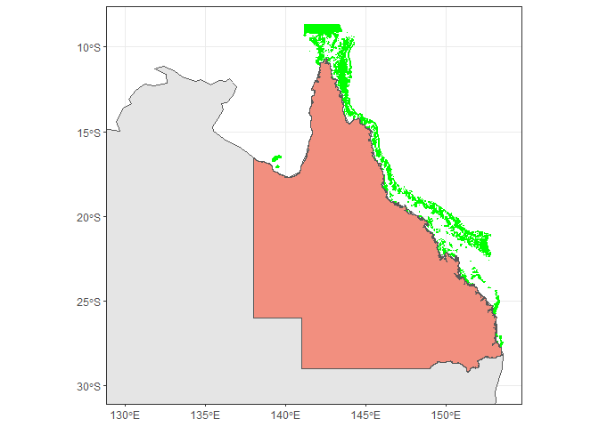

Extracting spatial data for Great Barrier Reef features
================
Denisse Fierro Arcos
2023-06-05

- <a href="#goal-of-this-notebook" id="toc-goal-of-this-notebook">Goal of
  this notebook</a>
  - <a href="#loading-libraries" id="toc-loading-libraries">Loading
    libraries</a>
  - <a href="#connecting-to-rimrep-collection"
    id="toc-connecting-to-rimrep-collection">Connecting to RIMReP
    collection</a>
  - <a href="#exploring-dataset-structure"
    id="toc-exploring-dataset-structure">Exploring dataset structure</a>
  - <a href="#extracting-sites-and-coordinates-from-dataset"
    id="toc-extracting-sites-and-coordinates-from-dataset">Extracting sites
    and coordinates from dataset</a>
    - <a href="#transforming-geometry-format"
      id="toc-transforming-geometry-format">Transforming <code>geometry</code>
      format</a>
  - <a href="#plotting-all-features" id="toc-plotting-all-features">Plotting
    all features</a>
  - <a href="#saving-gbr-features-as-shapefile"
    id="toc-saving-gbr-features-as-shapefile">Saving GBR features as
    shapefile</a>

# Goal of this notebook

This notebook will show how to access the RIMReP `geoparquet` collection
for Great Barrier Reef (GBR) Feature from the Great Barrier Reef Marine
Park Authority (GBRMPA). This dataset includes the unique IDs and names
of all features above water, including sand banks, reefs, cays, islets,
and islands. Since this dataset includes spatial data, we can extract
the spatial limits of each feature included in this dataset.

We could use this spatial data to extract environmental or biological
information for sites of our interest.

## Loading libraries

``` r
library(arrow)
library(dplyr)
library(magrittr)
library(stringr)
library(wkb)
library(ggplot2)
library(sf)
library(lubridate)
```

## Connecting to RIMReP collection

Connecting to the Great Barrier Reef Feature dataset. This can take a
minute or so.

``` r
#Establishing connection
data_bucket <- s3_bucket("s3://rimrep-data-public/gbrmpa-complete-gbr-features")

#Accessing dataset
data_df <- open_dataset(data_bucket)
```

## Exploring dataset structure

We can explore the dataset `schema` to understand its structure, and
identify the fields that are relevant to us.

``` r
#Checking data structure
data_df$schema
```

    ## Schema
    ## TARGET_FID: int64
    ## DATASET: string
    ## LOC_NAME_S: string
    ## GBR_NAME: string
    ## CHART_NAME: string
    ## TRAD_NAME: string
    ## UN_FEATURE: string
    ## LABEL_ID: string
    ## SORT_GBR_I: int64
    ## FEAT_NAME: string
    ## LEVEL_1: string
    ## LEVEL_2: string
    ## LEVEL_3: string
    ## CLASS_CONF: string
    ## CLASS_SRC: string
    ## POLY_ORIG: string
    ## IMG_SRC: string
    ## SUB_NO: int64
    ## CODE: string
    ## FEATURE_C: int64
    ## QLD_NAME: string
    ## X_LABEL: string
    ## GBR_ID: string
    ## LOC_NAME_L: string
    ## X_COORD: double
    ## Y_COORD: double
    ## SHAPE_AREA: double
    ## SHAPE_LEN: double
    ## Checked: string
    ## RegionID: int64
    ## LatitudeID: int64
    ## GroupID: int64
    ## PriorityLb: string
    ## Country: string
    ## UNIQUE_ID: string
    ## geometry: binary
    ## minx: double
    ## miny: double
    ## maxx: double
    ## maxy: double
    ## fid: int64
    ## 
    ## See $metadata for additional Schema metadata

We can see that there are a number of variables available in this
dataset. We will need to access three variables to create a list of all
above water sites in the Great Barrier Reef Marine Park:  
- `UNIQUE_ID`, which includes a unique identification number for each
area above water - `LOC_NAME`, which includes the name of each location
above water - `geometry`, which includes latitude and longitude
coordinates in [well-known binary
(WKB)](https://loc.gov/preservation/digital/formats/fdd/fdd000549.shtml)
format

We will transform the information in the `geometry` field into
coordinate pairs (i.e., latitude and longitude in degrees for each node
along its boundary).

**Note:** One location (`LOC_NAME`) may contain multiple values under
the `UNIQUE_ID` column. This is above water structures may not appear
connected when looking at the surface, but they are part of the same
structure and thus are connected under water.

## Extracting sites and coordinates from dataset

We can extract data from the AIMS dataset by using `dplyr` verbs as
shown below.

``` r
sites <- data_df %>% 
  #We select unique sites included in the dataset
  distinct(UNIQUE_ID, LOC_NAME_S, geometry) %>%
  #This will load them into memory
  collect()

#Checking results
glimpse(sites)
```

    ## Rows: 9,612
    ## Columns: 3
    ## $ UNIQUE_ID  <chr> "09347110101", "09347110100", "09355110126", "09355110127",…
    ## $ LOC_NAME_S <chr> "U/N Sand Bank (09-347a)", "U/N Sand Bank (09-347)", "U/N S…
    ## $ geometry   <arrw_bnr> <01, 03, 00, 00, 00, 01, 00, 00, 00, 57, 00, 00, 00, 9…

As explained above, the `geometry` field is in WKB format, which we will
transform into degree coordinates in the next step. Here, we will use
the `WKB` to transform the `geometry` and then we will convert it to an
`sf` object for easy data manipulation.

### Transforming `geometry` format

``` r
sites <- sites %>% 
  #Adding column with spatial information in degrees
  mutate(coords_deg = readWKB(geometry) %>% st_as_sf())

#Clean up sites information transforming into shapefile
sites <- sites %>%
  #Removing original geometry column
  select(!geometry) %>% 
  #Renaming coordinate degrees column
  mutate(coords_deg = coords_deg$geometry) %>% 
  rename("geometry" = "coords_deg") %>% 
  #Transforming into shapefile
  st_as_sf() %>% 
  #Assigning reference systems: WGS84 (EPSG: 4326)
  st_set_crs(4326)

#Checking results - We will exclude the geometry column
head(sites)
```

    ## Simple feature collection with 6 features and 2 fields
    ## Geometry type: POLYGON
    ## Dimension:     XY
    ## Bounding box:  xmin: 143.0087 ymin: -9.399422 xmax: 143.1298 ymax: -9.266528
    ## Geodetic CRS:  WGS 84
    ## # A tibble: 6 × 3
    ##   UNIQUE_ID   LOC_NAME_S                                                geometry
    ##   <chr>       <chr>                                                <POLYGON [°]>
    ## 1 09347110101 U/N Sand Bank (09-347a)  ((143.0851 -9.26657, 143.087 -9.267642, …
    ## 2 09347110100 U/N Sand Bank (09-347)   ((143.0549 -9.293396, 143.0547 -9.294603…
    ## 3 09355110126 U/N Sand Bank (09-355z)  ((143.1056 -9.3908, 143.1054 -9.390851, …
    ## 4 09355110127 U/N Sand Bank (09-355a0) ((143.0985 -9.390079, 143.0981 -9.390089…
    ## 5 09355110128 U/N Sand Bank (09-355a1) ((143.0939 -9.391464, 143.0936 -9.391468…
    ## 6 09355110122 U/N Sand Bank (09-355v)  ((143.1298 -9.36866, 143.1296 -9.36886, …

## Plotting all features

We will make a map of all features included within the Great Barrier
Reef Marine Protected Area in green so they are easily recognised. Note
that the GBR features also includes a `Mainland` location, which
represents the state of Queensland. We will show this state as light
red.

``` r
#Loading basemap with countries in Oceania and Asia
australia <- rnaturalearth::ne_countries(country = "Australia", returnclass = "sf")

#Extracting mainland Australia for plotting
mainland_aus <- sites %>% 
  filter(str_detect(LOC_NAME_S, "Mainland"))

#Creating map with all features included in GBR dataset
#Plotting basemap of Australia
australia %>% 
  ggplot()+
  geom_sf()+
  #Adding all GBR features in green
  geom_sf(inherit.aes = F, data = sites, color = "green", fill = "green")+
  #Adding mainland features included in the dataset
  geom_sf(inherit.aes = F, data = mainland_aus, fill = "#f28f7f")+
  #Adjusting limits to focus on GBR: East of 130E and north of 30S
  lims(x = c(130, NA), y = c(-30, NA))+
  #Removing default grey background
  theme_bw()
```

<!-- -->

## Saving GBR features as shapefile

We will need to provide a path to the folder where we want to save our
shapefile containing the limits of all features within the GBR Marine
Protected Area.

``` r
#First we will provide a path to the folder where we want to save our data
folder_out <- "Outputs"

#Checking if folder exists, if not, create it
if(!dir.exists(folder_out)){
  dir.create(folder_out)
}

#Saving data summaries
shp_out <- paste(folder_out, "GBR_features.shp", sep = "/")
#Setting delete layer to TRUE to allow shapefile to be overwritten if needed
write_sf(sites, shp_out, delete_layer = TRUE)
```
