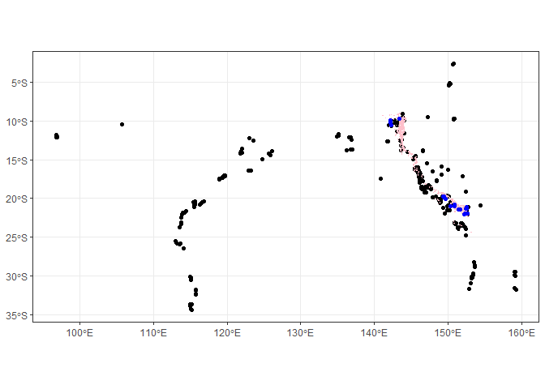
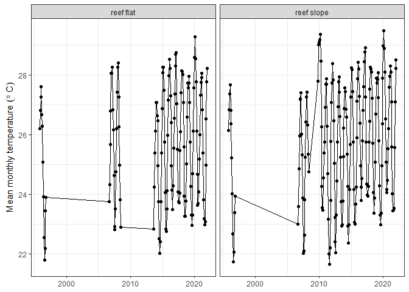

Extracting temperature using GBR features
================
Denisse Fierro Arcos
2023-06-07

- <a href="#goal-of-this-notebook" id="toc-goal-of-this-notebook">Goal of
  this notebook</a>
- <a href="#loading-libraries" id="toc-loading-libraries">Loading
  libraries</a>
- <a href="#connecting-to-rimrep-collection"
  id="toc-connecting-to-rimrep-collection">Connecting to RIMReP
  collection</a>
- <a href="#extracting-monitoring-sites-and-their-coordinates"
  id="toc-extracting-monitoring-sites-and-their-coordinates">Extracting
  monitoring sites and their coordinates</a>
- <a href="#identifying-aims-sites-within-gbr-feature-of-interest"
  id="toc-identifying-aims-sites-within-gbr-feature-of-interest">Identifying
  AIMS sites within GBR feature of interest</a>
  - <a href="#identifying-sites-of-interest"
    id="toc-identifying-sites-of-interest">Identifying sites of interest</a>
  - <a
    href="#extracting-temperature-for-monitoring-site-within-area-of-interest"
    id="toc-extracting-temperature-for-monitoring-site-within-area-of-interest">Extracting
    temperature for monitoring site within area of interest</a>
  - <a href="#plotting-timeseries" id="toc-plotting-timeseries">Plotting
    timeseries</a>
  - <a href="#saving-data-summaries-and-plot"
    id="toc-saving-data-summaries-and-plot">Saving data summaries and
    plot</a>

# Goal of this notebook

This notebook will demonstrate how to use one or more Great Barrier Reef
(GBR) features recognised by the Great Barrier Reef Marine Park
Authority (GBRMPA) dataset to extract water temperature data from the
AIMS Sea Surface Temperature Monitoring Program available at RIMReP
`geoparquet` collection.

# Loading libraries

``` r
library(arrow)
library(dplyr)
library(magrittr)
library(stringr)
library(ggplot2)
library(sf)
library(lubridate)
source("useful_spatial_functions_data_extraction.R")
```

# Connecting to RIMReP collection

Connecting to the AIMS Sea Surface Temperature Monitoring Program. This
can take a minute or so.

``` r
#Establishing connection
data_bucket <- s3_bucket("s3://rimrep-data-public/091-aims-sst/test-50-64-spatialpart")

#Accessing dataset
data_df <- open_dataset(data_bucket)
```

# Extracting monitoring sites and their coordinates

``` r
sites_shp <- data_df %>% 
  #We select unique sites included in the dataset
  distinct(site, subsite, lon, lat) %>%
  #This will load them into memory
  collect()

#Creating shapefile of unique locations
sites_shp <- sites_shp %>% 
  #Creating column to identify deployment location
  mutate(deployment_location =  case_when(str_detect(subsite, "FL[0-9]{1}") ~ "reef flat",
                                          str_detect(subsite, "SL[0-9]{1}") ~ "reef slope",
                                          #If no condition is met, return NA
                                          T ~ NA)) %>%
  #Turning into shapefile
  st_as_sf(coords = c("lon", "lat"), crs = 4326)

#Checking results
glimpse(sites_shp)
```

    ## Rows: 589
    ## Columns: 4
    ## $ site                <chr> "Hamelin Bay", "Flinders Bay", "Geographe Bay", "C…
    ## $ subsite             <chr> "HAMBAYFL1", "FLINDERSBAY1", "GEOBAYFL1", "COWBAYF…
    ## $ deployment_location <chr> "reef flat", NA, "reef flat", "reef flat", "reef f…
    ## $ geometry            <POINT [°]> POINT (115.0268 -34.2206), POINT (115.2009 -…

# Identifying AIMS sites within GBR feature of interest

In this section, we will use the functions included in the
[useful_spatial_functions_data_extraction](https://github.com/aodn/rimrep-examples/blob/main/poc-data-api/useful_spatial_functions_data_extraction.R)
script to load GBR features of interest. We will then use the boundaries
of the feature of interest to identify the names of the sites within
these limits.

We will use the `gbr_features` function to access the boundaries for our
sites of interest. If no parameters are given to this function, it will
load all features recognised by the GBRMPA. You could also provide the
name of the site using the `site_name` parameter or the GBRMPA unique ID
using the `site_id` parameter. You can also use both parameters at the
same time in case you have the names for some sites and the IDs for
others.

As an example, we will use **U/N Reef** or unnamed reefs. We chose them
simply because they cover a large area and will overlap with the most
number of AIMS monitoring sites.

``` r
un_reefs <- gbr_features(site_name = "u/n reef")
```

    ## Subsetting GBR features by u/n reef

``` r
#Checking results
un_reefs
```

    ## Simple feature collection with 4101 features and 3 fields
    ## Geometry type: POLYGON
    ## Dimension:     XY
    ## Bounding box:  xmin: 141.1284 ymin: -24.43007 xmax: 153.1677 ymax: -8.965184
    ## Geodetic CRS:  WGS 84
    ## # A tibble: 4,101 × 4
    ##    UNIQUE_ID   GBR_NAME LOC_NAME_S                                      geometry
    ##  * <chr>       <chr>    <chr>                                      <POLYGON [°]>
    ##  1 09361104104 U/N Reef U/N Reef (09-361d) ((143.2286 -9.263747, 143.2286 -9.26…
    ##  2 09361104100 U/N Reef U/N Reef (09-361)  ((143.2367 -9.267288, 143.2377 -9.26…
    ##  3 09361104102 U/N Reef U/N Reef (09-361b) ((143.2341 -9.259977, 143.232 -9.259…
    ##  4 09361104103 U/N Reef U/N Reef (09-361c) ((143.2284 -9.260164, 143.2287 -9.25…
    ##  5 09361104105 U/N Reef U/N Reef (09-361e) ((143.2196 -9.257815, 143.2199 -9.25…
    ##  6 09361104106 U/N Reef U/N Reef (09-361f) ((143.2299 -9.256957, 143.2299 -9.25…
    ##  7 09361104101 U/N Reef U/N Reef (09-361a) ((143.2398 -9.260512, 143.2399 -9.26…
    ##  8 09354104100 U/N Reef U/N Reef (09-354)  ((143.1372 -9.261412, 143.1374 -9.26…
    ##  9 09359104100 U/N Reef U/N Reef (09-359)  ((143.2262 -9.272064, 143.2262 -9.27…
    ## 10 09363104109 U/N Reef U/N Reef (09-363i) ((143.2719 -9.323137, 143.2715 -9.32…
    ## # ℹ 4,091 more rows

## Identifying sites of interest

Depending on the amount of polygons used to identify the sites of
interest, this may take a couple of minutes.

We will plot the original AIMS monitoring sites (black), the polygon of
interest (pink) and the sites within polygons (blue) to check that sites
have been correctly identified.

Note that unless the AIMS site is within a polygon, it will not to be
identified in our final list.

``` r
site_list <- sites_of_interest(sites_shp, un_reefs)
```

    ## Warning: attribute variables are assumed to be spatially constant throughout
    ## all geometries

``` r
#Plotting results
#AIMS monitoring sites
sites_shp %>% 
  ggplot()+
  geom_sf()+
  #Polygon of interest
  geom_sf(inherit.aes = F, data = un_reefs, color = "pink")+
  #AIMS polygons within area of interest
  geom_sf(inherit.aes = F, data = site_list, color = "blue")+
  theme_bw()
```

<!-- -->

## Extracting temperature for monitoring site within area of interest

We will now extract data only for the monitoring sites located within
the GBR feature of our interest.

``` r
temp_area_int <- data_df %>%
  select(site, subsite, time, qc_val) %>% 
  inner_join(st_drop_geometry(site_list), by = c("site", "subsite")) %>% 
  mutate(year = year(time),
         month = month(time)) %>%
  group_by(year, month, deployment_location) %>%
  summarise(temp_monthly_mean = round(mean(qc_val, na.rm = TRUE), 2)) %>%
  collect()

#Checking results
head(temp_area_int)
```

    ## # A tibble: 6 × 4
    ## # Groups:   year, month [6]
    ##    year month deployment_location temp_monthly_mean
    ##   <int> <int> <chr>                           <dbl>
    ## 1  2014     3 reef slope                       26.9
    ## 2  2012    12 reef slope                       26.9
    ## 3  2013     1 reef slope                       27.8
    ## 4  2012    11 reef slope                       25.8
    ## 5  2013     2 reef slope                       27.9
    ## 6  2013    11 reef slope                       26.2

## Plotting timeseries

We can now use `ggplot2` to create a plot showing how temperature has
changed over time. We will save the plot as a variable so we can save it
to our local machine later.

``` r
temp_plot <- temp_area_int %>% 
  #Combining year and month columns into one
  mutate(date = ym(paste0(year, "-", month))) %>% 
  #Plotting temperature of y axis and time on x axis. Color data by site.
  ggplot(aes(x = date, y = temp_monthly_mean))+
  #Plot data as points and lines
  geom_point()+
  geom_line()+
  #Creating subplots for each site for easy comparison
  facet_grid(~deployment_location)+
  #Removing default grey background
  theme_bw()+
  #Change position of legend
  theme(legend.position = "top", axis.title.x = element_blank())+
  #Change position and title of legend
  # guides(colour = guide_legend(title.position = "top", title.hjust = 0.5, title = "Site names"))+
  labs(y = expression("Mean monthly temperature  " ( degree~C)))

#Checking plot
temp_plot
```

<!-- -->

## Saving data summaries and plot

We will need to provide a path to the folder where we want to save our
data summaries and plots, as well as the file names for our outputs.

``` r
#First we will provide a path to the folder where we want to save our data
folder_out <- "Outputs"

#Checking if folder exists, if not, create it
if(!dir.exists(folder_out)){
  dir.create(folder_out)
}

#Saving data summaries
data_out <- paste(folder_out, "monthly_means_temperature.csv", sep = "/")
write_csv_arrow(temp_area_int, file = data_out)

#Saving plot
plot_out <- paste(folder_out, "monthly_means_timeseries.tif", sep = "/")
ggsave(plot_out, temp_plot, device = "tiff")
```
