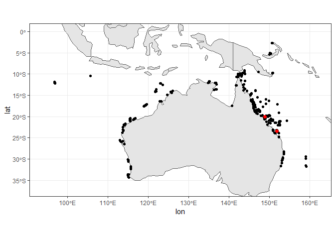
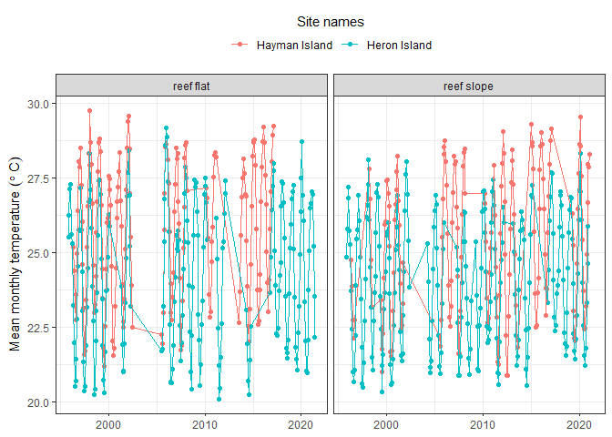

Extracting temperature at specific reefs
================
Denisse Fierro Arcos
2023-06-05

- <a href="#goal-of-this-notebook" id="toc-goal-of-this-notebook">Goal of
  this notebook</a>
  - <a href="#loading-libraries" id="toc-loading-libraries">Loading
    libraries</a>
  - <a href="#connecting-to-rimrep-collection"
    id="toc-connecting-to-rimrep-collection">Connecting to RIMReP
    collection</a>
  - <a href="#exploring-dataset-structure"
    id="toc-exploring-dataset-structure">Exploring dataset structure</a>
  - <a href="#extracting-sites-and-coordinates-from-dataset"
    id="toc-extracting-sites-and-coordinates-from-dataset">Extracting sites
    and coordinates from dataset</a>
    - <a href="#transforming-geometry-format"
      id="toc-transforming-geometry-format">Transforming <code>geometry</code>
      format</a>
  - <a href="#plotting-map-of-sampled-sites-in-this-dataset"
    id="toc-plotting-map-of-sampled-sites-in-this-dataset">Plotting map of
    sampled sites in this dataset</a>
  - <a href="#extracting-data-for-one-site-of-interest"
    id="toc-extracting-data-for-one-site-of-interest">Extracting data for
    one site of interest</a>
    - <a href="#plotting-timeseries" id="toc-plotting-timeseries">Plotting
      timeseries</a>
  - <a href="#saving-data-summaries-and-plot"
    id="toc-saving-data-summaries-and-plot">Saving data summaries and
    plot</a>

# Goal of this notebook

This notebook will demonstrate how to access the RIMReP `geoparquet`
collection for AIMS Sea Surface Temperature Monitoring Program. This
dataset includes data since 1980 for tropical and subtropical coral
reefs around Australia, including 80 Great Barrier Reef sites.

Then, we will extract the coordinates for all sites sampled in this
monitoring program. This way we can extract data for the site of our
choice using the name of the site of our interest, without the need to
know their coordinates.

## Loading libraries

``` r
library(arrow)
library(dplyr)
library(magrittr)
library(stringr)
library(wkb)
library(ggplot2)
library(sf)
library(lubridate)
```

## Connecting to RIMReP collection

As mentioned above, we will connect to the AIMS Sea Surface Temperature
Monitoring Program. This can take a minute or so.

``` r
#Establishing connection
data_bucket <- s3_bucket("s3://rimrep-data-public/091-aims-sst/test-50-64-spatialpart")

#Accessing dataset
data_df <- open_dataset(data_bucket)
```

## Exploring dataset structure

We can explore the dataset `schema` to understand its structure, and
identify the fields that are relevant to us.

``` r
#Checking data structure
data_df$schema
```

    ## Schema
    ## fid: int64
    ## deployment_id: int64
    ## site: string
    ## site_id: int64
    ## subsite: string
    ## subsite_id: int64
    ## from_date: timestamp[us]
    ## thru_date: timestamp[us]
    ## depth: double
    ## parameter: string
    ## instrument_type: string
    ## serial_num: string
    ## lat: double
    ## lon: double
    ## gbrmpa_reef_id: string
    ## metadata_uuid: string
    ## sites_with_climatology_available: double
    ## time: timestamp[us, tz=UTC]
    ## cal_val: double
    ## qc_val: double
    ## qc_flag: double
    ## geometry: binary
    ## hilbert_distance: uint64
    ## 
    ## See $metadata for additional Schema metadata

We can see that there are a number of variables available in this
dataset. We will need to access two variables to create our list of
sampled sites in this monitoring program:  
- `site`, which includes the name of all sites sampled - `geometry`,
which includes latitude and longitude coordinates in [well-known binary
(WKB)](https://loc.gov/preservation/digital/formats/fdd/fdd000549.shtml)
format.

We will transform the information in the `geometry` field into
coordinate pairs (i.e., latitude and longitude in degrees).  
Note that you get additional information about our dataset by exploring
its metadata as shown below.

``` r
#Checking metadata
data_df$metadata
```

    ## $pandas
    ## [1] "{\"index_columns\": [\"hilbert_distance\"], \"column_indexes\": [{\"name\": null, \"field_name\": null, \"pandas_type\": \"unicode\", \"numpy_type\": \"object\", \"metadata\": {\"encoding\": \"UTF-8\"}}], \"columns\": [{\"name\": \"fid\", \"field_name\": \"fid\", \"pandas_type\": \"int64\", \"numpy_type\": \"int64\", \"metadata\": null}, {\"name\": \"deployment_id\", \"field_name\": \"deployment_id\", \"pandas_type\": \"int64\", \"numpy_type\": \"int64\", \"metadata\": null}, {\"name\": \"site\", \"field_name\": \"site\", \"pandas_type\": \"unicode\", \"numpy_type\": \"object\", \"metadata\": null}, {\"name\": \"site_id\", \"field_name\": \"site_id\", \"pandas_type\": \"int64\", \"numpy_type\": \"int64\", \"metadata\": null}, {\"name\": \"subsite\", \"field_name\": \"subsite\", \"pandas_type\": \"unicode\", \"numpy_type\": \"object\", \"metadata\": null}, {\"name\": \"subsite_id\", \"field_name\": \"subsite_id\", \"pandas_type\": \"int64\", \"numpy_type\": \"int64\", \"metadata\": null}, {\"name\": \"from_date\", \"field_name\": \"from_date\", \"pandas_type\": \"datetime\", \"numpy_type\": \"datetime64[ns]\", \"metadata\": null}, {\"name\": \"thru_date\", \"field_name\": \"thru_date\", \"pandas_type\": \"datetime\", \"numpy_type\": \"datetime64[ns]\", \"metadata\": null}, {\"name\": \"depth\", \"field_name\": \"depth\", \"pandas_type\": \"float64\", \"numpy_type\": \"float64\", \"metadata\": null}, {\"name\": \"parameter\", \"field_name\": \"parameter\", \"pandas_type\": \"unicode\", \"numpy_type\": \"object\", \"metadata\": null}, {\"name\": \"instrument_type\", \"field_name\": \"instrument_type\", \"pandas_type\": \"unicode\", \"numpy_type\": \"object\", \"metadata\": null}, {\"name\": \"serial_num\", \"field_name\": \"serial_num\", \"pandas_type\": \"unicode\", \"numpy_type\": \"object\", \"metadata\": null}, {\"name\": \"lat\", \"field_name\": \"lat\", \"pandas_type\": \"float64\", \"numpy_type\": \"float64\", \"metadata\": null}, {\"name\": \"lon\", \"field_name\": \"lon\", \"pandas_type\": \"float64\", \"numpy_type\": \"float64\", \"metadata\": null}, {\"name\": \"gbrmpa_reef_id\", \"field_name\": \"gbrmpa_reef_id\", \"pandas_type\": \"empty\", \"numpy_type\": \"object\", \"metadata\": null}, {\"name\": \"metadata_uuid\", \"field_name\": \"metadata_uuid\", \"pandas_type\": \"unicode\", \"numpy_type\": \"object\", \"metadata\": null}, {\"name\": \"sites_with_climatology_available\", \"field_name\": \"sites_with_climatology_available\", \"pandas_type\": \"float64\", \"numpy_type\": \"float64\", \"metadata\": null}, {\"name\": \"time\", \"field_name\": \"time\", \"pandas_type\": \"datetimetz\", \"numpy_type\": \"datetime64[ns]\", \"metadata\": {\"timezone\": \"UTC\"}}, {\"name\": \"cal_val\", \"field_name\": \"cal_val\", \"pandas_type\": \"float64\", \"numpy_type\": \"float64\", \"metadata\": null}, {\"name\": \"qc_val\", \"field_name\": \"qc_val\", \"pandas_type\": \"float64\", \"numpy_type\": \"float64\", \"metadata\": null}, {\"name\": \"qc_flag\", \"field_name\": \"qc_flag\", \"pandas_type\": \"float64\", \"numpy_type\": \"float64\", \"metadata\": null}, {\"name\": \"geometry\", \"field_name\": \"geometry\", \"pandas_type\": \"bytes\", \"numpy_type\": \"object\", \"metadata\": null}, {\"name\": \"hilbert_distance\", \"field_name\": \"hilbert_distance\", \"pandas_type\": \"uint64\", \"numpy_type\": \"uint64\", \"metadata\": null}], \"creator\": {\"library\": \"pyarrow\", \"version\": \"10.0.1\"}, \"pandas_version\": \"1.5.1\"}"
    ## 
    ## $geo
    ## [1] "{\"primary_column\": \"geometry\", \"columns\": {\"geometry\": {\"encoding\": \"WKB\", \"crs\": null, \"geometry_type\": \"Point\", \"bbox\": [112.9866, -34.3725, 115.7104, -22.495]}}, \"version\": \"0.4.0\", \"creator\": {\"library\": \"geopandas\", \"version\": \"0.12.2\"}}"

## Extracting sites and coordinates from dataset

We can extract data from the AIMS dataset by using `dplyr` verbs as
shown below.

``` r
sites <- data_df %>% 
  #We select unique sites included in the dataset
  distinct(site, geometry) %>%
  #This will load them into memory
  collect()

#Checking results
glimpse(sites)
```

    ## Rows: 516
    ## Columns: 2
    ## $ site     <chr> "Vannessas", "Hamelin Bay", "Flinders Bay", "Geographe Bay", …
    ## $ geometry <arrw_bnr> <01, 01, 00, 00, 00, 27, 31, 08, ac, 1c, c4, 62, 40, ae,…

As explained above, the `geometry` field is in WKB format, which we will
transform into degree coordinates in the next step. Here, we will use
the `WKB` to transform the `geometry` and then we will convert it to an
`sf` object for easy data manipulation.

### Transforming `geometry` format

``` r
sites <- sites %>% 
  #Adding column with coordinate pairs in degrees
  mutate(coords_deg = readWKB(geometry) %>% st_as_sf()) %>% 
  #Separating coordinate pairs into latitude and longitude columns
  mutate(lon = st_coordinates(coords_deg)[,"X"],
         lat = st_coordinates(coords_deg)[,"Y"])

#Checking results - We will exclude the geometry column
sites %>% 
  select(!geometry) %>% 
  head()
```

    ## # A tibble: 6 × 4
    ##   site          coords_deg$geometry   lon    lat
    ##   <chr>                     <POINT> <dbl>  <dbl>
    ## 1 Vannessas       (150.1285 -5.295)  150.  -5.30
    ## 2 Hamelin Bay   (115.0268 -34.2206)  115. -34.2 
    ## 3 Flinders Bay  (115.2009 -34.3725)  115. -34.4 
    ## 4 Geographe Bay (115.1499 -33.6308)  115. -33.6 
    ## 5 Cowaramup Bay  (114.9875 -33.861)  115. -33.9 
    ## 6 Canal Rocks    (114.997 -33.6693)  115. -33.7

## Plotting map of sampled sites in this dataset

We will make a map of all sites included in the AIMS Water Temperature
Monitoring Program. We will also highlight the location of two sites:
**Hayman Island** and **Heron Island** in red. We will use these sites
as an example to show how to extract data at multiple sites of interest.

``` r
#Loading basemap with countries in Oceania and Asia
oce_asia <- rnaturalearth::ne_countries(continent = c("oceania", "asia"), 
                                     returnclass = "sf")

#Creating map with all sites included in dataset
#First we plot the basemap with the countries in Oceania and Asia
oce_asia %>% 
  ggplot()+
  geom_sf()+
  #Plotting monitoring sites
  geom_point(inherit.aes = F, data = sites, aes(x = lon, y = lat))+
  geom_point(inherit.aes = F, data = sites[sites["site"] == "Hayman Island" | sites["site"] == "Heron Island",], 
             aes(x = lon, y = lat), color = "red", size = 2)+
  #Changing map limits - Adding a buffer of 2 degree around max and min site coordinates
  lims(y = c(floor(min(sites$lat))-2, ceiling(max(sites$lat))+2),
       x = c(floor(min(sites$lon))-2, ceiling(max(sites$lon))+2))+
  #Removing default grey background
  theme_bw()
```

<!-- -->

## Extracting data for one site of interest

We can use the information in our `sites` variable to extract data for a
site of interest. All we need to know is the name of the site, as shown
below.

Here, we will use data collected at **Hayman Island** and **Heron
Island** as an example. We will calculate monthly means at each site, so
we can plot time series that will show us how temperature has changed
over time.

``` r
sites_coords <- sites %>% 
  #Using random site as example
  filter(site %in% c("Hayman Island", "Heron Island")) %>% 
  #Extracting latitude and longitude coordinates
  select(site, lon, lat)

#Checking results
sites_coords
```

    ## # A tibble: 8 × 3
    ##   site            lon   lat
    ##   <chr>         <dbl> <dbl>
    ## 1 Heron Island   152. -23.4
    ## 2 Heron Island   152. -23.4
    ## 3 Heron Island   152. -23.4
    ## 4 Heron Island   152. -23.4
    ## 5 Heron Island   152. -23.4
    ## 6 Heron Island   152. -23.4
    ## 7 Hayman Island  149. -20.0
    ## 8 Hayman Island  149. -20.1

We can see that there are multiple coordinates for each site, but they
are located in close proximity to one another. We will use this
information to extract data from the dataset.

Note that `qc_val` is the variable containing the temperature data in
this dataset.

``` r
sites_temp <- data_df %>% 
  #We will only keep data for the sites of our interest
  inner_join(sites_coords, by = c("site", "lon", "lat"))%>% 
  #We will two new columns: year and month to calculate monthly means
  mutate(year = year(time),
         month = month(time)) %>% 
  #We will now group data by month, year and site
  group_by(year, month, site) %>% 
  #Calculating monthly means for temperature at each site
  summarise(temp_monthly_mean = round(mean(qc_val, na.rm = TRUE), 2),
            #Number of points used in monthly mean calculations
            nPoints = n()) %>% 
  #Arranging in chronological order
  arrange(site, year, month) %>% 
  #Turning results into data frame
  collect()

#Checking results
head(sites_temp)
```

    ## # A tibble: 6 × 5
    ## # Groups:   year, month [6]
    ##    year month site          temp_monthly_mean nPoints
    ##   <int> <int> <chr>                     <dbl>   <int>
    ## 1  1996     5 Hayman Island              25.0     232
    ## 2  1996     6 Hayman Island              24.1    2878
    ## 3  1996     7 Hayman Island              23.0    2973
    ## 4  1996     8 Hayman Island              22.4    2976
    ## 5  1996     9 Hayman Island              23.3    2283
    ## 6  1996    10 Hayman Island              25.0    1487

### Plotting timeseries

We can now use `ggplot2` to create a plot showing how temperature has
changed over time. We will save the plot as a variable so we can save it
to our local machine later.

``` r
temp_plot <- sites_temp %>% 
  #Combining year and month columns into one
  mutate(date = ym(paste0(year, "-", month))) %>% 
  #Plotting temperature of y axis and time on x axis. Color data by site.
  ggplot(aes(x = date, y = temp_monthly_mean, color = site))+
  #Plot data as points and lines
  geom_point()+
  geom_line()+
  #Creating subplots for each site for easy comparison
  facet_grid(~site)+
  #Removing default grey background
  theme_bw()+
  #Change position of legend
  theme(legend.position = "top")+
  #Change position and title of legend
  guides(colour = guide_legend(title.position = "top", title.hjust = 0.5, title = "Site names"))

#Checking plot
temp_plot
```

<!-- -->

## Saving data summaries and plot

We will need to provide a path to the folder where we want to save our
data summaries and plots, as well as the file names for our outputs.

``` r
#First we will provide a path to the folder where we want to save our data
folder_out <- "Outputs"

#Checking if folder exists, if not, create it
if(!dir.exists(folder_out)){
  dir.create(folder_out)
}

#Saving data summaries
data_out <- paste(folder_out, "monthly_means_temperature.csv", sep = "/")
write_csv_arrow(sites_temp, file = data_out)

#Saving plot
plot_out <- paste(folder_out, "monthly_means_timeseries.tif", sep = "/")
ggsave(plot_out, temp_plot, device = "tiff")
```
